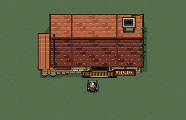

# Guild clearing art booklet

Guild House is an outdoor grass clearing with winding earth paths, clustered
trees, two wood sources, two gold mines and a small central tavern. The Keeper
sits outside its south porch. All new scenery and the seated sprite are authored
in native Aseprite; the existing Keeper portrait and dialogue portrait are
unchanged.

Review the [forest booklet](forest/previews/index.html),
[ground and hero contrast](ground/previews/hero-legibility-3x.png),
[tavern composition](tavern/previews/tavern-and-keeper-3x.png), and
[seated Keeper motion](../../npcs/keeper/seated/previews/motion-review.html).
These are source-art reviews, separate from the rendered game and deployment.

## Native asset contract

| Asset and source guide | Canvas | Frames | Runtime atlas |
| --- | --- | --- | --- |
| [Trees](forest/README.md) · [master](forest/trees.aseprite) | 76 × 76 | 20 static variants: oak, birch, pine, crooked and fir, each N/E/S/W | 304 × 380, four columns × five rows |
| [Gold mine](forest/README.md) · [master](forest/mine.aseprite) | 95 × 95 | 4 static entrance directions, N/E/S/W | 380 × 95 |
| [Grass](ground/README.md) · [master](ground/grass_tiles.aseprite) | 19 × 19 | 4 static variants: moss, sage, olive, dapple | 76 × 19 |
| [Earth patches](ground/README.md) · [master](ground/dirt_patches.aseprite) | 76 × 76 | 3 static variants: worn clearing, curved footpath, stony clearing | 228 × 76 |
| [Tavern](tavern/README.md) · [master](tavern/tavern.aseprite) | 247 × 171 | 1 static building | 247 × 171 |
| [Seated Keeper](../../npcs/keeper/seated/README.md) · [master](../../npcs/keeper/seated/keeper_seated.aseprite) | 38 × 38 | 8 animated frames: `idle_s` 1–4, `beckon_s` 5–8 | 304 × 38 |

The field uses 19 source pixels per tile. At focused 1× output, one source
pixel is one display pixel; runtime sprites use `pixel_size = 0.25 / 19` and
nearest filtering. Keep exact untrimmed regions, lossless texture import and
no mipmaps or automatic 3D compression. Static tree and mine directions select
different authored frames; they are not an animation. The tavern's runtime
`tavern_frames.tres` wrapper exposes `idle_n/e/s/w`, all referencing its one
unchanged 247 × 171 PNG. Keeper idle loops with 800/300/800/300 ms timing;
beckoning plays once with 180/220/300/240 ms timing, then the introduction
returns him to idle.

Grass tiles are opaque and share compatible edge colors. Earth patches are
transparent overlays; trees, mines, tavern and Keeper have transparent margins
and deliberate shadow alpha. The tavern preserves 20 clear rows below its
porch. Neither the transparent canvas nor visible roots, roof, branches or
shadows defines collision or gathering radius.

## Sources, exports and palette

Editable masters, authored OKLCH palettes, native Lua tooling, metadata checks
and review images remain under this `assets/` tree. Runtime PNGs and JSON live
under [arenic-game/assets/environment/guild_clearing](../../../arenic-game/assets/environment/guild_clearing/),
with the seated Keeper under
[arenic-game/assets/npcs/keeper/seated](../../../arenic-game/assets/npcs/keeper/seated/).
The individual guides above describe export commands, layer structure, pivots
and explicit reconstruction flags. Normal export reads the saved master;
subsequent manual pixel edits remain authoritative.

The [shared environment palette](../palette.oklch.json) supplies timber, stone
and gold. Local [foliage](forest/palette.oklch.json),
[ground](ground/palette.oklch.json) and [roof](tavern/palette.oklch.json) ramps
extend it, while [Keeper's original palette](../../npcs/keeper/palette.oklch.json)
retains his identity. Palette conversion occurs only at Aseprite's RGBA export
boundary. Upper-left screen lighting connects the buildings, stone and canopy
surfaces; the muted grass keeps 19-pixel heroes legible.

## Inspector placement and state boundary

Open [guild_clearing.tres](../../../arenic-game/data/world/guild_clearing.tres)
in Godot's Inspector to edit the scenery. Its `trees` array currently contains
53 authored placements, each with `cell`, one of five `variant` values and
cardinal `facing`. Seven `paths` contain control-point sequences. The
`wood_variants`, `wood_facings` and `mine_facings` arrays select the two work
sites' appearances. This is fixed authored composition, with no runtime random
placement. The resource validates bounds and limits, including at most 96
trees and 256 path stamps.

Actual source/dropoff cells, work radius and bag rules remain in
[gathering.tres](../../../arenic-game/data/guild/gathering.tres). Wood unloads
at `(23, 21)` to the tavern's left; gold unloads at `(42, 21)` to its right.
The seventh scenery path follows the porch curve
`(23, 21) → (24, 18) → (28, 17.5) → (33, 18) → (37, 17.5) → (41, 18) → (42, 21)`.
Source positions and gathering rules are unchanged by this dropoff relocation.
Sites show native artwork without resource-name, dropoff or bank labels;
character bag progress UI and actual deposit activity remain.
[Guild House's arena resource](../../../arenic-game/data/world/guild_house.tres)
selects the tavern wrapper and visual offset while preserving its existing
training-target combat identity and footprint.
[Keeper's NPC resource](../../../arenic-game/data/npcs/keeper.tres) selects the
seated frames at `(33, 18)`; its portrait references stay unchanged. Scenery,
motion and visual offsets do not alter saved bags, banks, recordings, hero
positions or dialogue progress. Dropoff geometry is a separate authored rule:
old routes keep their exact recorded intent and may need rerecording to reach
the new locations; the previous dropoff cells no longer unload. See the [world presentation](../../../docs/overworld.md)
and [gathering rules](../../../docs/gathering.md) for those owners.

Native Aseprite readback and source previews verify frame counts, layers,
untrimmed dimensions and palette/alpha contracts. Forest, tavern and Keeper
export-only checks reproduce the saved-master and runtime hashes. In-game
rendering and release checks are reported independently; this booklet does
not claim a deployment.
