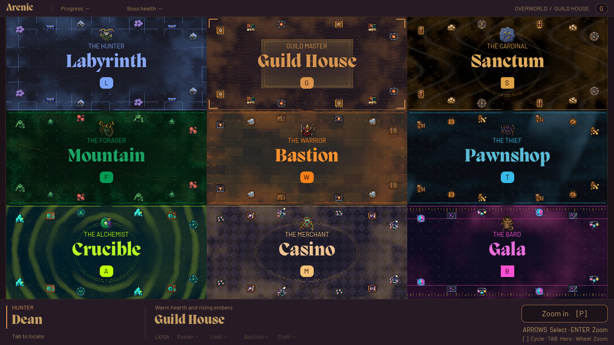
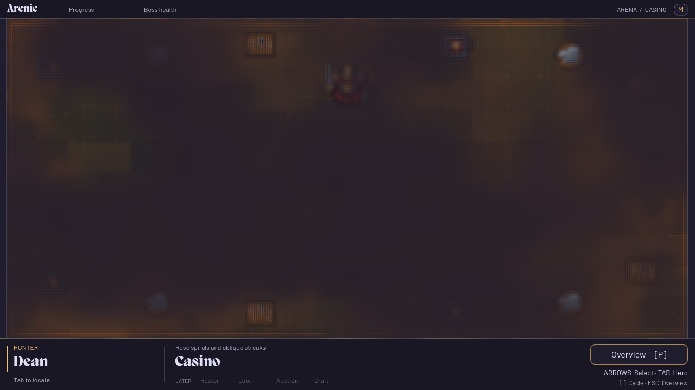

# Arena themes

Each arena keeps its own palette, floor treatment, atmosphere, and border props while sharing the existing overworld, camera, movement grid, and persistent HUD. This is a presentation layer; it adds no collision, combat, or navigation rules.

## Source and palette assignments

The source is [`matthewharwood/arenic` at `60da21575de191461a12f2b2f68a7efd1b254bcd`](https://github.com/matthewharwood/arenic/commit/60da21575de191461a12f2b2f68a7efd1b254bcd). The [arena identity and atmosphere table](https://github.com/matthewharwood/arenic/blob/60da21575de191461a12f2b2f68a7efd1b254bcd/crates/arenic_game/src/arena.rs) supplies the upstream assignments and two voices per arena; the table below identifies the current runtime voices. All twenty color primitives and the structural tokens come from [the Rust palettes](https://github.com/matthewharwood/arenic/blob/60da21575de191461a12f2b2f68a7efd1b254bcd/crates/arenic_game/src/theme/palettes.rs).

| Index | Arena / resource stem | Palette (`theme_id`) | Runtime backdrop / foreground voice |
| ---: | --- | --- | --- |
| 0 | Labyrinth / `labyrinth` | Tokyo Night (`tokyo_night`) | Banded / Streaks |
| 1 | Guild House / `guild_house` | Coffee (`coffee`) | Hearth / Grain |
| 2 | Sanctum / `sanctum` | Luxury (`luxury`) | Billows / Grain |
| 3 | Mountain / `mountain` | Forest (`forest`) | Vertical / Grain |
| 4 | Bastion / `bastion` | Gruvbox Dark (`gruvbox_dark`) | Vertical / Embers |
| 5 | Pawnshop / `pawnshop` | Ayu Dark (`ayu_dark`) | Banded / Sweep |
| 6 | Crucible / `crucible` | Abyss (`abyss`) | Billows / Ripple |
| 7 | Casino / `casino` | Rosé Pine (`rose_pine`) | Spiral / Streaks |
| 8 | Gala / `gala` | Synthwave (`synthwave`) | Billows / Pulse |

Guild House retains Coffee and the Hearth backdrop. Its runtime foreground
uses Grain (style 8) with coverage 0.24 and drift `(0.014, 0.006)`, replacing
the upstream Embers foreground (style 4). The separate under-floor swarm
retains its original 14 rising ember motes. The 2026-09-13 restyle also replaces
the indoor floor and props with the
[outdoor clearing artwork](../assets/environment/guild_clearing/README.md);
the upstream palette and the other eight arenas remain unchanged.

Of these nine palettes, only **Luxury, Forest, and Synthwave** also appear in the source [theme CSS](https://github.com/matthewharwood/arenic/blob/60da21575de191461a12f2b2f68a7efd1b254bcd/theme-css/arenic.css). Their values agree with the Rust definitions. The other six come from Rust, not that CSS file. Gala uses Synthwave, not the retired bespoke `Gala` palette.

The later [`author-layers` tip, `32acbd243471d731bf9e2904d02939b7b07d4bdf`](https://github.com/matthewharwood/arenic/commit/32acbd243471d731bf9e2904d02939b7b07d4bdf), is **16 commits ahead** of that main revision. Its arena/theme data, atmosphere shader, and tile/swarm modules are unchanged, and it adds no `assets/themes/` directory. The useful new contract is its [non-destructive presentation effect tracks](https://github.com/matthewharwood/arenic/blob/32acbd243471d731bf9e2904d02939b7b07d4bdf/crates/arenic_game/src/effect.rs): sample an explicit clock for playback or scrubbing, isolate per-instance material changes, and preserve authored data. Its separate [encounter layer stack](https://github.com/matthewharwood/arenic/blob/32acbd243471d731bf9e2904d02939b7b07d4bdf/crates/arenic_game/src/layer.rs), authoring UI, title choreography, and audio are outside this theme implementation.

## Data and color ownership

Each [world arena resource](../arenic-game/data/world/) references a shared `visual_theme: ArenicArenaTheme` in [`arenic-game/data/themes/`](../arenic-game/data/themes/). The [theme resource script](../arenic-game/scripts/themes/arena_theme.gd) owns palette lookup and conversion. `theme_id` selects the palette identity; `arena_id` and `atmosphere_id` preserve the arena association and row-major index. The resource also holds a short subtitle, border/depth/radii, both voices' style, scale, drift, coverage, vignette and speed, and pinned source paths/revision.

The twenty palette entries remain authored as `Vector3(lightness, chroma, hue_degrees)` in OKLCH. Keys follow the upstream primitive fields: CSS `--color-base-100` becomes `base_100`, alongside `base_content`, `primary`, `primary_content`, and the remaining content/status pairs. Radii and border widths use logical pixels; source CSS rem values use the upstream conversion of 16 pixels per rem.

`color(token, alpha)` converts OKLCH to Oklab, applies the [Oklab inverse matrix](https://bottosson.github.io/posts/oklab/#converting-from-linear-srgb-to-oklab), clips linear RGB channels at the output boundary, then uses Godot's sRGB transfer conversion. `linear_color()` returns the clipped linear representation for explicit linear math. Conversion never changes stored palette values. Godot UI and shader uniforms marked `source_color` receive `color()`; they must not receive a second manually linearized value. HUD, projected labels, and the hero selection marker follow the selected arena's tokens. Hero and boss sprite pixels remain untinted.

## Flat rendering layers

[`ArenicArenaEnvironment`](../arenic-game/scripts/world/arena_environment.gd), mounted by `ArenicArenaView` as `EnvironmentLayers`, owns the decorative layers and each arena's materials. Everything lies on flat XZ planes viewed by the existing orthographic camera.

| Layer | Height above the board | Owner |
| --- | ---: | --- |
| Backdrop | −0.02 | [Atmosphere shader](../arenic-game/shaders/themes/arena_atmosphere.gdshader) on one arena-sized plane |
| Sky-swarm | −0.005 | [119 bounded GPU motes](../arenic-game/scripts/themes/arena_swarm.gd) across nine arenas |
| Floor | 0 | [Surface shader](../arenic-game/shaders/themes/arena_surface.gdshader) overriding the arena's tile material |
| Foreground veil | 0.002 | Second atmosphere plane, with sparse edge effects |
| Border props | 0.004 | Twelve fixed `Sprite3D` decorations in each of eight boss arenas; 96 total |
| Guild clearing paths / trees | 0.001 / 0.007 | Bounded authored path stamps and 53 trees from `guild_clearing.tres` |
| Boss / hero | 0.01 / 0.025 | Existing actor views above the environmental layers |

The floor retains **66 × 31 real tile planes**, 2,046 per arena, at 0.25 world units each. Close view at the fixed 1280 × 720 logical viewport displays each cell at **19 × 19 pixels**. The surface shader quantizes to that raster. Eight arena floors place one center dot at local pixel `(9, 9)`; Guild House samples the four native Aseprite grass variants without center dots, architectural seams or a perimeter frame. Earth paths are separate transparent overlays. Architectural seams and ornaments elsewhere remain decoration, not additional movement cells. Per-instance coordinates let patterns continue across tile boundaries; the immutable white texture remains a fallback. Overview reduces the same artwork to one-third scale.

Eight floor signatures follow the branch's [canonical arena model](https://github.com/matthewharwood/arenic/blob/32acbd243471d731bf9e2904d02939b7b07d4bdf/_docs/arena_model.go): Labyrinth's static cyan sightline, Sanctum's gold rings, Mountain's off-axis fault, Bastion's anvil hexagon, Pawnshop's warm torch seam, Crucible's alchemical sigil, Casino's asynchronous gold/cyan sparkles, and Gala's equalizer and pulsing seams. Guild House replaces its former hearth ring with native grass and earth paths. Casino's glints have separate phases rather than Gala's shared beat.

Atmosphere uses fixed shader fields, sparse procedural cells, and a fixed MultiMesh of 10–16 sky-swarm motes per arena (119 total), with no runtime spawning. The [swarm shader](../arenic-game/shaders/themes/arena_swarm.gdshader) preserves the source counts, nominal scales, phases and motion equations, flattens vertical lift into screen-plane motion, and confines the result to an outer ellipse. Darts patrol Labyrinth; the retained under-floor ember field rises in Guild House; gilt flakes descend in Sanctum; spores drift through Mountain; cinders churn in Bastion; darts pause and dart in Pawnshop; bubbles oppose each other in Crucible; coins tumble in Casino; confetti follows Gala’s rhythm. There are two atmosphere planes per arena; time advances a bounded presentation clock and hidden arenas skip material uploads. These effects never update hero state or consume gameplay randomness. The eight boss arenas retain **96 fixed border-prop instances**, outside the central travel corridors and without collision. Guild House instead mounts 53 authored trees and bounded earth-path stamps through `ArenicGuildClearingView`; its tavern and gathering-site views have their own art resources. These scenery pixels do not define gameplay collision. The foreground is below actor sprites and does not recolor them. Transparent material priorities explicitly order backdrop (−30), swarm (−20), floor (−10), foreground (−5), then the existing actors/props (0); clearing paths use −8 and trees −1 between those layers; GPU vertex displacement alone is not used to determine draw order.

Each environment exposes `atmosphere_time` in seconds, `atmosphere_playing`, and `effect_strength` clamped to 0–1, including scripted assignments. Set `atmosphere_playing = false` before a future `AnimationPlayer` seeks or animates `atmosphere_time`; a paused visible arena still uploads its clock and strength each frame. The floor and both atmosphere materials receive the same `atmosphere_time` and `strength` uniforms. Resuming advances the clock with the existing one-hour wrap. Strength scales atmospheric color effects, foreground opacity, and animated floor accents without changing actor or palette data. Each arena owns its materials, so seeking or fading one environment leaves the others independent.

Arena nodes stay mounted during zoom and sequence camera moves. `GameShell` still owns stage replacement and the persistent HUD; navigation or a sequence exclusively owns the camera. Theme rendering does not replace those contracts or introduce cinematic content. See [overworld scene and choreography ownership](overworld.md#optional-sequences-and-camera-ownership).

## Title ink and navigation dissolve

Overview names use each arena's dominant `primary` color, softened with 14% `base_content` and then 8% `secondary`. Casino consequently uses warm Rosé Pine gold. A restrained dark shadow and radial backplate keep the names legible without another text shader. Measured text widths and projected card bounds are cached; static camera frames do not repeat label layout, font overrides, or drawing.

The former whiteout came from hiding the departing arena as soon as selection changed, before the camera reached the destination. The stage now retains all nine bounded arenas during camera motion or sequence ownership; normal renderer frustum culling still applies. Once navigation settles, CPU visibility uses the actual four viewport corner rays, including resized fits. Picking follows visible arena geometry, so a crossed arena can be clicked to retarget. The world's clear color also follows the selected dark theme surface.

[`ArenicArenaTransition`](../arenic-game/scripts/world/arena_transition.gd) listens to the camera's existing 0.55-second motion rather than creating another tween. Its [fog shader](../arenic-game/shaders/themes/arena_transition.gdshader) draws above map labels and below the persistent HUD, clipped to the world rectangle. A fixed nine-tap tent blur and two value-noise octaves dissolve the world through dark theme-colored mist. Rapid retargeting preserves visible fog density, color and cloud position; cancellation and sequence ownership leave no stale overlay.

The cost is bounded to one rectangular `BackBufferCopy` and one canvas draw while moving. Samples are clamped inside the copied region, following [Godot's screen-reading shader rules](https://docs.godotengine.org/en/stable/tutorials/shaders/screen-reading_shaders.html). There are no mipmaps, extra viewports, frame readbacks, spawned particles or per-frame overlay processing. At rest both the copy and draw are disabled. One identity pass during world loading primes the GPU pipeline before interactive navigation; headless checks skip that render-only preparation.

## Native decoration assets

Editable masters live at `assets/environment/<arena_id>/<arena_id>_decorations.aseprite`: nine files, each with four layers and three tagged, static 76 × 76 prop frames. Their `(38, 38)` pivot and `pixel_size = 0.25 / 19` give each canvas a four-cell footprint. These **27 native prop studies are a creative 2D interpretation** of the themes. The 24 props for the eight boss arenas remain in use; Guild House’s three indoor studies remain preserved source and atlas references, replaced in the live clearing by its dedicated outdoor assets. They are not the canonical flora/fauna named in the reference's arena model, which specifies placeholder primitives for its own prop identities.

[`build-arena-decorations.lua`](../assets/pipeline/build-arena-decorations.lua) uses Aseprite's native API and the authored [OKLCH material palette](../assets/environment/palette.oklch.json). Export reopens the saved masters and writes the [228 × 684 runtime atlas](../arenic-game/assets/environment/arena_decorations.png), [frame metadata](../arenic-game/assets/environment/arena_decorations.json), previews, and [native readback](../assets/environment/native-readback.json). Atlas rows follow the table above; columns hold each arena's three props. Use its `export_only=true` mode after native edits to preserve those edits when rebuilding exports.

Godot uses `AtlasTexture` regions with nearest filtering, lossless import, no mipmaps, and a half-pixel offset for even-sized canvases. Each of the eight boss arenas repeats its three authored props at twelve fixed border positions. Guild House uses the separate [clearing contract](../assets/environment/guild_clearing/README.md), with Inspector-authored trees and paths, native source-site art, a 247 × 171 tavern and the seated 38 × 38 Keeper. Source masters and [review previews](../assets/environment/previews/) remain outside the Godot project; runtime PNG/metadata remain under `arenic-game/assets/environment/`.

## Historical validation

The following records predate the 2026-09-13 outdoor-clearing restyle. Their
counts and captures describe those tested revisions, including Guild House’s
former indoor presentation; they do not certify the current clearing. The
initial [validation record](arena-theme-validation.json) is dated 2026-09-10.

All nine checks passed in an isolated project snapshot on Godot 4.7.2: grid (354 assertions), camera (18 inset fits and round trips), scene flow (98), hero rules (112), hero flow (112), boss catalogue (193), theme data (461), arena tiles (173, covering all 18,414 placements), and presentation (2,244). Import and runtime logs contained no script or shader errors. The source-side assets were made available beside the isolated project so catalogue provenance checks resolved correctly.

Those presentation checks covered isolated materials, all nine styles, 108 native props, 119 bounded swarm instances, exact layer priority, actor clearance, unchanged viewport bounds, native prop alignment, and pause/seek/fade/resume without resource reallocation or cross-arena changes. The native Aseprite export also passed saved-master readback and byte-identical re-export checks.

Actual Godot Play was exercised through the title Start button, character selection, Guild House focus and keyboard movement. All nine arenas were visually inspected at native 1280 × 720. Four sampled centers per arena rendered as isolated single pixels at the expected 19-pixel spacing. The selected Hunter’s 159 opaque pixels matched its source frame byte for byte; another capture confirmed atmospheric motion without any change to the hero raster. These are rendered samples, not an exhaustive pixel test of every animated state.

A short local Apple M4 Max / Metal Forward+ sample observed 120 fps in overview and focus, with p95 frame intervals of 9.42 ms and 8.87 ms respectively. This is host-specific evidence, not a performance guarantee for other systems. Details and counts are retained in [the validation record](arena-theme-validation.json).

After the title/transition changes, all nine suites passed again, plus **418 transition assertions** covering long pans, rapid replacement, blur continuity, cancel/no-op/zoom reversal, sequence ownership, resize, mouse retargeting, retained stage/HUD identity and disabled idle work. The live renderer showed palette-colored overview labels and a fog-blurred world with a sharp HUD; runtime logs had no script or shader errors.

The reproducible [transition benchmark](../arenic-game/tests/themes/transition_benchmark.gd) samples identical routes through all nine arenas with and without the veil/copy, including rapid changes and the first animated zoom. On this M4 Max / Metal host at native 1280 × 720, the final effect run recorded **642 intervals: p95 9.975 ms, p99 11.256 ms, maximum 16.726 ms**. One interval exceeded the 16.67 ms target by 0.056 ms; none exceeded 20 ms. The first animated frame was **8.445 ms**, with zero new pipeline compilations. Before prewarming, first use was 42.437 ms and compiled one canvas pipeline. The control route's p95 was 10.400 ms; VSync pacing and ordinary host variance mean this is not an isolated measurement of GPU cost. See [the full final sample](arena-transition-benchmark.json). No universal 60 fps guarantee is inferred from this short local run.

Run from the repository root with an installed Godot executable, while other game instances are stopped:

```sh
godot --headless --path arenic-game --script res://tests/world/transition_checks.gd
godot --path arenic-game --script res://tests/themes/transition_benchmark.gd
```

## Historical runtime captures

These captures were made before the 2026-09-13 outdoor-clearing restyle.
The Guild House image shows the earlier indoor presentation.





Native close views: [Guild House](images/arena-themes/guild_house.png), [Labyrinth](images/arena-themes/labyrinth.png), [Sanctum](images/arena-themes/sanctum.png), [Mountain](images/arena-themes/mountain.png), [Bastion](images/arena-themes/bastion.png), [Pawnshop](images/arena-themes/pawnshop.png), [Crucible](images/arena-themes/crucible.png), [Casino](images/arena-themes/casino.png), [Gala](images/arena-themes/gala.png).
