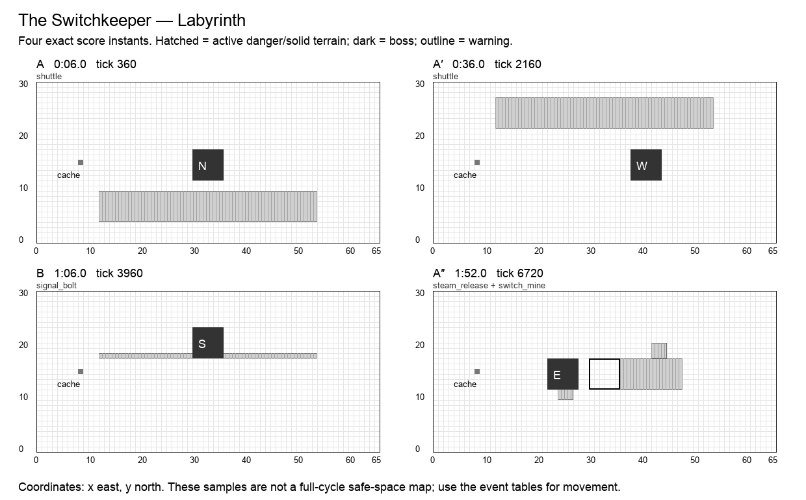

# The Switchkeeper

**Labyrinth · Hunter boss · Normal · 120 seconds / 7,200 ticks · six moves · 25 authored events.** Design revision `v2.0-draft.1`. Shared rules: [CONTRACT](CONTRACT.md). All numbers are proposed Arenic tuning, not WoW values or current runtime behavior.

## Historical precedent and creative direction

The primary precedent is **Operator Thogar**, Blackrock Foundry, Warlords of Draenor. Scope: Normal/Heroic, 2015; Mythic considered separately.

Thogar uses four tracks and a repeatable train arrival sequence, with troop arrivals and blocked space creating prioritization. The documented original train sequence is fixed per pull rather than a looping two-minute pattern. Arenic borrows anticipation of cross-traffic and station occupancy; it authors a new loop and removes kill-dependent departures and the all-track enrage.[^1]

A colossal trapper operates four luminous rail beds. The boss is the stationmaster; the moving danger is traffic. Sidings give uninterrupted work, but the best firing line is on the far side of the next departure.

**Unique decision — CROSS:** Trains are spectral web shuttles with a finite hazard rectangle, never target-seeking traps. Optional projectile cover and preparatory floor damage matter between departures. A cross-platform swap in B reverses the direction of study without changing the map.

## Arena specification

Four six-cell tracks occupy y=4…9, 10…15, 16…21, 22…27 across x=12…53. Their painted bed is decorative except during a listed shuttle impact. West/east concourses x=9…11 and 54…56 stay open. Crossings use y=3 or y=28. The working siding beside the boss stays distinct from a currently active track. The four track masks are explicitly selected in every phrase; generic mirroring never moves a train off its painted track.

The 66 × 31 coordinate system, six-cell boss footprint, recovery perimeter, forty distinct start slots, and cache at `(8,15)` use [the shared geometry contract](CONTRACT.md). A nonblocking cache supplies personal deterministic Transmute entitlements. Terrain and graphics are distinct: only a `terrain` event changes walkability; only printed impact masks deal boss damage. Fields use integer cell sets.

A′ mirrors applicable masks across x=32.5; B’s geometry and reordered events are explicitly baked into the data. The table below is authoritative even when a prose direction describes the opening motif. A″ restores the opening masks and adds exactly one listed overlap. Its final transfer occurs at 1:53, allowing six full seconds without boss damage before the seam.

The diagram samples exact instants; it does not mark permanently safe working space.

## Composition

| Phrase | Interval | Musical role | Player task |
| --- | --- | --- | --- |
| A | 0:00–0:30 | statement | Read lower traffic while the boss faces north. |
| A′ | 0:30–1:00 | variation | Reverse the lane order and expose the eastern siding. |
| B | 1:00–1:30 | contrast | Alternate cross-traffic with the signalbox, then transfer back through center. The bridge’s exact reordered attacks appear in the event table. |
| A″ | 1:30–2:00 | return | Return to the opening order, adding one previously taught grenade while traffic clears. The event labeled overlap is simultaneous with a familiar move, with its own mask and damage. |

The opening six seconds have no boss damage. Phrases are clock transitions, never damage phases. The six move names remain recognizable through the variations; changed masks and deliberate overlaps supply complexity. The final opportunity window runs until the seam even where it is longer than an earlier instance of that move.

## Six moves

| Move | Damage / behavior | Counterplay and invariant |
| --- | --- | --- |
| **Web Shuttle** (`shuttle`) | crush; crush | A spectral train occupies its entire painted track rectangle for 60 ticks. Leave the marked track or reach a concourse; defensive spells cannot absorb it. |
| **Signal Bolt** (`signal_bolt`) | 1 HP; projectile | A west-to-east warning line resolves once; Block faces west, a Border or Misdirection crossing may intercept it. |
| **Switch Mine** (`switch_mine`) | 2 HP; floor | Two fixed 3×3 pads explode once. Both the pads and their numerical IDs are shown; neither follows a hero. |
| **Double Departure** (`double_departure`) | crush; crush | Two separated tracks run simultaneously for 60 ticks. At least one central track and both concourses remain open. |
| **Steam Release** (`steam_release`) | 1 HP; cone, expose | A rectangular east- or west-facing steam fan wounds and applies Exposure; walk around its end or use frontal cover. |
| **Siding Change** (`siding_change`) | optional window; window | Boss phase-transfers to the next siding, then offers one extra damage on each actor’s first direct hit during the six-second stop. Every transfer is warned for 180 ticks. |

Every impact has a warning start, resolve tick, and end tick. A rectangle is `[x,y,width,height]`, inclusive at its origin and exclusive at its far edge. Ordinary attacks warn for at least two seconds; crush, construction and transfers warn for three. Exposure means one personal delayed wound, as defined in CONTRACT. When two events share a timestamp, both occur in stable event-ID order.

## Complete event score

`End` is exclusive. A one-tick impact ends 1/60 second after the displayed impact timestamp; the exact end tick removes ambiguity. Windows without masks use their explicit condition below, not an invisible arena-wide attack.

| Event | Warning | Impact | Tick | End tick | Move | Exact masks / extra payload |
| --- | --- | --- | ---: | ---: | --- | --- |
| `hunter.1.1` | 0:03 | 0:06 | 360 | 420 | Web Shuttle | `12,4,42,6` |
| `hunter.1.2` | 0:08 | 0:10 | 600 | 601 | Signal Bolt | `12,12,42,1`; incoming west |
| `hunter.1.3` | 0:12 | 0:14 | 840 | 841 | Switch Mine | `24,10,3,3`; `42,18,3,3` |
| `hunter.1.4` | 0:15 | 0:18 | 1080 | 1140 | Double Departure | `12,4,42,6`; `12,22,42,6` |
| `hunter.1.5` | 0:20 | 0:22 | 1320 | 1321 | Steam Release | `36,12,12,6`; incoming west |
| `hunter.1.6` | 0:21 | 0:24 | 1440 | 1800 | Siding Change | —; boss → (38, 12), w |
| `hunter.2.1` | 0:33 | 0:36 | 2160 | 2220 | Web Shuttle | `12,22,42,6` |
| `hunter.2.2` | 0:38 | 0:40 | 2400 | 2401 | Signal Bolt | `12,12,42,1`; incoming east |
| `hunter.2.3` | 0:42 | 0:44 | 2640 | 2641 | Switch Mine | `39,10,3,3`; `21,18,3,3` |
| `hunter.2.4` | 0:45 | 0:48 | 2880 | 2940 | Double Departure | `12,4,42,6`; `12,16,42,6` |
| `hunter.2.5` | 0:50 | 0:52 | 3120 | 3121 | Steam Release | `18,12,12,6`; incoming east |
| `hunter.2.6` | 0:51 | 0:54 | 3240 | 3600 | Siding Change | —; boss → (30, 18), s |
| `hunter.3.1` | 1:04 | 1:06 | 3960 | 3961 | Signal Bolt | `12,18,42,1`; incoming west |
| `hunter.3.2` | 1:08 | 1:10 | 4200 | 4201 | Switch Mine | `24,18,3,3`; `42,10,3,3` |
| `hunter.3.3` | 1:11 | 1:14 | 4440 | 4500 | Web Shuttle | `12,10,42,6` |
| `hunter.3.4` | 1:16 | 1:18 | 4680 | 4681 | Steam Release | `36,13,12,6`; incoming west |
| `hunter.3.5` | 1:19 | 1:22 | 4920 | 4980 | Double Departure | `12,10,42,6`; `12,22,42,6` |
| `hunter.3.6` | 1:21 | 1:24 | 5040 | 5400 | Siding Change | —; boss → (22, 12), e |
| `hunter.4.1` | 1:33 | 1:36 | 5760 | 5820 | Web Shuttle | `12,4,42,6` |
| `hunter.4.2` | 1:38 | 1:40 | 6000 | 6001 | Signal Bolt | `12,12,42,1`; incoming west |
| `hunter.4.3` | 1:42 | 1:44 | 6240 | 6241 | Switch Mine | `24,10,3,3`; `42,18,3,3` |
| `hunter.4.4` | 1:45 | 1:48 | 6480 | 6540 | Double Departure | `12,4,42,6`; `12,22,42,6` |
| `hunter.4.5` | 1:50 | 1:52 | 6720 | 6721 | Steam Release | `36,12,12,6`; incoming west |
| `hunter.4.overlap` | 1:50 | 1:52 | 6720 | 6721 | Switch Mine | `24,10,3,3`; `42,18,3,3` |
| `hunter.4.6` | 1:50 | 1:53 | 6780 | 7200 | Siding Change | —; boss → (30, 12), n |

## Optional reward condition

The first original direct hit by each actor while Siding Change is active earns +1 damage.

Each reward can be claimed once per actor per window. No successful bonus is required for ordinary damage or the next phrase. Direct-hit definitions and precedence are in [the implementation contract](IMPLEMENTATION.md#exact-window-conditions); the final window ends at tick 7,200.

## Boss pose and target access

| From | Origin | Facing | Rear witness cell |
| --- | --- | --- | --- |
| 0:00 / tick 0 | `30,12` | n | `30,11` |
| 0:24 / tick 1440 | `38,12` | w | `44,12` |
| 0:54 / tick 3240 | `30,18` | s | `30,24` |
| 1:24 / tick 5040 | `22,12` | e | `21,12` |
| 1:53 / tick 6780 | `30,12` | n | `30,11` |

The target stays grounded during these v2 transfers. A pose is a pure function of this track and cycle tick. Direct projectiles use accepted aim cells; attached DOTs use identity. Each rear witness cell is outside the boss footprint. A player may stand at any other valid adjacent rear cell to reserve a nonconflicting route.

## Walking solution, recovery, and recorded roles

The west concourse and perimeter always remain a walking alternative. At each Siding Change, approach the announced rear after arrival; do not stand on the arriving 6×6 footprint. Between 24–30 seconds the first rear is east of the new footprint, at x=44. A ranged actor may stay in the west concourse and wait for a closer phase instead of crossing a train.

The conservative walking validator finds a zero-hazard cardinal route from `(29,2)`, holds these rear cells for 75 ticks, and returns to `(29,2)` before the seam:

- 0:25.5, tick 1530: `44,12`.
- 0:55.5, tick 3330: `30,24`.
- 1:25.5, tick 5130: `21,12`.
- 1:54.5, tick 6870: `30,11`.

The [full movement witness](data/walking-witnesses.json) is executable planning data at one cardinal cell per 15 ticks. It does not use portals, protection, attunement, or bonus objectives. It establishes a useful solo movement baseline, not a DPS rotation or a simulation of forty heroes. Copying it to multiple heroes without reserving separate cells causes hero contact. Forager setup and player-created friendly fire require the additional fixtures below.

A first recording should claim an approach lane and one working station. A second recording should add a different station or a support adjacency, never simply overlay the first route. Reserve portals and rear cells before adding dense support clusters. A support can widen a damage window, but none is required to make the boss advance.

## All 32 hero abilities

`+` means a strong encounter-specific opportunity, `=` an ordinary useful role, `−` a real positional/timing disadvantage with a stated usable alternative. These are design judgments, not measured DPS. The [ability contract](ABILITIES.md) supplies exact ranges, cooldowns, costs, deterministic changes, and live-versus-planned status.

| Hero | Ability / status | Fit | Opportunity, cost, and fallback |
| --- | --- | --- | --- |
| Hunter | Auto Shot (`auto_shot`); live | + | Fire from a siding before Shuttle; hold shots whose flight crosses Siding Change. |
| Hunter | Poison Shot (`poison_shot`); planned | + | Apply before a siding transfer; plan recoil onto a safe tile outside the next track. |
| Hunter | Sniper (`sniper`); planned | + | Long concourse sightlines give safe ranged work; transfers still require correct impact timing. |
| Hunter | Trap (`trap`); planned | + | Plant at a future siding during absence; Shuttle timing never depends on detonation. |
| Warrior | Bash (`bash`); live | = | Use the stationary siding; chasing the boss across active tracks costs more than waiting. |
| Warrior | Block (`block`); planned | + | Face west for Signal Bolt, east for its mirrored repeat; trains remain crush hazards. |
| Warrior | Taunt (`taunt`); planned | = | Guard a channeling ally from Signal Bolt; a pledge cannot draw a train off their recording. |
| Warrior | Bulwark (`bulwark`); planned | + | Cover Steam Release at its fixed fan; place the wall outside the next train track. |
| Thief | Backstab (`backstab`); live | + | Wait beside the next siding’s rear; do not follow the visually moving sprite through a train. |
| Thief | Shadow Step (`shadow_step`); planned | + | Cross one threatened track quickly; arrive outside crush masks before the train becomes active. |
| Thief | Misdirection (`smoke_screen`); planned | + | Convert Signal Bolt into damage without altering its lane; the following Shuttle is unchanged. |
| Thief | Pickpocket (`pickpocket`); planned | = | A six-second siding dwell fits the full hold, but approach after the transfer completes. |
| Alchemist | Acid Flask (`acid_flask`); live | + | Throw onto the next siding; keep pools away from cross-track approach routes and shared rear cells. |
| Alchemist | Ironskin Draft (`ironskin_draft`); planned | = | Work through Steam Release or a mine wound; no armor can survive a Shuttle crush. |
| Alchemist | Siphon (`siphon`); planned | = | Channel from a siding after traffic clears; use boss mode solo, never drain a last-HP ally. |
| Alchemist | Transmute (`transmute`); planned | = | Use the west cache while a train owns the center; return with a fixed guard for Steam. |
| Cardinal | Sacrifice (`heal`); live | + | Full siding dwell supports several Sacrifice pulses; end before traffic blocks your approach. |
| Cardinal | Barrier (`barrier`); planned | = | Shield a wounded crossing partner before Steam Release; trains bypass the shield. |
| Cardinal | Beam (`beam`); planned | = | Line up the boss from a clear siding; a one-second aim cannot run through a train crossing. |
| Cardinal | Resurrect (`resurrect`); planned | = | Revive after a train clears, preserving the staff cursor; empty-corpse fallback gives a Steam shield. |
| Bard | Cleanse (`cleanse`); live | + | Clear Steam Exposure beside the siding, then let attached damage follow its next transfer. |
| Bard | Dance (`dance`); planned | - | An eight-tap performance spans traffic decisions; use the six-second siding pause for all taps. |
| Bard | Mimic (`mimic`); planned | = | Stand adjacent to a ranged siding partner; count ten direct hits, never copied mines or trains. |
| Bard | Helix (`helix`); planned | = | Regenerate a siding group or bank a Haste hit; neither mode speeds a track crossing. |
| Forager | Dig (`dig`); live | + | Prepare future sidings, not transit tracks; ground damage needs accumulated boss overlap. |
| Forager | Boulder (`bolder`); planned | = | Roll parallel to a safe track after traffic; the stone never pushes the train. |
| Forager | Border (`border`); planned | + | Dig a safe siding tile, then deflect Signal Bolt; never place the plan on a crush track. |
| Forager | Symbiosis (`mushroom`); planned | - | Traffic separates work groups; plant in a siding and retain self-healing even without allies. |
| Merchant | Fortune (`fortune`); live | - | Twenty-second commitment needs near-boss route planning across sidings; skip optional dividend actions. |
| Merchant | Coin Toss (`coin_toss`); planned | - | Long charges can outlast a siding; use a short release or wait for its posted dwell. |
| Merchant | Dice (`dice`); planned | = | Build visible pips during traffic downtime, then spend on a siding direct hit. |
| Merchant | Vault (`vault`); planned | - | A fixed zone can outlive the siding position; place for the next known stop. |

Every pair of these abilities is governed by the [interaction pipeline](INTERACTIONS.md). A support effect cannot move the boss score, a copied hit cannot copy itself, and a bonus cannot multiply another bonus. The same-caster active-cast restriction remains meaningful: in particular, Fortune competes with that Merchant’s other actions while its aura is active.

## Presentation and authored assets

Use four visibly numbered rail beds, gates that brighten before departure, a low train silhouette, a line cue for Signal Bolt, two individually numbered mine pads, and an unmistakable steam fan. Separate all warnings from the boss transfer outline.

All warning graphics must show the actual mask at native gameplay scale. The six move cues need distinct silhouettes or symbols in addition to sound. Existing boss appearances may be reused; this specification does not claim new attack art, sounds, or engine resources have been produced.

## Implementation and acceptance

Train occupancy is a timed hazard, not physics or a line-of-sight wall. Do not accidentally make the scenic rails impassable. A shortened travel animation must not shorten the 180-tick transfer warning.

- **Train boundary:** At tick 359 the first Shuttle is warning-only; at 360 its entire [12,4,42,6] is crush. A hero at (11,6) is safe, at (12,6) is defeated. Protection never changes that distinction.
- **Siding shot:** Fire at an old aim cell just before tick 1440; a hit resolving after the footprint transfer misses unless the new footprint also covers that cell. No retargeting and no phantom damage report.
- **Final overlap:** At tick 6720, Steam Release and the additional Switch Mine have separate event IDs, masks, tags and damage. A defense for Steam cannot erase the mine.
- **Future ground:** Dig or Trap in the future eastern footprint before 24 seconds; confirm deterministic overlap/trigger after arrival and no change in the next train.

Also run the shared empty-roster/full-roster boss-score checksum, 100-cycle restart comparison, boundary save/load, simultaneous-event ordering, viewport/audio independence, and source/loaded-resource parity fixtures in [IMPLEMENTATION](IMPLEMENTATION.md). These are required future runtime gates. The delivered static validator checks the authored design data and solo walking witnesses; it does not claim those Godot tests already passed.

Per-arena state consists only of the shared clock/revision, active actor effects and budgets, earned personal window flags, and existing combat/recording authority. Pose, warning, visual animation, and terrain shape are derived from the score. A window claim, portal cooldown, attunement, or overlap counter that affects outcomes must be captured/restored through the versioned save boundary.

No Heroic/Mythic timeline is implied by this Normal score. A harder tier requires a separate authored score and the same coverage/navigation gates; increasing damage or narrowing a lane under an existing recording’s fingerprint is forbidden.

## Sources

[^1]: Operator Thogar, [Blackrock Foundry encounter guide](https://www.icy-veins.com/wow/operator-thogar-strategy-guide-normal-heroic-mythic); BigWigs Mods, [pinned encounter source](https://github.com/BigWigsMods/BigWigs_WarlordsOfDraenor/blob/ad94f51d9c2c44cd4afdc957e4f18f226a462845/BlackrockFoundry/Thogar.lua). Scope/difficulty distinctions and rejected alternatives are in [research](research/README.md). Arenic adaptation, timing, geometry, and tuning are original design decisions.
