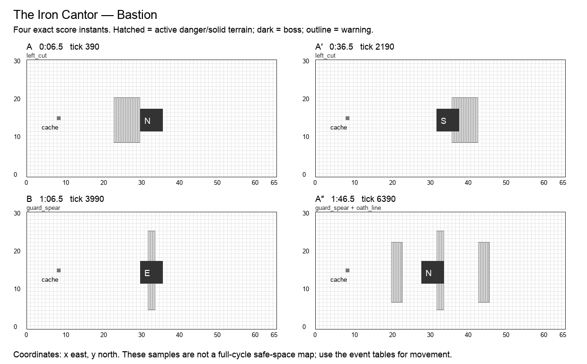

# The Iron Cantor

**Bastion · Warrior boss · Normal · 120 seconds / 7,200 ticks · six moves · 25 authored events.** Design revision `v2.0-draft.1`. Shared rules: [CONTRACT](CONTRACT.md). All numbers are proposed Arenic tuning, not WoW values or current runtime behavior.

## Historical precedent and creative direction

The primary precedent is **Will of the Emperor**, Mogu’shan Vaults, Mists of Pandaria. Scope: Normal five-strike combo; Heroic’s longer combo is not imported.

Will of the Emperor rewards avoiding Devastating Combo with Opportunistic Strike while adds create separate pressures. Normal and Heroic have different combo lengths; references to ten attacks belong to Heroic. Arenic takes the dodge-and-answer relationship, not the original encounter’s adds, taunt behavior, or numerical damage.[^1]

An armored duelist recites a visible sequence of left cut, right cut, retreat, and answer. Space close to the boss is more readable than the perimeter. The central lesson is to move the minimum distance and return to the exposed rear.

**Unique decision — ANSWER:** One immortal duelist replaces two bosses. Every cleave direction is printed in advance. Completing a phrase provides an optional personal riposte; failure loses only the reward or health, never prevents the next phrase.

## Arena specification

A central dueling square spans x=22…43,y=6…25. West/east flanks occupy x=23…29 and 36…42; north/south retreat strips y=6…8 and 21…23. The four-square motif is orientation relative to the fixed boss origin, not to the controlled hero.

The 66 × 31 coordinate system, six-cell boss footprint, recovery perimeter, forty distinct start slots, and cache at `(8,15)` use [the shared geometry contract](CONTRACT.md). A nonblocking cache supplies personal deterministic Transmute entitlements. Terrain and graphics are distinct: only a `terrain` event changes walkability; only printed impact masks deal boss damage. Fields use integer cell sets.

A′ mirrors applicable masks across x=32.5; B’s geometry and reordered events are explicitly baked into the data. The table below is authoritative even when a prose direction describes the opening motif. A″ restores the opening masks and adds exactly one listed overlap. Its final transfer occurs at 1:53, allowing six full seconds without boss damage before the seam.

The diagram samples exact instants; it does not mark permanently safe working space.

## Composition

| Phrase | Interval | Musical role | Player task |
| --- | --- | --- | --- |
| A | 0:00–0:30 | statement | West cut, east cut, retreat, return. |
| A′ | 0:30–1:00 | variation | Rotate the combo by 180 degrees, preserving its spoken order. |
| B | 1:00–1:30 | contrast | Use a long guard-and-projectile bridge rather than a rapid footwork phrase. The bridge’s exact reordered attacks appear in the event table. |
| A″ | 1:30–2:00 | return | Return to the opening facing with both earlier retreat cues visible. The event labeled overlap is simultaneous with a familiar move, with its own mask and damage. |

The opening six seconds have no boss damage. Phrases are clock transitions, never damage phases. The six move names remain recognizable through the variations; changed masks and deliberate overlaps supply complexity. The final opportunity window runs until the seam even where it is longer than an earlier instance of that move.

## Six moves

| Move | Damage / behavior | Counterplay and invariant |
| --- | --- | --- |
| **Left Cut** (`left_cut`) | 2 HP; cone | Strike the printed side rectangle once (west in the opening). Walk outside the fan or use an appropriately facing Bulwark; Block only catches projectiles. |
| **Right Cut** (`right_cut`) | 2 HP; cone | Strike the complementary printed side rectangle once (east in the opening). This is a fresh fixed event, not a tracking continuation. |
| **Heel Stamp** (`heel_stamp`) | 2 HP; floor | Strike a rectangular ring around the boss, leaving the outer retreat strip safe. No jump button is required. |
| **Guard Spear** (`guard_spear`) | 1 HP; projectile, expose | A narrow north-to-south spear tests a directionally prepared shield. Its Exposure can be cleansed or healed. |
| **Oath Line** (`oath_line`) | 1 HP; floor | Two lateral strips briefly punish lingering far from the duel. The south retreat remains safe. |
| **Open Guard** (`open_guard`) | optional window; window | Transfer exactly two cells laterally to the next marked origin and turn. For 330 ticks, each actor that avoided this phrase’s first five events gets +1 on its first direct hit; ordinary hits always count. The small transfer exposes new ground for Trap and Dig without becoming a perimeter chase. |

Every impact has a warning start, resolve tick, and end tick. A rectangle is `[x,y,width,height]`, inclusive at its origin and exclusive at its far edge. Ordinary attacks warn for at least two seconds; crush, construction and transfers warn for three. Exposure means one personal delayed wound, as defined in CONTRACT. When two events share a timestamp, both occur in stable event-ID order.

## Complete event score

`End` is exclusive. A one-tick impact ends 1/60 second after the displayed impact timestamp; the exact end tick removes ambiguity. Windows without masks use their explicit condition below, not an invisible arena-wide attack.

| Event | Warning | Impact | Tick | End tick | Move | Exact masks / extra payload |
| --- | --- | --- | ---: | ---: | --- | --- |
| `warrior.1.1` | 0:04.5 | 0:06.5 | 390 | 391 | Left Cut | `23,9,7,12`; incoming east |
| `warrior.1.2` | 0:07.5 | 0:09.5 | 570 | 571 | Right Cut | `36,9,7,12`; incoming west |
| `warrior.1.3` | 0:10.5 | 0:12.5 | 750 | 751 | Heel Stamp | `27,9,12,3`; `27,18,12,3`; `27,12,3,6`; `36,12,3,6` |
| `warrior.1.4` | 0:14.5 | 0:16.5 | 990 | 991 | Guard Spear | `32,5,2,21`; incoming north |
| `warrior.1.5` | 0:19.5 | 0:21.5 | 1290 | 1291 | Oath Line | `20,7,3,16`; `43,7,3,16` |
| `warrior.1.6` | 0:21.5 | 0:24.5 | 1470 | 1800 | Open Guard | —; boss → (32, 12), s |
| `warrior.2.1` | 0:34.5 | 0:36.5 | 2190 | 2191 | Left Cut | `36,9,7,12`; incoming west |
| `warrior.2.2` | 0:37.5 | 0:39.5 | 2370 | 2371 | Right Cut | `23,9,7,12`; incoming east |
| `warrior.2.3` | 0:40.5 | 0:42.5 | 2550 | 2551 | Heel Stamp | `27,9,12,3`; `27,18,12,3`; `36,12,3,6`; `27,12,3,6` |
| `warrior.2.4` | 0:44.5 | 0:46.5 | 2790 | 2791 | Guard Spear | `32,5,2,21`; incoming north |
| `warrior.2.5` | 0:49.5 | 0:51.5 | 3090 | 3091 | Oath Line | `43,7,3,16`; `20,7,3,16` |
| `warrior.2.6` | 0:51.5 | 0:54.5 | 3270 | 3600 | Open Guard | —; boss → (30, 12), e |
| `warrior.3.1` | 1:04.5 | 1:06.5 | 3990 | 3991 | Guard Spear | `32,5,2,21`; incoming north |
| `warrior.3.2` | 1:07.5 | 1:09.5 | 4170 | 4171 | Left Cut | `23,10,7,12`; incoming east |
| `warrior.3.3` | 1:10.5 | 1:12.5 | 4350 | 4351 | Heel Stamp | `27,19,12,3`; `27,10,12,3`; `27,13,3,6`; `36,13,3,6` |
| `warrior.3.4` | 1:14.5 | 1:16.5 | 4590 | 4591 | Right Cut | `36,10,7,12`; incoming west |
| `warrior.3.5` | 1:19.5 | 1:21.5 | 4890 | 4891 | Oath Line | `20,8,3,16`; `43,8,3,16` |
| `warrior.3.6` | 1:21.5 | 1:24.5 | 5070 | 5400 | Open Guard | —; boss → (28, 12), n |
| `warrior.4.1` | 1:34.5 | 1:36.5 | 5790 | 5791 | Left Cut | `23,9,7,12`; incoming east |
| `warrior.4.2` | 1:37.5 | 1:39.5 | 5970 | 5971 | Right Cut | `36,9,7,12`; incoming west |
| `warrior.4.3` | 1:40.5 | 1:42.5 | 6150 | 6151 | Heel Stamp | `27,9,12,3`; `27,18,12,3`; `27,12,3,6`; `36,12,3,6` |
| `warrior.4.4` | 1:44.5 | 1:46.5 | 6390 | 6391 | Guard Spear | `32,5,2,21`; incoming north |
| `warrior.4.overlap` | 1:44.5 | 1:46.5 | 6390 | 6391 | Oath Line | `20,7,3,16`; `43,7,3,16` |
| `warrior.4.5` | 1:49.5 | 1:51.5 | 6690 | 6691 | Oath Line | `20,7,3,16`; `43,7,3,16` |
| `warrior.4.6` | 1:50 | 1:53 | 6780 | 7200 | Open Guard | —; boss → (30, 12), n |

## Optional reward condition

Avoid every damaging mask in the current phrase, including the reprise overlap. Protection does not count as avoidance. The first original direct hit during Open Guard then earns +1 damage. Failure leaves ordinary damage available.

Each reward can be claimed once per actor per window. No successful bonus is required for ordinary damage or the next phrase. Direct-hit definitions and precedence are in [the implementation contract](IMPLEMENTATION.md#exact-window-conditions); the final window ends at tick 7,200.

## Boss pose and target access

| From | Origin | Facing | Rear witness cell |
| --- | --- | --- | --- |
| 0:00 / tick 0 | `30,12` | n | `30,11` |
| 0:24.5 / tick 1470 | `32,12` | s | `32,18` |
| 0:54.5 / tick 3270 | `30,12` | e | `29,12` |
| 1:24.5 / tick 5070 | `28,12` | n | `28,11` |
| 1:53 / tick 6780 | `30,12` | n | `30,11` |

The target stays grounded during these v2 transfers. A pose is a pure function of this track and cycle tick. Direct projectiles use accepted aim cells; attached DOTs use identity. Each rear witness cell is outside the boss footprint. A player may stand at any other valid adjacent rear cell to reserve a nonconflicting route.

## Walking solution, recovery, and recorded roles

The published solo route begins at (29,8). Stand in the south retreat for the first three strikes, then approach the current rear after the spear. Dodging outside melee does not grant a different damage multiplier: enter to spend the one-hit riposte while the guard is open. An actor unable to finish the combo can keep ordinary ranged or floor damage.

The conservative walking validator finds a zero-hazard cardinal route from `(29,2)`, holds these rear cells for 75 ticks, and returns to `(29,2)` before the seam:

- 0:26, tick 1560: `32,18`.
- 0:56, tick 3360: `29,12`.
- 1:26, tick 5160: `28,11`.
- 1:54.5, tick 6870: `30,11`.

The [full movement witness](data/walking-witnesses.json) is executable planning data at one cardinal cell per 15 ticks. It does not use portals, protection, attunement, or bonus objectives. It establishes a useful solo movement baseline, not a DPS rotation or a simulation of forty heroes. Copying it to multiple heroes without reserving separate cells causes hero contact. Forager setup and player-created friendly fire require the additional fixtures below.

A first recording should claim an approach lane and one working station. A second recording should add a different station or a support adjacency, never simply overlay the first route. Reserve portals and rear cells before adding dense support clusters. A support can widen a damage window, but none is required to make the boss advance.

## All 32 hero abilities

`+` means a strong encounter-specific opportunity, `=` an ordinary useful role, `−` a real positional/timing disadvantage with a stated usable alternative. These are design judgments, not measured DPS. The [ability contract](ABILITIES.md) supplies exact ranges, cooldowns, costs, deterministic changes, and live-versus-planned status.

| Hero | Ability / status | Fit | Opportunity, cost, and fallback |
| --- | --- | --- | --- |
| Hunter | Auto Shot (`auto_shot`); live | = | Shoot between cuts; the rear route can spend Open Guard more efficiently than retreating. |
| Hunter | Poison Shot (`poison_shot`); planned | = | Poison persists through facing changes; recoil can put the Hunter into Oath Line. |
| Hunter | Sniper (`sniper`); planned | = | Range avoids cleaves, but Open Guard rewards re-entry rather than permanent disengagement. |
| Hunter | Trap (`trap`); planned | + | Seed the two-cell strip of the next lateral stance; Open Guard’s transfer guarantees a later trigger. |
| Warrior | Bash (`bash`); live | + | Adjacent timing and known facing make the duel a natural work area; Bash never interrupts. |
| Warrior | Block (`block`); planned | = | Guard Spear has a known approach; cleaves need movement or Bulwark instead. |
| Warrior | Taunt (`taunt`); planned | + | Pledge before Left/Right Cut for an aggressive flank partner; two-HP hits retain some risk. |
| Warrior | Bulwark (`bulwark`); planned | + | Prepare a frontal answer to cleaves; rotate the cast orientation for A′. |
| Thief | Backstab (`backstab`); live | + | The fight explicitly exposes authored rears; leave the stamped ring before returning. |
| Thief | Shadow Step (`shadow_step`); planned | = | Recover a missed flank; immunity cannot earn a clean dodge if the combo mask was occupied. |
| Thief | Misdirection (`smoke_screen`); planned | = | Convert Guard Spear; Left Cut and Heel Stamp cannot be reversed. |
| Thief | Pickpocket (`pickpocket`); planned | = | Open Guard offers economic time at the cost of a damage riposte; boss guard stays intact. |
| Alchemist | Acid Flask (`acid_flask`); live | + | The long central dwell rewards eight burns; protect the melee retreat strip from friendly fire. |
| Alchemist | Ironskin Draft (`ironskin_draft`); planned | + | Cover a heavy cut during a committed action; clean-dodge credit still requires avoiding the mask. |
| Alchemist | Siphon (`siphon`); planned | + | Close boss dwell gives a reliable three-pulse self-recovery; cutters still limit greed. |
| Alchemist | Transmute (`transmute`); planned | = | Trade distant-cache travel for a guard before a duel phrase; no loot roll is needed. |
| Cardinal | Sacrifice (`heal`); live | + | Channel from the south retreat between spears; this starter damages the boss and does not heal allies. |
| Cardinal | Barrier (`barrier`); planned | + | A shield absorbs one of a two-HP cleave, preserving a risky melee answer. |
| Cardinal | Beam (`beam`); planned | + | Aim across the boss and a wounded melee partner during Open Guard. |
| Cardinal | Resurrect (`resurrect`); planned | = | Use Open Guard to recover a duelist; the returning staff must still avoid the next cut. |
| Bard | Cleanse (`cleanse`); live | + | Heal melee wounds while stacking damage; avoid clustering heroes onto the same rear tile. |
| Bard | Dance (`dance`); planned | = | Combine taps with deliberate dodge movement, or perform in Open Guard’s quieter interval. |
| Bard | Mimic (`mimic`); planned | + | Frequent Bash/Backstab hits fill the meter; adjacent cells are enough and must not overlap. |
| Bard | Helix (`helix`); planned | + | Sustain adjacent duelists or add one fixed hit charge; recorded dodge timings never change. |
| Forager | Dig (`dig`); live | + | Prepare the exposed two-cell strip while the boss occupies its old stance; repeated dwell banks overlap. |
| Forager | Boulder (`bolder`); planned | + | A stable boss footprint rewards a straight stone; start with the guaranteed two rocks. |
| Forager | Border (`border`); planned | = | Guard Spear gives a predictable defensive line; Border does not absorb cleave cones. |
| Forager | Symbiosis (`mushroom`); planned | + | Stable duel geography rewards a mature healing node just beyond the stamped ring. |
| Merchant | Fortune (`fortune`); live | + | Stable melee proximity pays regular aura pulses; retreat from Heel Stamp before returning. |
| Merchant | Coin Toss (`coin_toss`); planned | = | Charge in a retreat strip, release into the stable boss; direct hits may spend Open Guard. |
| Merchant | Dice (`dice`); planned | + | Prepare three pips before Open Guard; capped bonus priority prevents multiplier spikes. |
| Merchant | Vault (`vault`); planned | + | Stable flank work fits the ten-second zone; do not cover the unsafe stamp ring. |

Every pair of these abilities is governed by the [interaction pipeline](INTERACTIONS.md). A support effect cannot move the boss score, a copied hit cannot copy itself, and a bonus cannot multiply another bonus. The same-caster active-cast restriction remains meaningful: in particular, Fortune competes with that Merchant’s other actions while its aura is active.

## Presentation and authored assets

Use left/right weapon anticipation, a heel lift for the stamped ring, a spear-line marker, and a lowered shield for Open Guard. Put the next two cuts beside the boss; never rely on seeing its back through the sprite alone.

All warning graphics must show the actual mask at native gameplay scale. The six move cues need distinct silhouettes or symbols in addition to sound. Existing boss appearances may be reused; this specification does not claim new attack art, sounds, or engine resources have been produced.

## Implementation and acceptance

Rotated masks must be baked into data. Never use current player orientation to rotate the duel. No weapon animation creates extra contact frames.

- **New substrate:** At 24.5 seconds origin changes from (30,12) to (32,12). The two-cell strip x=36…37 becomes occupied; it can have been prepared before arrival.
- **Five checks:** Open Guard eligibility checks the actor against the first five printed events, not the sprite animation or a damage total. Immunity does not substitute for avoiding the mask.
- **Partial success:** Take one cleave, survive at 2 HP, and keep dealing normal Bash/Backstab damage during Open Guard without the bonus. No phase stalls.
- **Orientation:** Validate rear cells against every stored facing. In B the fixed spear-first order is not regenerated from a target.

Also run the shared empty-roster/full-roster boss-score checksum, 100-cycle restart comparison, boundary save/load, simultaneous-event ordering, viewport/audio independence, and source/loaded-resource parity fixtures in [IMPLEMENTATION](IMPLEMENTATION.md). These are required future runtime gates. The delivered static validator checks the authored design data and solo walking witnesses; it does not claim those Godot tests already passed.

Per-arena state consists only of the shared clock/revision, active actor effects and budgets, earned personal window flags, and existing combat/recording authority. Pose, warning, visual animation, and terrain shape are derived from the score. A window claim, portal cooldown, attunement, or overlap counter that affects outcomes must be captured/restored through the versioned save boundary.

No Heroic/Mythic timeline is implied by this Normal score. A harder tier requires a separate authored score and the same coverage/navigation gates; increasing damage or narrowing a lane under an existing recording’s fingerprint is forbidden.

## Sources

[^1]: Will of the Emperor, [Mogu’shan Vaults encounter guide](https://www.icy-veins.com/mists-of-pandaria-classic/will-of-the-emperor-encounter-guide-strategy-abilities-loot); BigWigs Mods, [pinned encounter source](https://github.com/BigWigsMods/BigWigs_MistsOfPandaria/blob/11ab705fd775a6ac7bd9f971d218717c4eb5b1d4/Mogushan/WillOfTheEmperor.lua). Scope/difficulty distinctions and rejected alternatives are in [research](research/README.md). Arenic adaptation, timing, geometry, and tuning are original design decisions.
