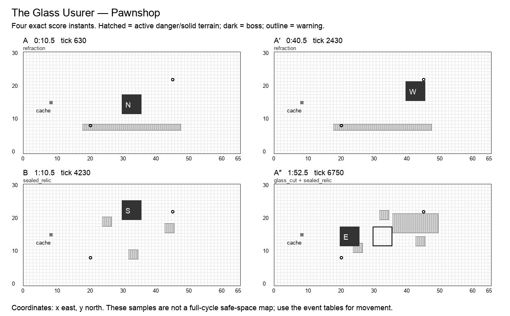

# The Glass Usurer

**Pawnshop · Thief boss · Normal · 120 seconds / 7,200 ticks · six moves · 25 authored events.** Design revision `v2.0-draft.1`. Shared rules: [CONTRACT](CONTRACT.md). All numbers are proposed Arenic tuning, not WoW values or current runtime behavior.

## Historical precedent and creative direction

The primary precedent is **Artificer Xy'mox**, Castle Nathria, Shadowlands. Scope: Normal/Heroic relic phases; Mythic overlap used only as a comparison.

Castle Nathria Xy’mox combines Dimensional Tear portals with relic hazards including seeds, spirits, and a central annihilation weapon. Its original portals are dropped by selected players. Arenic instead fixes portal positions and relic order, and omits random assignment and chasing fixates.[^1]

A collector opens paired mirrors to move between display rooms. The route, not the identity of the boss, is the puzzle. Mirrors are labeled entrances with exact destinations; every hazard is honest.

**Unique decision — ROUTE:** Three displayed relics correspond to three reproducible routing problems. The boss remains a single clearly identified target. A recorded portal route remains legible even without audio, and walking around the outside always works.

## Arena specification

Two one-cell portal endpoints are (20,8) and (45,22), each with a two-cell approach apron. They exist only during Mirror Lease. The southern walking bypass y=3 connects west and east galleries; the northern bypass is y=28. The central display occupies x=27…38,y=9…20.

The 66 × 31 coordinate system, six-cell boss footprint, recovery perimeter, forty distinct start slots, and cache at `(8,15)` use [the shared geometry contract](CONTRACT.md). A nonblocking cache supplies personal deterministic Transmute entitlements. Terrain and graphics are distinct: only a `terrain` event changes walkability; only printed impact masks deal boss damage. Fields use integer cell sets.

A′ mirrors applicable masks across x=32.5; B’s geometry and reordered events are explicitly baked into the data. The table below is authoritative even when a prose direction describes the opening motif. A″ restores the opening masks and adds exactly one listed overlap. Its final transfer occurs at 1:53, allowing six full seconds without boss damage before the seam.

The diagram samples exact instants; it does not mark permanently safe working space.

## Composition

| Phrase | Interval | Musical role | Player task |
| --- | --- | --- | --- |
| A | 0:00–0:30 | statement | Take a portal or walk around the first central blade. |
| A′ | 0:30–1:00 | variation | Reverse the mirrored beam; the destination label never changes. |
| B | 1:00–1:30 | contrast | Seeds occupy the center while the collector moves to the upper display. The bridge’s exact reordered attacks appear in the event table. |
| A″ | 1:30–2:00 | return | Return to the opening gallery with a known portal/seed overlap. The event labeled overlap is simultaneous with a familiar move, with its own mask and damage. |

The opening six seconds have no boss damage. Phrases are clock transitions, never damage phases. The six move names remain recognizable through the variations; changed masks and deliberate overlaps supply complexity. The final opportunity window runs until the seam even where it is longer than an earlier instance of that move.

## Six moves

| Move | Damage / behavior | Counterplay and invariant |
| --- | --- | --- |
| **Mirror Lease** (`mirror_lease`) | optional window; window | Open the fixed paired portals for 18 seconds. Stepping on an endpoint transfers to the other subject to the shared vacancy/cooldown rules; no player targeting. |
| **Refraction** (`refraction`) | 1 HP; projectile | A fixed horizontal glass ray resolves through the lower gallery. Its direction reverses in A′; the mask is still printed. |
| **Sealed Relic** (`sealed_relic`) | 2 HP; floor | Three labeled 3×3 relic pads detonate once. Portals shorten the crossing, but the perimeter bypass is long enough at ordinary movement speed. |
| **Collector’s Blade** (`collector_blade`) | 2 HP; floor | The central 12×12 display is dangerous for one instant, with no suction or forced movement. Port out or leave by either bypass. |
| **Glass Cut** (`glass_cut`) | 1 HP; cone, expose | A side gallery fan wounds and applies Exposure. A portal is optional; conventional cover or movement handles the fan. |
| **Inventory Turn** (`inventory_turn`) | optional window; window | Transfer to the next display and face its open aisle. Five seconds of guaranteed boss dwell, with a one-hit direct-damage bonus after a portal used earlier in this phrase; walkers keep normal damage. |

Every impact has a warning start, resolve tick, and end tick. A rectangle is `[x,y,width,height]`, inclusive at its origin and exclusive at its far edge. Ordinary attacks warn for at least two seconds; crush, construction and transfers warn for three. Exposure means one personal delayed wound, as defined in CONTRACT. When two events share a timestamp, both occur in stable event-ID order.

## Complete event score

`End` is exclusive. A one-tick impact ends 1/60 second after the displayed impact timestamp; the exact end tick removes ambiguity. Windows without masks use their explicit condition below, not an invisible arena-wide attack.

| Event | Warning | Impact | Tick | End tick | Move | Exact masks / extra payload |
| --- | --- | --- | ---: | ---: | --- | --- |
| `thief.1.1` | 0:04 | 0:06 | 360 | 1440 | Mirror Lease | —; portals [[20, 8], [45, 22]] |
| `thief.1.2` | 0:08.5 | 0:10.5 | 630 | 631 | Refraction | `18,7,30,2`; incoming west |
| `thief.1.3` | 0:13 | 0:15 | 900 | 901 | Sealed Relic | `24,10,3,3`; `32,20,3,3`; `43,12,3,3` |
| `thief.1.4` | 0:17.5 | 0:19.5 | 1170 | 1171 | Collector’s Blade | `27,9,12,12` |
| `thief.1.5` | 0:20.5 | 0:22.5 | 1350 | 1351 | Glass Cut | `36,16,14,6`; incoming west |
| `thief.1.6` | 0:22 | 0:25 | 1500 | 1800 | Inventory Turn | —; boss → (40, 16), w |
| `thief.2.1` | 0:34 | 0:36 | 2160 | 3240 | Mirror Lease | —; portals [[20, 8], [45, 22]] |
| `thief.2.2` | 0:38.5 | 0:40.5 | 2430 | 2431 | Refraction | `18,7,30,2`; incoming east |
| `thief.2.3` | 0:43 | 0:45 | 2700 | 2701 | Sealed Relic | `39,10,3,3`; `31,20,3,3`; `20,12,3,3` |
| `thief.2.4` | 0:47.5 | 0:49.5 | 2970 | 2971 | Collector’s Blade | `27,9,12,12` |
| `thief.2.5` | 0:50.5 | 0:52.5 | 3150 | 3151 | Glass Cut | `16,16,14,6`; incoming east |
| `thief.2.6` | 0:52 | 0:55 | 3300 | 3600 | Inventory Turn | —; boss → (30, 20), s |
| `thief.3.1` | 1:04 | 1:06 | 3960 | 5040 | Mirror Lease | —; portals [[20, 8], [45, 22]] |
| `thief.3.2` | 1:08.5 | 1:10.5 | 4230 | 4231 | Sealed Relic | `24,18,3,3`; `32,8,3,3`; `43,16,3,3` |
| `thief.3.3` | 1:13 | 1:15 | 4500 | 4501 | Refraction | `18,22,30,2`; incoming west |
| `thief.3.4` | 1:17.5 | 1:19.5 | 4770 | 4771 | Collector’s Blade | `27,10,12,12` |
| `thief.3.5` | 1:20.5 | 1:22.5 | 4950 | 4951 | Glass Cut | `36,9,14,6`; incoming west |
| `thief.3.6` | 1:22 | 1:25 | 5100 | 5400 | Inventory Turn | —; boss → (20, 12), e |
| `thief.4.1` | 1:34 | 1:36 | 5760 | 6840 | Mirror Lease | —; portals [[20, 8], [45, 22]] |
| `thief.4.2` | 1:38.5 | 1:40.5 | 6030 | 6031 | Refraction | `18,7,30,2`; incoming west |
| `thief.4.3` | 1:43 | 1:45 | 6300 | 6301 | Sealed Relic | `24,10,3,3`; `32,20,3,3`; `43,12,3,3` |
| `thief.4.4` | 1:47.5 | 1:49.5 | 6570 | 6571 | Collector’s Blade | `27,9,12,12` |
| `thief.4.5` | 1:50.5 | 1:52.5 | 6750 | 6751 | Glass Cut | `36,16,14,6`; incoming west |
| `thief.4.overlap` | 1:50.5 | 1:52.5 | 6750 | 6751 | Sealed Relic | `24,10,3,3`; `32,20,3,3`; `43,12,3,3` |
| `thief.4.6` | 1:50 | 1:53 | 6780 | 7200 | Inventory Turn | —; boss → (30, 12), n |

## Optional reward condition

Complete at least one successful fixed portal transfer in the current phrase. The first original direct hit during Inventory Turn then earns +1 damage. Mirror Lease is only the portal-availability interval and awards no damage itself.

Each reward can be claimed once per actor per window. No successful bonus is required for ordinary damage or the next phrase. Direct-hit definitions and precedence are in [the implementation contract](IMPLEMENTATION.md#exact-window-conditions); the final window ends at tick 7,200.

## Boss pose and target access

| From | Origin | Facing | Rear witness cell |
| --- | --- | --- | --- |
| 0:00 / tick 0 | `30,12` | n | `30,11` |
| 0:25 / tick 1500 | `40,16` | w | `46,16` |
| 0:55 / tick 3300 | `30,20` | s | `30,26` |
| 1:25 / tick 5100 | `20,12` | e | `19,12` |
| 1:53 / tick 6780 | `30,12` | n | `30,11` |

The target stays grounded during these v2 transfers. A pose is a pure function of this track and cycle tick. Direct projectiles use accepted aim cells; attached DOTs use identity. Each rear witness cell is outside the boss footprint. A player may stand at any other valid adjacent rear cell to reserve a nonconflicting route.

## Walking solution, recovery, and recorded roles

Walk from (18,3) around the outside of the display; keep away from y=7…8 during Refraction. Waiting in the west gallery at x=16 never requires a portal. Record a portal shortcut only after its exit lane is reserved. Inventory Turn creates a rear opportunity appropriate to the next displayed facing.

The conservative walking validator finds a zero-hazard cardinal route from `(29,2)`, holds these rear cells for 75 ticks, and returns to `(29,2)` before the seam:

- 0:26.5, tick 1590: `46,16`.
- 0:56.5, tick 3390: `30,26`.
- 1:26.5, tick 5190: `19,12`.
- 1:54.5, tick 6870: `30,11`.

The [full movement witness](data/walking-witnesses.json) is executable planning data at one cardinal cell per 15 ticks. It does not use portals, protection, attunement, or bonus objectives. It establishes a useful solo movement baseline, not a DPS rotation or a simulation of forty heroes. Copying it to multiple heroes without reserving separate cells causes hero contact. Forager setup and player-created friendly fire require the additional fixtures below.

A first recording should claim an approach lane and one working station. A second recording should add a different station or a support adjacency, never simply overlay the first route. Reserve portals and rear cells before adding dense support clusters. A support can widen a damage window, but none is required to make the boss advance.

## All 32 hero abilities

`+` means a strong encounter-specific opportunity, `=` an ordinary useful role, `−` a real positional/timing disadvantage with a stated usable alternative. These are design judgments, not measured DPS. The [ability contract](ABILITIES.md) supplies exact ranges, cooldowns, costs, deterministic changes, and live-versus-planned status.

| Hero | Ability / status | Fit | Opportunity, cost, and fallback |
| --- | --- | --- | --- |
| Hunter | Auto Shot (`auto_shot`); live | - | Inventory Turn defeats fixed aim; release after transfer instead of firing at the old display. |
| Hunter | Poison Shot (`poison_shot`); planned | + | Attached poison survives display transfer; never recoil onto an occupied mirror endpoint. |
| Hunter | Sniper (`sniper`); planned | - | Repeated display transfers punish blind reticles; aim during the five-second Inventory Turn dwell. |
| Hunter | Trap (`trap`); planned | + | Trap the next display before Inventory Turn; avoid placing it on a shared portal endpoint. |
| Warrior | Bash (`bash`); live | - | A short melee reach requires gallery travel; wait at the announced arrival’s adjacent cell. |
| Warrior | Block (`block`); planned | + | Refraction reverses direction in A′; rotate during the warning, then cross normally. |
| Warrior | Taunt (`taunt`); planned | = | Absorb one wound from Glass Cut; do not promise to pull a portal or central blade. |
| Warrior | Bulwark (`bulwark`); planned | = | Shelter a gallery from Glass Cut; Collector’s Blade remains a floor evacuation. |
| Thief | Backstab (`backstab`); live | + | Reserve the next display’s rear via a portal shortcut; other heroes may require the walking route. |
| Thief | Shadow Step (`shadow_step`); planned | + | Provides an alternative shortcut when a mirror exit is busy; check destination contact. |
| Thief | Misdirection (`smoke_screen`); planned | + | Place the field across Refraction’s ray; never obscure the portal exit label. |
| Thief | Pickpocket (`pickpocket`); planned | + | Inventory Turn is a literal inventory window; route early to keep the full hold adjacent. |
| Alchemist | Acid Flask (`acid_flask`); live | - | Frequent display changes waste late pools; throw before Inventory Turn at its known destination. |
| Alchemist | Ironskin Draft (`ironskin_draft`); planned | = | Survive a late Collector’s Blade escape; transfer crush remains unmitigated. |
| Alchemist | Siphon (`siphon`); planned | - | Gallery transfers leave short channels; accept a one-pulse recovery instead of chasing the beam. |
| Alchemist | Transmute (`transmute`); planned | + | Portal planning can shorten the return from the cache; take the walking route if its exit is reserved. |
| Cardinal | Sacrifice (`heal`); live | - | Accepted identity survives transfers but range can break; use the announced display pause. |
| Cardinal | Barrier (`barrier`); planned | = | Protect a late gallery crossing; revival and shields cannot make an occupied portal exit legal. |
| Cardinal | Beam (`beam`); planned | - | Moving displays can leave the ray; fire after Inventory Turn rather than before. |
| Cardinal | Resurrect (`resurrect`); planned | = | Revive only at a vacant gallery cell; never move a corpse through a mirror to force success. |
| Bard | Cleanse (`cleanse`); live | + | Attached stacks survive display changes; a small party can share area coverage without sharing a cell. |
| Bard | Dance (`dance`); planned | - | Portal contact and display shifts complicate target range; complete the performance during a dwell. |
| Bard | Mimic (`mimic`); planned | - | Portal separation can break adjacency; own-hit fallback provides value when working alone. |
| Bard | Helix (`helix`); planned | - | Gallery separation reduces aura coverage; the caster still benefits from their own aura. |
| Forager | Dig (`dig`); live | + | Pre-dig the next gallery while the boss is elsewhere; portals shorten setup travel. |
| Forager | Boulder (`bolder`); planned | - | Portal transit does not carry boulders; aim from the current gallery’s open line. |
| Forager | Border (`border`); planned | + | Protect a fixed gallery ray; the shield does not block a portal or move its exit. |
| Forager | Symbiosis (`mushroom`); planned | - | Gallery travel shortens coverage; plant near a portal apron while leaving its cell unoccupied. |
| Merchant | Fortune (`fortune`); live | - | Wide display transfers lose ticks; plan portal or walking routes without assuming every pulse hits. |
| Merchant | Coin Toss (`coin_toss`); planned | - | Display relocation punishes full charge; five-second Inventory Turn needs a shorter safe release. |
| Merchant | Dice (`dice`); planned | = | Build pips while walking galleries; preserve them if no direct hit lands. |
| Merchant | Vault (`vault`); planned | - | Gallery shifts waste a poorly placed zone; author it at the next display’s firing station. |

Every pair of these abilities is governed by the [interaction pipeline](INTERACTIONS.md). A support effect cannot move the boss score, a copied hit cannot copy itself, and a bonus cannot multiply another bonus. The same-caster active-cast restriction remains meaningful: in particular, Fortune competes with that Merchant’s other actions while its aura is active.

## Presentation and authored assets

Use paired numbered mirrors with destination arrows, labeled relic pedestals, a glass-ray outline, and a clearly bounded central blade. The real boss always has its ordinary name and target readout. No false health bars or intentionally deceptive hazard colors.

All warning graphics must show the actual mask at native gameplay scale. The six move cues need distinct silhouettes or symbols in addition to sound. Existing boss appearances may be reused; this specification does not claim new attack art, sounds, or engine resources have been produced.

## Implementation and acceptance

Portal transfers must be integrated into the existing movement/contact phase. Do not replay a portal crossing twice after restore, resolve it against a render position, or search for a different exit if occupied.

- **Portal occupancy:** Two actors attempt the same exit. Resolve transfer eligibility and contact in stable order; a rejected transfer stays at entry, never searches nearby space.
- **Walking bypass:** The supplied witness uses no portal and reaches all four rear checkpoints without damage.
- **Lease expiry:** A portal is absent at its end tick. A move onto its former endpoint becomes ordinary movement; no delayed transfer remains queued.
- **Identity:** Stacks stay on one boss identity at Inventory Turn. A fixed-cell shot can miss while an attached DOT remains active.

Also run the shared empty-roster/full-roster boss-score checksum, 100-cycle restart comparison, boundary save/load, simultaneous-event ordering, viewport/audio independence, and source/loaded-resource parity fixtures in [IMPLEMENTATION](IMPLEMENTATION.md). These are required future runtime gates. The delivered static validator checks the authored design data and solo walking witnesses; it does not claim those Godot tests already passed.

Per-arena state consists only of the shared clock/revision, active actor effects and budgets, earned personal window flags, and existing combat/recording authority. Pose, warning, visual animation, and terrain shape are derived from the score. A window claim, portal cooldown, attunement, or overlap counter that affects outcomes must be captured/restored through the versioned save boundary.

No Heroic/Mythic timeline is implied by this Normal score. A harder tier requires a separate authored score and the same coverage/navigation gates; increasing damage or narrowing a lane under an existing recording’s fingerprint is forbidden.

## Sources

[^1]: Artificer Xy'mox, [Castle Nathria encounter guide](https://www.icy-veins.com/wow/artificer-xy-mox-strategy-guide-for-castle-nathria); BigWigs Mods, [pinned encounter source](https://github.com/BigWigsMods/BigWigs_Shadowlands/blob/f9b43b9e82e2a8c72a72b97a73b50a6813e4a8f6/CastleNathria/Xymox.lua). Scope/difficulty distinctions and rejected alternatives are in [research](research/README.md). Arenic adaptation, timing, geometry, and tuning are original design decisions.
