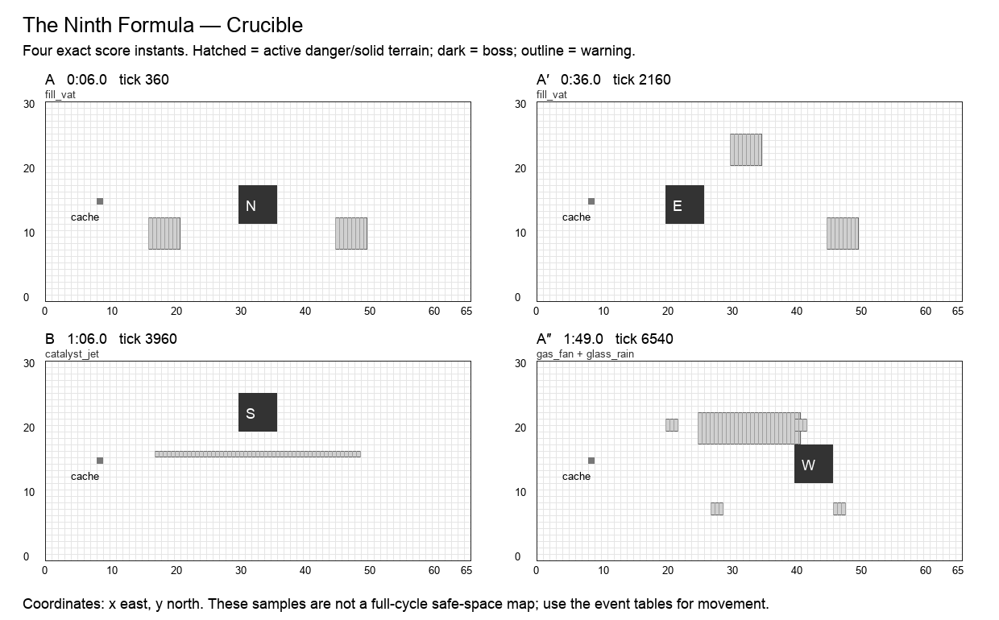

# The Ninth Formula

**Crucible · Alchemist boss · Normal · 120 seconds / 7,200 ticks · six moves · 25 authored events.** Design revision `v2.0-draft.1`. Shared rules: [CONTRACT](CONTRACT.md). All numbers are proposed Arenic tuning, not WoW values or current runtime behavior.

## Historical precedent and creative direction

The primary precedent is **Professor Putricide**, Icecrown Citadel, Wrath of the Lich King. Scope: Normal baseline; Heroic Unbound Plague explicitly excluded.

Putricide mixes persistent slime, alternating experimental adds, gas bombs and bouncing goo; the abomination provides a way to manage floor pressure. Health thresholds change the original phases, and Heroic adds Unbound Plague. Arenic preserves laboratory sequencing and preparation, while replacing player-chasing experiments with fixed reagent tracks.[^1]

Three reagent circuits are drawn before the fight. The alchemist fills, combines, and vents them in a visible order. Heroes may exploit fixed reaction windows, but cannot accidentally change the chemistry for everyone else.

**Unique decision — SEQUENCE:** The chemistry is a scored circuit, not a simulation of arbitrary multiplying pools. Player Acid never changes a boss pool’s radius, identity, fuse, or next reaction. A helpful reagent action earns a local bonus without causing a cascade.

## Arena specification

Reagent vats are nonblocking props at (18,10), (32,22), and (47,10). Their danger pads are 5×5. A U-shaped lab aisle runs x=12 and x=53 with the south cross-aisle y=4. The boss’s work benches are centered, left, upper, and right anchors; a six-second bench pause rewards traps and Dig.

The 66 × 31 coordinate system, six-cell boss footprint, recovery perimeter, forty distinct start slots, and cache at `(8,15)` use [the shared geometry contract](CONTRACT.md). A nonblocking cache supplies personal deterministic Transmute entitlements. Terrain and graphics are distinct: only a `terrain` event changes walkability; only printed impact masks deal boss damage. Fields use integer cell sets.

A′ mirrors applicable masks across x=32.5; B’s geometry and reordered events are explicitly baked into the data. The table below is authoritative even when a prose direction describes the opening motif. A″ restores the opening masks and adds exactly one listed overlap. Its final transfer occurs at 1:53, allowing six full seconds without boss damage before the seam.

The diagram samples exact instants; it does not mark permanently safe working space.

## Composition

| Phrase | Interval | Musical role | Player task |
| --- | --- | --- | --- |
| A | 0:00–0:30 | statement | Fill two separate pads and demonstrate their joined vent. |
| A′ | 0:30–1:00 | variation | Substitute the upper vat for the left vat while retaining the same combine delay; the exact fixed pipe rectangles are listed below. |
| B | 1:00–1:30 | contrast | Distill at the upper bench: the contrasting task is a long channel window between vents. The bridge’s exact reordered attacks appear in the event table. |
| A″ | 1:30–2:00 | return | Reprise the initial fill order, joining one old pipe with the familiar gas spray. The event labeled overlap is simultaneous with a familiar move, with its own mask and damage. |

The opening six seconds have no boss damage. Phrases are clock transitions, never damage phases. The six move names remain recognizable through the variations; changed masks and deliberate overlaps supply complexity. The final opportunity window runs until the seam even where it is longer than an earlier instance of that move.

## Six moves

| Move | Damage / behavior | Counterplay and invariant |
| --- | --- | --- |
| **Fill Vat** (`fill_vat`) | 1 HP; floor | Activate two fixed 5×5 pads for 180 ticks, pulse at activation and +60,+120. Each pulse is a distinct wound event. No autonomous growth. |
| **Catalyst Jet** (`catalyst_jet`) | 1 HP; projectile, expose | A narrow reagent stream crosses a fixed pipe, applying Exposure on a hit. Defense changes damage only; the next reaction still happens. |
| **Binary Reaction** (`binary_reaction`) | 2 HP; floor | Two designated circuit links flash once. The pair is specified in the score, never chosen from player-made acid. |
| **Gas Fan** (`gas_fan`) | 1 HP; cone, expose | A fixed bench-side fan wounds and applies Exposure. The complementary aisle remains open. |
| **Glass Rain** (`glass_rain`) | 1 HP; projectile | Four 2×2 marked pads receive falling vials once; projectile defense can cover a prepared work station. |
| **Distillation** (`distillation`) | optional window; window | Transfer to a bench for six seconds. The first hit owned by an actor from a pre-existing DOT or ground field during the window gains +1; direct hits retain normal value. |

Every impact has a warning start, resolve tick, and end tick. A rectangle is `[x,y,width,height]`, inclusive at its origin and exclusive at its far edge. Ordinary attacks warn for at least two seconds; crush, construction and transfers warn for three. Exposure means one personal delayed wound, as defined in CONTRACT. When two events share a timestamp, both occur in stable event-ID order.

## Complete event score

`End` is exclusive. A one-tick impact ends 1/60 second after the displayed impact timestamp; the exact end tick removes ambiguity. Windows without masks use their explicit condition below, not an invisible arena-wide attack.

| Event | Warning | Impact | Tick | End tick | Move | Exact masks / extra payload |
| --- | --- | --- | ---: | ---: | --- | --- |
| `alchemist.1.1` | 0:04 | 0:06 | 360 | 540 | Fill Vat | `16,8,5,5`; `45,8,5,5`; pulses +0,60,120 ticks |
| `alchemist.1.2` | 0:09 | 0:11 | 660 | 661 | Catalyst Jet | `17,14,32,1`; incoming west |
| `alchemist.1.3` | 0:13.5 | 0:15.5 | 930 | 931 | Binary Reaction | `21,10,10,2`; `36,10,9,2` |
| `alchemist.1.4` | 0:17 | 0:19 | 1140 | 1141 | Gas Fan | `25,18,16,5`; incoming south |
| `alchemist.1.5` | 0:20 | 0:22 | 1320 | 1321 | Glass Rain | `20,20,2,2`; `27,7,2,2`; `40,20,2,2`; `46,7,2,2`; incoming north |
| `alchemist.1.6` | 0:21 | 0:24 | 1440 | 1800 | Distillation | —; boss → (20, 12), e |
| `alchemist.2.1` | 0:34 | 0:36 | 2160 | 2340 | Fill Vat | `30,21,5,5`; `45,8,5,5`; pulses +0,60,120 ticks |
| `alchemist.2.2` | 0:39 | 0:41 | 2460 | 2461 | Catalyst Jet | `17,14,32,1`; incoming east |
| `alchemist.2.3` | 0:43.5 | 0:45.5 | 2730 | 2731 | Binary Reaction | `34,16,2,6`; `36,12,9,2` |
| `alchemist.2.4` | 0:47 | 0:49 | 2940 | 2941 | Gas Fan | `25,18,16,5`; incoming south |
| `alchemist.2.5` | 0:50 | 0:52 | 3120 | 3121 | Glass Rain | `44,20,2,2`; `37,7,2,2`; `24,20,2,2`; `18,7,2,2`; incoming north |
| `alchemist.2.6` | 0:51 | 0:54 | 3240 | 3600 | Distillation | —; boss → (30, 20), s |
| `alchemist.3.1` | 1:04 | 1:06 | 3960 | 3961 | Catalyst Jet | `17,16,32,1`; incoming west |
| `alchemist.3.2` | 1:09 | 1:11 | 4260 | 4440 | Fill Vat | `16,18,5,5`; `45,18,5,5`; pulses +0,60,120 ticks |
| `alchemist.3.3` | 1:13.5 | 1:15.5 | 4530 | 4531 | Binary Reaction | `21,19,10,2`; `36,19,9,2` |
| `alchemist.3.4` | 1:17 | 1:19 | 4740 | 4741 | Glass Rain | `20,9,2,2`; `27,22,2,2`; `40,9,2,2`; `46,22,2,2`; incoming north |
| `alchemist.3.5` | 1:20 | 1:22 | 4920 | 4921 | Gas Fan | `25,8,16,5`; incoming north |
| `alchemist.3.6` | 1:21 | 1:24 | 5040 | 5400 | Distillation | —; boss → (40, 12), w |
| `alchemist.4.1` | 1:34 | 1:36 | 5760 | 5940 | Fill Vat | `16,8,5,5`; `45,8,5,5`; pulses +0,60,120 ticks |
| `alchemist.4.2` | 1:39 | 1:41 | 6060 | 6061 | Catalyst Jet | `17,14,32,1`; incoming west |
| `alchemist.4.3` | 1:43.5 | 1:45.5 | 6330 | 6331 | Binary Reaction | `21,10,10,2`; `36,10,9,2` |
| `alchemist.4.4` | 1:47 | 1:49 | 6540 | 6541 | Gas Fan | `25,18,16,5`; incoming south |
| `alchemist.4.overlap` | 1:47 | 1:49 | 6540 | 6541 | Glass Rain | `20,20,2,2`; `27,7,2,2`; `40,20,2,2`; `46,7,2,2`; incoming north |
| `alchemist.4.5` | 1:50 | 1:52 | 6720 | 6721 | Glass Rain | `20,20,2,2`; `27,7,2,2`; `40,20,2,2`; `46,7,2,2`; incoming north |
| `alchemist.4.6` | 1:50 | 1:53 | 6780 | 7200 | Distillation | —; boss → (30, 12), n |

## Optional reward condition

During Distillation, the first periodic hit from an effect accepted before the window opened earns +1 damage. Eligible effects are Poison/Cleanse DOT, Acid, Dig, Sacrifice and Fortune. Each actor has an independent claim.

Each reward can be claimed once per actor per window. No successful bonus is required for ordinary damage or the next phrase. Direct-hit definitions and precedence are in [the implementation contract](IMPLEMENTATION.md#exact-window-conditions); the final window ends at tick 7,200.

## Boss pose and target access

| From | Origin | Facing | Rear witness cell |
| --- | --- | --- | --- |
| 0:00 / tick 0 | `30,12` | n | `30,11` |
| 0:24 / tick 1440 | `20,12` | e | `19,12` |
| 0:54 / tick 3240 | `30,20` | s | `30,26` |
| 1:24 / tick 5040 | `40,12` | w | `46,12` |
| 1:53 / tick 6780 | `30,12` | n | `30,11` |

The target stays grounded during these v2 transfers. A pose is a pure function of this track and cycle tick. Direct projectiles use accepted aim cells; attached DOTs use identity. Each rear witness cell is outside the boss footprint. A player may stand at any other valid adjacent rear cell to reserve a nonconflicting route.

## Walking solution, recovery, and recorded roles

The U aisle is always available. Work on the lower side of a future bench after checking the next Jet line. Acid should be thrown toward the bench rather than across the walking aisle. Distillation rewards a field laid before arrival, while ranged direct attacks still have ordinary access if the floor is already crowded.

The conservative walking validator finds a zero-hazard cardinal route from `(29,2)`, holds these rear cells for 75 ticks, and returns to `(29,2)` before the seam:

- 0:25.5, tick 1530: `19,12`.
- 0:55.5, tick 3330: `30,26`.
- 1:25.5, tick 5130: `46,12`.
- 1:54.5, tick 6870: `30,11`.

The [full movement witness](data/walking-witnesses.json) is executable planning data at one cardinal cell per 15 ticks. It does not use portals, protection, attunement, or bonus objectives. It establishes a useful solo movement baseline, not a DPS rotation or a simulation of forty heroes. Copying it to multiple heroes without reserving separate cells causes hero contact. Forager setup and player-created friendly fire require the additional fixtures below.

A first recording should claim an approach lane and one working station. A second recording should add a different station or a support adjacency, never simply overlay the first route. Reserve portals and rear cells before adding dense support clusters. A support can widen a damage window, but none is required to make the boss advance.

## All 32 hero abilities

`+` means a strong encounter-specific opportunity, `=` an ordinary useful role, `−` a real positional/timing disadvantage with a stated usable alternative. These are design judgments, not measured DPS. The [ability contract](ABILITIES.md) supplies exact ranges, cooldowns, costs, deterministic changes, and live-versus-planned status.

| Hero | Ability / status | Fit | Opportunity, cost, and fallback |
| --- | --- | --- | --- |
| Hunter | Auto Shot (`auto_shot`); live | = | Shoot across clean bench aisles; Catalyst Jet makes a stationary line less forgiving. |
| Hunter | Poison Shot (`poison_shot`); planned | + | Apply before Distillation to earn its field/DOT bonus; keep the recoil out of vat pads. |
| Hunter | Sniper (`sniper`); planned | = | Clean outer aisles support aimed fire; direct damage receives no Distillation field bonus. |
| Hunter | Trap (`trap`); planned | + | Future benches guarantee a trigger; Trap deals direct damage and misses the DOT-only Distillation bonus. |
| Warrior | Bash (`bash`); live | = | Strike at the bench; keep one exit free of your Alchemist partners’ acid. |
| Warrior | Block (`block`); planned | = | Catch Catalyst Jet or Glass Rain; the floor reaction is unaffected by the shield. |
| Warrior | Taunt (`taunt`); planned | + | Guard a stationary distiller from Gas Fan; the fixed recipient transfer is not chemistry control. |
| Warrior | Bulwark (`bulwark`); planned | + | A four-second wall covers Gas Fan and a short channel; Binary Reaction still lands. |
| Thief | Backstab (`backstab`); live | = | Bench-facing changes yield known rear windows; acid can punish an unreserved approach. |
| Thief | Shadow Step (`shadow_step`); planned | = | Cross a short reactive link without damage; an occupied exit never pushes another hero. |
| Thief | Misdirection (`smoke_screen`); planned | + | Convert a vial or Catalyst Jet; no intercepted projectile changes the reagent reaction. |
| Thief | Pickpocket (`pickpocket`); planned | = | Take a bench token during Distillation; it does not consume reagent state or shorten the window. |
| Alchemist | Acid Flask (`acid_flask`); live | + | Pre-existing pools spend Distillation’s bonus; own acid never extends or ignites boss vats. |
| Alchemist | Ironskin Draft (`ironskin_draft`); planned | + | Reduce several Fill Vat pulses during a controlled risky cast; immunity never suppresses later reactions. |
| Alchemist | Siphon (`siphon`); planned | + | Bench pauses provide a full boss-mode drain; ally donor mode requires explicit recorded consent. |
| Alchemist | Transmute (`transmute`); planned | + | Personal reagent conversion matches the lab’s planning rhythm but cannot mutate boss pools. |
| Cardinal | Sacrifice (`heal`); live | + | A fixed bench is a reliable channel target; keep the caster off the reagent links. |
| Cardinal | Barrier (`barrier`); planned | + | Pre-shield a bench worker before Gas Fan; exposure still needs its own subsequent protection. |
| Cardinal | Beam (`beam`); planned | + | A clean bench ray both harms the boss and heals an ally outside acid. |
| Cardinal | Resurrect (`resurrect`); planned | = | Wait until a vat expires before reviving there; otherwise take the living shield fallback. |
| Bard | Cleanse (`cleanse`); live | + | Remove Gas/Jet Exposure and earn Distillation on attached stacks; acid pools are never cleansed. |
| Bard | Dance (`dance`); planned | = | The bench window can fit all eight taps; stay off persistent Fill Vat pads. |
| Bard | Mimic (`mimic`); planned | = | Echo direct bench attacks; copying acid, Siphon, or Distillation bonus damage is forbidden. |
| Bard | Helix (`helix`); planned | + | Regeneration supports deliberate chemical risk; Haste charges do not accelerate reactions. |
| Forager | Dig (`dig`); live | + | Bench transfers make deliberate ground preparation pay during Distillation. |
| Forager | Boulder (`bolder`); planned | + | Bench lanes give long unobstructed paths; stone contact does not trigger chemical reactions. |
| Forager | Border (`border`); planned | + | Prepare beside a bench for Catalyst Jet; player substrate is independent of reagent pads. |
| Forager | Symbiosis (`mushroom`); planned | + | A mature node supports risky bench channels; acid can still kill allies faster than it heals. |
| Merchant | Fortune (`fortune`); live | + | Following aura can track a bench shift; Distillation accepts its pre-existing periodic hit. |
| Merchant | Coin Toss (`coin_toss`); planned | = | Charge through a clear bench window, never while standing on a ticking vat. |
| Merchant | Dice (`dice`); planned | = | Save certainty for bench direct hits; DOT-only Distillation cannot consume it. |
| Merchant | Vault (`vault`); planned | = | Bench dwell offers predictable territory, but field/DOT bonus rules do not multiply Vault. |

Every pair of these abilities is governed by the [interaction pipeline](INTERACTIONS.md). A support effect cannot move the boss score, a copied hit cannot copy itself, and a bonus cannot multiply another bonus. The same-caster active-cast restriction remains meaningful: in particular, Fortune competes with that Merchant’s other actions while its aura is active.

## Presentation and authored assets

Use three distinct reagent symbols, visible pipe links, fill-level anticipation, two labeled gas fan orientations, and a distillation glow that marks an opportunity rather than danger. Player acid keeps its own outline and owner provenance.

All warning graphics must show the actual mask at native gameplay scale. The six move cues need distinct silhouettes or symbols in addition to sound. Existing boss appearances may be reused; this specification does not claim new attack art, sounds, or engine resources have been produced.

## Implementation and acceptance

All reaction dependencies are authored event IDs, with depth at most one. Never let a player pool, a cleansed debuff, or an intercepted vial trigger or cancel another boss event.

- **No chemistry recursion:** Place player acid across both Binary Reaction links. The fixed reaction still resolves once, with unchanged extent and timestamp; only independent damage differs.
- **Three vat pulses:** The opening Fill Vat wounds at 360,420,480; it expires at 540. It does not deal damage on the intervening ticks or at 540.
- **Cleanse boundary:** Cleanse at the exact delayed Exposure damage tick removes that stack before its scheduled wound. It leaves player acid and attunement untouched.
- **Distillation ownership:** Two Alchemists have overlapping pools at a bench. Each can earn one personal bonus; neither can consume the other’s window credit.

Also run the shared empty-roster/full-roster boss-score checksum, 100-cycle restart comparison, boundary save/load, simultaneous-event ordering, viewport/audio independence, and source/loaded-resource parity fixtures in [IMPLEMENTATION](IMPLEMENTATION.md). These are required future runtime gates. The delivered static validator checks the authored design data and solo walking witnesses; it does not claim those Godot tests already passed.

Per-arena state consists only of the shared clock/revision, active actor effects and budgets, earned personal window flags, and existing combat/recording authority. Pose, warning, visual animation, and terrain shape are derived from the score. A window claim, portal cooldown, attunement, or overlap counter that affects outcomes must be captured/restored through the versioned save boundary.

No Heroic/Mythic timeline is implied by this Normal score. A harder tier requires a separate authored score and the same coverage/navigation gates; increasing damage or narrowing a lane under an existing recording’s fingerprint is forbidden.

## Sources

[^1]: Professor Putricide, [Icecrown Citadel encounter guide](https://www.icy-veins.com/wotlk-classic/professor-putricide-encounter-guide-strategy-abilities-loot); BigWigs Mods, [pinned encounter source](https://github.com/BigWigsMods/BigWigs_WrathOfTheLichKing/blob/b4ddf4eb00b06f7eb5546a5f30c5a488d02a12dd/Citadel/Putricide.lua). Scope/difficulty distinctions and rejected alternatives are in [research](research/README.md). Arenic adaptation, timing, geometry, and tuning are original design decisions.
