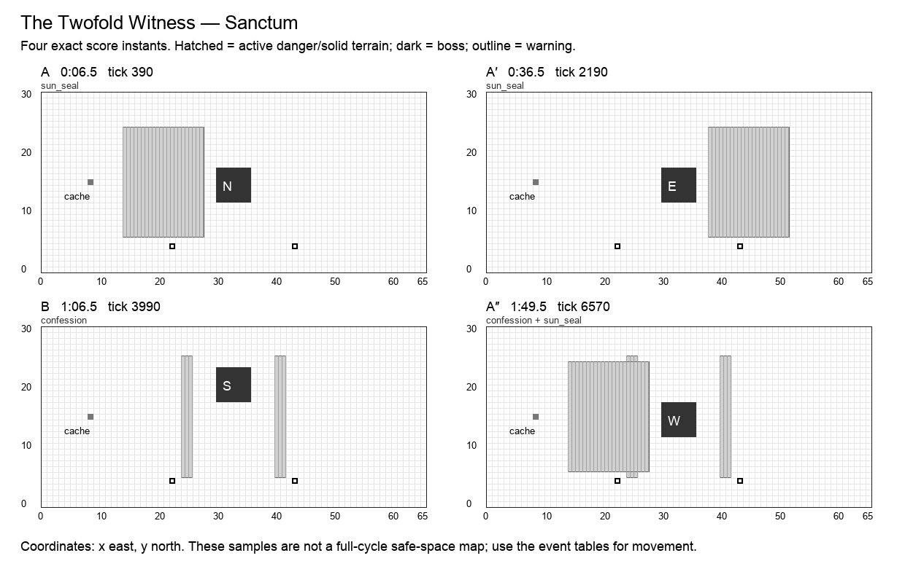

# The Twofold Witness

**Sanctum · Cardinal boss · Normal · 120 seconds / 7,200 ticks · six moves · 25 authored events.** Design revision `v2.0-draft.1`. Shared rules: [CONTRACT](CONTRACT.md). All numbers are proposed Arenic tuning, not WoW values or current runtime behavior.

## Historical precedent and creative direction

The primary precedent is **Maiden of Vigilance**, Tomb of Sargeras, Legion. Scope: Normal/Heroic infusion and instability; no raid-wide mandatory soak.

Maiden of Vigilance assigns Light/Fel infusions; opposite-element interactions trigger Unstable Soul, with a pit-and-ward response and a later shielded phase. Arenic uses explicit polarity and personal recovery, but removes random assignment, inter-player chain explosions, knockback, and required shield breaking. Twin Val’kyr supplies a secondary comparison for voluntarily selected essences, not a second primary precedent.[^1]

A two-faced witness alternates Sun and Moon seals on a cathedral floor. The player chooses an attunement by standing on a marked font. Matching a seal offers efficient work; the unsealed central aisle is a universal alternative.

**Unique decision — ATTUNE:** No beneficial ability ever becomes hostile. Sun and Moon are actor-owned tags, not healing inversion. An untagged solo actor can complete the entire score through the neutral aisle. A failed match deals one immediate personal wound; Confession separately applies delayed Exposure. Neither creates a raid-wide explosion.

## Arena specification

Sun font (22,4), Moon font (43,4); entering sets that actor’s attunement until changed or cycle reset. Fonts are outside attack masks. West chapel x=14…27, east chapel x=38…51; neutral aisles x=28…29 and x=36…37 remain open around the central boss. The south transept y=4 connects both.

The 66 × 31 coordinate system, six-cell boss footprint, recovery perimeter, forty distinct start slots, and cache at `(8,15)` use [the shared geometry contract](CONTRACT.md). A nonblocking cache supplies personal deterministic Transmute entitlements. Terrain and graphics are distinct: only a `terrain` event changes walkability; only printed impact masks deal boss damage. Fields use integer cell sets.

A′ mirrors applicable masks across x=32.5; B’s geometry and reordered events are explicitly baked into the data. The table below is authoritative even when a prose direction describes the opening motif. A″ restores the opening masks and adds exactly one listed overlap. Its final transfer occurs at 1:53, allowing six full seconds without boss damage before the seam.

The diagram samples exact instants; it does not mark permanently safe working space.

## Composition

| Phrase | Interval | Musical role | Player task |
| --- | --- | --- | --- |
| A | 0:00–0:30 | statement | Show Sun, then Moon, then the personal instability tell. |
| A′ | 0:30–1:00 | variation | Reverse the two seals; fonts remain fixed. |
| B | 1:00–1:30 | contrast | Use neutral aisle travel while both outer chapels answer. The bridge’s exact reordered attacks appear in the event table. |
| A″ | 1:30–2:00 | return | Return to Sun-first with an already learned fan before reconciliation. The event labeled overlap is simultaneous with a familiar move, with its own mask and damage. |

The opening six seconds have no boss damage. Phrases are clock transitions, never damage phases. The six move names remain recognizable through the variations; changed masks and deliberate overlaps supply complexity. The final opportunity window runs until the seam even where it is longer than an earlier instance of that move.

## Six moves

| Move | Damage / behavior | Counterplay and invariant |
| --- | --- | --- |
| **Sun Seal** (`sun_seal`) | 1 HP; floor, sun | The west chapel pulses once. Sun actors take zero; Moon/untagged actors take one wound. The central aisle is safe for everyone. |
| **Moon Seal** (`moon_seal`) | 1 HP; floor, moon | The east chapel pulses once. Moon actors take zero; Sun/untagged actors take one wound. No other actor is affected by a mismatch. |
| **Split Hammer** (`split_hammer`) | 2 HP; cone | A central forward hammer fan hits once. Attunement does not protect against this physical hit; leave the fan or place frontal protection. |
| **Confession** (`confession`) | 1 HP; projectile, expose | Two labeled narrow beams apply a personal Exposure. Walk out, shield, cleanse afterward, or heal; no cleanse is mandatory. |
| **Eclipse** (`eclipse`) | 1 HP; floor | Both outer chapels pulse. An actor matching the element label of its occupied mask takes zero; others take one wound. Mirrored phrases preserve labels per mask, not fixed west/east meaning. Neutral aisles remain safe. |
| **Reconciliation** (`reconciliation`) | optional window; window | Face the next transept; for five seconds the first direct hit by an actor with the phrase’s displayed attunement earns +1. Healing and damage keep their ordinary allegiance. |

Every impact has a warning start, resolve tick, and end tick. A rectangle is `[x,y,width,height]`, inclusive at its origin and exclusive at its far edge. Ordinary attacks warn for at least two seconds; crush, construction and transfers warn for three. Exposure means one personal delayed wound, as defined in CONTRACT. When two events share a timestamp, both occur in stable event-ID order.

## Complete event score

`End` is exclusive. A one-tick impact ends 1/60 second after the displayed impact timestamp; the exact end tick removes ambiguity. Windows without masks use their explicit condition below, not an invisible arena-wide attack.

| Event | Warning | Impact | Tick | End tick | Move | Exact masks / extra payload |
| --- | --- | --- | ---: | ---: | --- | --- |
| `cardinal.1.1` | 0:04.5 | 0:06.5 | 390 | 391 | Sun Seal | `14,6,14,19`; elements in mask order: sun |
| `cardinal.1.2` | 0:09.5 | 0:11.5 | 690 | 691 | Moon Seal | `38,6,14,19`; elements in mask order: moon |
| `cardinal.1.3` | 0:13.5 | 0:15.5 | 930 | 931 | Split Hammer | `27,18,12,6`; incoming south |
| `cardinal.1.4` | 0:17.5 | 0:19.5 | 1170 | 1171 | Confession | `24,5,2,21`; `40,5,2,21`; incoming north |
| `cardinal.1.5` | 0:20.5 | 0:22.5 | 1350 | 1351 | Eclipse | `14,6,14,19`; `38,6,14,19`; elements in mask order: sun,moon |
| `cardinal.1.6` | 0:22 | 0:25 | 1500 | 1800 | Reconciliation | —; boss → (30, 12), e; bonus sun |
| `cardinal.2.1` | 0:34.5 | 0:36.5 | 2190 | 2191 | Sun Seal | `38,6,14,19`; elements in mask order: sun |
| `cardinal.2.2` | 0:39.5 | 0:41.5 | 2490 | 2491 | Moon Seal | `14,6,14,19`; elements in mask order: moon |
| `cardinal.2.3` | 0:43.5 | 0:45.5 | 2730 | 2731 | Split Hammer | `27,18,12,6`; incoming south |
| `cardinal.2.4` | 0:47.5 | 0:49.5 | 2970 | 2971 | Confession | `40,5,2,21`; `24,5,2,21`; incoming north |
| `cardinal.2.5` | 0:50.5 | 0:52.5 | 3150 | 3151 | Eclipse | `38,6,14,19`; `14,6,14,19`; elements in mask order: sun,moon |
| `cardinal.2.6` | 0:52 | 0:55 | 3300 | 3600 | Reconciliation | —; boss → (30, 18), s; bonus moon |
| `cardinal.3.1` | 1:04.5 | 1:06.5 | 3990 | 3991 | Confession | `24,5,2,21`; `40,5,2,21`; incoming north |
| `cardinal.3.2` | 1:09.5 | 1:11.5 | 4290 | 4291 | Sun Seal | `14,6,14,19`; elements in mask order: sun |
| `cardinal.3.3` | 1:13.5 | 1:15.5 | 4530 | 4531 | Moon Seal | `38,6,14,19`; elements in mask order: moon |
| `cardinal.3.4` | 1:17.5 | 1:19.5 | 4770 | 4771 | Split Hammer | `27,7,12,6`; incoming north |
| `cardinal.3.5` | 1:20.5 | 1:22.5 | 4950 | 4951 | Eclipse | `14,6,14,19`; `38,6,14,19`; elements in mask order: sun,moon |
| `cardinal.3.6` | 1:22 | 1:25 | 5100 | 5400 | Reconciliation | —; boss → (30, 12), w; bonus moon |
| `cardinal.4.1` | 1:34.5 | 1:36.5 | 5790 | 5791 | Sun Seal | `14,6,14,19`; elements in mask order: sun |
| `cardinal.4.2` | 1:39.5 | 1:41.5 | 6090 | 6091 | Moon Seal | `38,6,14,19`; elements in mask order: moon |
| `cardinal.4.3` | 1:43.5 | 1:45.5 | 6330 | 6331 | Split Hammer | `27,18,12,6`; incoming south |
| `cardinal.4.4` | 1:47.5 | 1:49.5 | 6570 | 6571 | Confession | `24,5,2,21`; `40,5,2,21`; incoming north |
| `cardinal.4.overlap` | 1:47.5 | 1:49.5 | 6570 | 6571 | Sun Seal | `14,6,14,19`; elements in mask order: sun |
| `cardinal.4.5` | 1:50.5 | 1:52.5 | 6750 | 6751 | Eclipse | `14,6,14,19`; `38,6,14,19`; elements in mask order: sun,moon |
| `cardinal.4.6` | 1:50 | 1:53 | 6780 | 7200 | Reconciliation | —; boss → (30, 12), n; bonus sun |

## Optional reward condition

Match the event’s printed Sun/Moon bonus at the hit tick. The first original direct hit during Reconciliation earns +1 damage. Seal immunity follows each mask’s element independently of this reward.

Each reward can be claimed once per actor per window. No successful bonus is required for ordinary damage or the next phrase. Direct-hit definitions and precedence are in [the implementation contract](IMPLEMENTATION.md#exact-window-conditions); the final window ends at tick 7,200.

## Boss pose and target access

| From | Origin | Facing | Rear witness cell |
| --- | --- | --- | --- |
| 0:00 / tick 0 | `30,12` | n | `30,11` |
| 0:25 / tick 1500 | `30,12` | e | `29,12` |
| 0:55 / tick 3300 | `30,18` | s | `30,24` |
| 1:25 / tick 5100 | `30,12` | w | `36,12` |
| 1:53 / tick 6780 | `30,12` | n | `30,11` |

The target stays grounded during these v2 transfers. A pose is a pure function of this track and cycle tick. Direct projectiles use accepted aim cells; attached DOTs use identity. Each rear witness cell is outside the boss footprint. A player may stand at any other valid adjacent rear cell to reserve a nonconflicting route.

## Walking solution, recovery, and recorded roles

Use x=28 or x=37 around the boss and y=4 to change sides. Attunement is optional. For a short melee approach, enter the current rear during Reconciliation; a Cardinal can channel from the neutral aisle whenever within eight tiles. A missed seal is recoverable at four HP.

The conservative walking validator finds a zero-hazard cardinal route from `(29,2)`, holds these rear cells for 75 ticks, and returns to `(29,2)` before the seam:

- 0:26.5, tick 1590: `29,12`.
- 0:56.5, tick 3390: `30,24`.
- 1:26.5, tick 5190: `36,12`.
- 1:54.5, tick 6870: `30,11`.

The [full movement witness](data/walking-witnesses.json) is executable planning data at one cardinal cell per 15 ticks. It does not use portals, protection, attunement, or bonus objectives. It establishes a useful solo movement baseline, not a DPS rotation or a simulation of forty heroes. Copying it to multiple heroes without reserving separate cells causes hero contact. Forager setup and player-created friendly fire require the additional fixtures below.

A first recording should claim an approach lane and one working station. A second recording should add a different station or a support adjacency, never simply overlay the first route. Reserve portals and rear cells before adding dense support clusters. A support can widen a damage window, but none is required to make the boss advance.

## All 32 hero abilities

`+` means a strong encounter-specific opportunity, `=` an ordinary useful role, `−` a real positional/timing disadvantage with a stated usable alternative. These are design judgments, not measured DPS. The [ability contract](ABILITIES.md) supplies exact ranges, cooldowns, costs, deterministic changes, and live-versus-planned status.

| Hero | Ability / status | Fit | Opportunity, cost, and fallback |
| --- | --- | --- | --- |
| Hunter | Auto Shot (`auto_shot`); live | = | Neutral aisles keep range without attunement; enter a seal only for the optional bonus. |
| Hunter | Poison Shot (`poison_shot`); planned | = | Poison needs no matching seal; recoil into the other chapel may lose safe attunement. |
| Hunter | Sniper (`sniper`); planned | + | Use the neutral aisle to reach either stance without crossing polarity hazards. |
| Hunter | Trap (`trap`); planned | = | Prepare the upper transept destination; attunement neither arms nor disarms the trap. |
| Warrior | Bash (`bash`); live | = | Stand at an aisle-facing corner; matching attunement is helpful but never needed to hit. |
| Warrior | Block (`block`); planned | = | Block Confession to avoid Exposure; neither seal nor hammer is a projectile. |
| Warrior | Taunt (`taunt`); planned | + | Protect a Confession target while preparing Cleanse; attunement never changes through the pledge. |
| Warrior | Bulwark (`bulwark`); planned | + | The Split Hammer fan gives a clear team-defense moment without a mandatory tank. |
| Thief | Backstab (`backstab`); live | = | Use rear cells beside neutral aisles; a wrong seal affects survival, not Backstab eligibility. |
| Thief | Shadow Step (`shadow_step`); planned | + | Reach the neutral aisle after a mismatch; font contact on arrival is explicit. |
| Thief | Misdirection (`smoke_screen`); planned | = | Convert Confession; polarity and physical hammer retain their printed semantics. |
| Thief | Pickpocket (`pickpocket`); planned | = | Choose a quiet rear beside a neutral aisle; stolen rewards never invert healing. |
| Alchemist | Acid Flask (`acid_flask`); live | = | Pool the boss footprint from a neutral aisle; do not poison a font’s safe approach. |
| Alchemist | Ironskin Draft (`ironskin_draft`); planned | + | Absorb the personal mismatch wound and Exposure; neutral walking remains the free solution. |
| Alchemist | Siphon (`siphon`); planned | + | Recover a personal seal mismatch without demanding a healer; a donor’s attunement is irrelevant. |
| Alchemist | Transmute (`transmute`); planned | + | Convert a reagent into a guard before Confession; it never changes Sun/Moon identity. |
| Cardinal | Sacrifice (`heal`); live | + | Channel from a neutral aisle; matching a seal changes optional bonus access, not the beam. |
| Cardinal | Barrier (`barrier`); planned | + | Protect a mismatched seal visitor or a Confession target; no healer-only assignment is imposed. |
| Cardinal | Beam (`beam`); planned | + | The neutral aisle allows a healing/damage line without opposite-element punishment. |
| Cardinal | Resurrect (`resurrect`); planned | + | Recover a failed attunement route or gain a personal shield before Confession. |
| Bard | Cleanse (`cleanse`); live | + | Confession gives a visible cleanse opportunity; Sun/Moon attunement is not removed. |
| Bard | Dance (`dance`); planned | = | Perform in the neutral aisle; floor polarity and key timing are independent. |
| Bard | Mimic (`mimic`); planned | = | Adjacent actors can use separate neutral cells; no shared attunement is required for Mimic. |
| Bard | Helix (`helix`); planned | + | Sustain a neutral-aisle group without touching attunement or spell allegiance. |
| Forager | Dig (`dig`); live | = | Prepare the upper transept, leaving fonts and aisles walkable; income never changes seal order. |
| Forager | Boulder (`bolder`); planned | = | Roll from a neutral aisle; rock damage carries no Sun/Moon allegiance. |
| Forager | Border (`border`); planned | = | Deflect Confession from a neutral aisle; neither attunement seal is a projectile. |
| Forager | Symbiosis (`mushroom`); planned | + | Plant along the neutral aisle; healing never turns into opposite-element harm. |
| Merchant | Fortune (`fortune`); live | = | Stay in a neutral aisle within radius two when possible; aura does not satisfy direct-hit seal bonuses. |
| Merchant | Coin Toss (`coin_toss`); planned | = | Neutral aisle avoids seal risk during charge; match only when the expected extra hit is worthwhile. |
| Merchant | Dice (`dice`); planned | = | Store pips before matching a seal; a higher-priority seal bonus leaves pips available. |
| Merchant | Vault (`vault`); planned | = | Place in a neutral aisle for reliable access; matching a seal is an optional extra route. |

Every pair of these abilities is governed by the [interaction pipeline](INTERACTIONS.md). A support effect cannot move the boss score, a copied hit cannot copy itself, and a bonus cannot multiply another bonus. The same-caster active-cast restriction remains meaningful: in particular, Fortune competes with that Merchant’s other actions while its aura is active.

## Presentation and authored assets

Use Sun/Moon icons and different fill patterns, physical font markers, a neutral aisle texture, and a countdown on personal Exposure. Healing stays visually beneficial. The same event name and pattern are used after a mirror variation.

All warning graphics must show the actual mask at native gameplay scale. The six move cues need distinct silhouettes or symbols in addition to sound. Existing boss appearances may be reused; this specification does not claim new attack art, sounds, or engine resources have been produced.

## Implementation and acceptance

Do not implement polarity as a debuff that Cleanse removes, and do not trigger explosions on hero adjacency. Attunement affects only damage evaluation and the optional bonus, never movement or recorded casts.

- **No chain reaction:** Opposite attunements in adjacent distinct cells never cause an explosion. Ordinary hero same-cell contact still applies.
- **Neutral route:** An actor with no attunement follows the conservative witness and reaches the rear each phrase. No font is a progression gate.
- **Mirror labels:** A′ mirrors seal masks while retaining each event’s element label. Damage checks the printed element, not an assumption that Sun always means west.
- **Beneficial stays beneficial:** Heal/guard an actor standing in an opposite seal. The beneficial effect never becomes damage; the seal resolves independently.

Also run the shared empty-roster/full-roster boss-score checksum, 100-cycle restart comparison, boundary save/load, simultaneous-event ordering, viewport/audio independence, and source/loaded-resource parity fixtures in [IMPLEMENTATION](IMPLEMENTATION.md). These are required future runtime gates. The delivered static validator checks the authored design data and solo walking witnesses; it does not claim those Godot tests already passed.

Per-arena state consists only of the shared clock/revision, active actor effects and budgets, earned personal window flags, and existing combat/recording authority. Pose, warning, visual animation, and terrain shape are derived from the score. A window claim, portal cooldown, attunement, or overlap counter that affects outcomes must be captured/restored through the versioned save boundary.

No Heroic/Mythic timeline is implied by this Normal score. A harder tier requires a separate authored score and the same coverage/navigation gates; increasing damage or narrowing a lane under an existing recording’s fingerprint is forbidden.

## Sources

[^1]: Maiden of Vigilance, [Tomb of Sargeras encounter guide](https://www.icy-veins.com/wow/maiden-of-vigilance-strategy-tactics-normal-heroic); BigWigs Mods, [pinned encounter source](https://github.com/BigWigsMods/BigWigs_Legion/blob/bbc48372f2b4483f1573175de20fd7b805785bc9/TombOfSargeras/MaidenofVigilance.lua). Scope/difficulty distinctions and rejected alternatives are in [research](research/README.md). Arenic adaptation, timing, geometry, and tuning are original design decisions.
