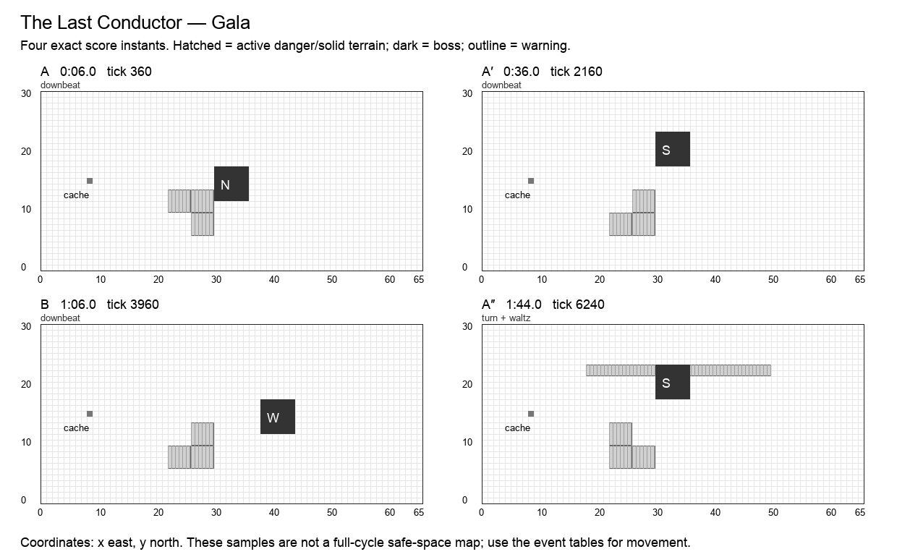

# The Last Conductor

**Gala · Bard boss · Normal · 120 seconds / 7,200 ticks · six moves · 25 authored events.** Design revision `v2.0-draft.1`. Shared rules: [CONTRACT](CONTRACT.md). All numbers are proposed Arenic tuning, not WoW values or current runtime behavior.

## Historical precedent and creative direction

The primary precedent is **The Council of Blood**, Castle Nathria, Shadowlands. Scope: Normal/Heroic dance; no health-triggered transition or kill order.

Council of Blood alternates ordinary combat with Danse Macabre at health thresholds; successful movement earns a benefit. Different kill orders also change the remaining mechanics. Arenic borrows a readable dance and returning combat, while fixing every intermission in time and removing kill-order dependence and attack-speed changes.[^1]

A conductor teaches a three scored floor steps and a free fourth return, answers it with a slow waltz, then combines both. The player composes movement around their own cast rhythm rather than responding to hidden tempo changes.

**Unique decision — PHRASE:** The floor gives a movement score separate from the Bard hero’s Dance ability. Any class can perform the floor phrase. Visual footfall markers carry the full information when sound is muted.

## Arena specification

Four adjacent 4×4 floor blocks form a loop: SW [22,6,4,4], SE [26,6,4,4], NE [26,10,4,4], NW [22,10,4,4]. The dance square is optional. Forty actors do not share a single tile; the floor mask has sixteen cells per block and surrounding walking room. The boss stands in the central or upper orchestra recess.

The 66 × 31 coordinate system, six-cell boss footprint, recovery perimeter, forty distinct start slots, and cache at `(8,15)` use [the shared geometry contract](CONTRACT.md). A nonblocking cache supplies personal deterministic Transmute entitlements. Terrain and graphics are distinct: only a `terrain` event changes walkability; only printed impact masks deal boss damage. Fields use integer cell sets.

A′ mirrors applicable masks across x=32.5; B’s geometry and reordered events are explicitly baked into the data. The table below is authoritative even when a prose direction describes the opening motif. A″ restores the opening masks and adds exactly one listed overlap. Its final transfer occurs at 1:53, allowing six full seconds without boss damage before the seam.

The diagram samples exact instants; it does not mark permanently safe working space.

## Composition

| Phrase | Interval | Musical role | Player task |
| --- | --- | --- | --- |
| A | 0:00–0:30 | statement | Teach the SW→SE→NE→NW footfall phrase. |
| A′ | 0:30–1:00 | variation | Reverse the traversal to NW→NE→SE→SW. |
| B | 1:00–1:30 | contrast | The bridge is a slow waltz across the upper room with a long stationary answer. The bridge’s exact reordered attacks appear in the event table. |
| A″ | 1:30–2:00 | return | Bring back the original footfalls while the previously seen waltz occupies a separate strip. The event labeled overlap is simultaneous with a familiar move, with its own mask and damage. |

The opening six seconds have no boss damage. Phrases are clock transitions, never damage phases. The six move names remain recognizable through the variations; changed masks and deliberate overlaps supply complexity. The final opportunity window runs until the seam even where it is longer than an earlier instance of that move.

## Six moves

| Move | Damage / behavior | Counterplay and invariant |
| --- | --- | --- |
| **Downbeat** (`downbeat`) | 1 HP; floor | Pulse the three inactive floor blocks once; the displayed active block and all cells outside the dance square are safe. This begins optional phrase participation. |
| **Upbeat** (`upbeat`) | 1 HP; floor | Advance the active block and pulse the other three. A second earned footfall is optional; missing it only loses phrase credit. |
| **Turn** (`turn`) | 1 HP; floor | Advance to the third block and pulse the others. Floor cues use ticks, never detected audio beats. |
| **Waltz** (`waltz`) | 2 HP; floor | A 2-cell-wide dancer strip crosses the upper room at its listed resolve time; it has no body that pushes actors. |
| **Coda Bolt** (`coda_bolt`) | 1 HP; projectile, expose | A short diagonal-looking visual resolves as the exact listed rectangular cells; tagged projectile defenses remain useful. |
| **Encore** (`encore`) | optional window; window | Transfer/turn to the orchestra recess for six seconds. Actors who occupied each active block at the first three footfalls gain +1 on their first direct hit. Outside actors keep full ordinary damage. |

Every impact has a warning start, resolve tick, and end tick. A rectangle is `[x,y,width,height]`, inclusive at its origin and exclusive at its far edge. Ordinary attacks warn for at least two seconds; crush, construction and transfers warn for three. Exposure means one personal delayed wound, as defined in CONTRACT. When two events share a timestamp, both occur in stable event-ID order.

## Complete event score

`End` is exclusive. A one-tick impact ends 1/60 second after the displayed impact timestamp; the exact end tick removes ambiguity. Windows without masks use their explicit condition below, not an invisible arena-wide attack.

| Event | Warning | Impact | Tick | End tick | Move | Exact masks / extra payload |
| --- | --- | --- | ---: | ---: | --- | --- |
| `bard.1.1` | 0:04 | 0:06 | 360 | 361 | Downbeat | `26,6,4,4`; `26,10,4,4`; `22,10,4,4`; safe pad [22, 6, 4, 4] |
| `bard.1.2` | 0:08 | 0:10 | 600 | 601 | Upbeat | `22,6,4,4`; `26,10,4,4`; `22,10,4,4`; safe pad [26, 6, 4, 4] |
| `bard.1.3` | 0:12 | 0:14 | 840 | 841 | Turn | `22,6,4,4`; `26,6,4,4`; `22,10,4,4`; safe pad [26, 10, 4, 4] |
| `bard.1.4` | 0:16.5 | 0:18.5 | 1110 | 1111 | Waltz | `18,22,32,2` |
| `bard.1.5` | 0:20 | 0:22 | 1320 | 1321 | Coda Bolt | `18,16,12,2`; incoming west |
| `bard.1.6` | 0:21 | 0:24 | 1440 | 1800 | Encore | —; boss → (30, 18), s |
| `bard.2.1` | 0:34 | 0:36 | 2160 | 2161 | Downbeat | `22,6,4,4`; `26,6,4,4`; `26,10,4,4`; safe pad [22, 10, 4, 4] |
| `bard.2.2` | 0:38 | 0:40 | 2400 | 2401 | Upbeat | `22,6,4,4`; `26,6,4,4`; `22,10,4,4`; safe pad [26, 10, 4, 4] |
| `bard.2.3` | 0:42 | 0:44 | 2640 | 2641 | Turn | `22,6,4,4`; `26,10,4,4`; `22,10,4,4`; safe pad [26, 6, 4, 4] |
| `bard.2.4` | 0:46.5 | 0:48.5 | 2910 | 2911 | Waltz | `16,22,32,2` |
| `bard.2.5` | 0:50 | 0:52 | 3120 | 3121 | Coda Bolt | `36,16,12,2`; incoming east |
| `bard.2.6` | 0:51 | 0:54 | 3240 | 3600 | Encore | —; boss → (38, 12), w |
| `bard.3.1` | 1:04 | 1:06 | 3960 | 3961 | Downbeat | `22,6,4,4`; `26,6,4,4`; `26,10,4,4`; safe pad [22, 10, 4, 4] |
| `bard.3.2` | 1:08 | 1:10 | 4200 | 4201 | Upbeat | `22,6,4,4`; `26,6,4,4`; `22,10,4,4`; safe pad [26, 10, 4, 4] |
| `bard.3.3` | 1:12 | 1:14 | 4440 | 4441 | Turn | `22,6,4,4`; `26,10,4,4`; `22,10,4,4`; safe pad [26, 6, 4, 4] |
| `bard.3.4` | 1:16.5 | 1:18.5 | 4710 | 4711 | Waltz | `18,22,32,2` |
| `bard.3.5` | 1:20 | 1:22 | 4920 | 4921 | Coda Bolt | `18,16,12,2`; incoming west |
| `bard.3.6` | 1:21 | 1:24 | 5040 | 5400 | Encore | —; boss → (30, 18), s |
| `bard.4.1` | 1:34 | 1:36 | 5760 | 5761 | Downbeat | `26,6,4,4`; `26,10,4,4`; `22,10,4,4`; safe pad [22, 6, 4, 4] |
| `bard.4.2` | 1:38 | 1:40 | 6000 | 6001 | Upbeat | `22,6,4,4`; `26,10,4,4`; `22,10,4,4`; safe pad [26, 6, 4, 4] |
| `bard.4.3` | 1:42 | 1:44 | 6240 | 6241 | Turn | `22,6,4,4`; `26,6,4,4`; `22,10,4,4`; safe pad [26, 10, 4, 4] |
| `bard.4.overlap` | 1:42 | 1:44 | 6240 | 6241 | Waltz | `18,22,32,2` |
| `bard.4.4` | 1:46.5 | 1:48.5 | 6510 | 6511 | Waltz | `18,22,32,2` |
| `bard.4.5` | 1:50 | 1:52 | 6720 | 6721 | Coda Bolt | `18,16,12,2`; incoming west |
| `bard.4.6` | 1:50 | 1:53 | 6780 | 7200 | Encore | —; boss → (30, 12), n |

## Optional reward condition

Occupy each of the three printed active pads at its exact floor-check tick. The first original direct hit during Encore earns +1 damage. The fourth visual return step has no eligibility check; hero Dance is a separate ability.

Each reward can be claimed once per actor per window. No successful bonus is required for ordinary damage or the next phrase. Direct-hit definitions and precedence are in [the implementation contract](IMPLEMENTATION.md#exact-window-conditions); the final window ends at tick 7,200.

## Boss pose and target access

| From | Origin | Facing | Rear witness cell |
| --- | --- | --- | --- |
| 0:00 / tick 0 | `30,12` | n | `30,11` |
| 0:24 / tick 1440 | `30,18` | s | `30,24` |
| 0:54 / tick 3240 | `38,12` | w | `44,12` |
| 1:24 / tick 5040 | `30,18` | s | `30,24` |
| 1:53 / tick 6780 | `30,12` | n | `30,11` |

The target stays grounded during these v2 transfers. A pose is a pure function of this track and cycle tick. Direct projectiles use accepted aim cells; attached DOTs use identity. Each rear witness cell is outside the boss footprint. A player may stand at any other valid adjacent rear cell to reserve a nonconflicting route.

## Walking solution, recovery, and recorded roles

A solo actor can ignore the dance square and approach through x=36…37. The floor-performance bonus requires only three checks, not perfect rhythmic input for the entire two minutes. A separate voluntary fourth step completes the visual loop but grants no additional gameplay requirement. The six-second Encore is a cast/recovery opportunity even after a missed footfall.

The conservative walking validator finds a zero-hazard cardinal route from `(29,2)`, holds these rear cells for 75 ticks, and returns to `(29,2)` before the seam:

- 0:25.5, tick 1530: `30,24`.
- 0:55.5, tick 3330: `44,12`.
- 1:25.5, tick 5130: `30,24`.
- 1:54.5, tick 6870: `30,11`.

The [full movement witness](data/walking-witnesses.json) is executable planning data at one cardinal cell per 15 ticks. It does not use portals, protection, attunement, or bonus objectives. It establishes a useful solo movement baseline, not a DPS rotation or a simulation of forty heroes. Copying it to multiple heroes without reserving separate cells causes hero contact. Forager setup and player-created friendly fire require the additional fixtures below.

A first recording should claim an approach lane and one working station. A second recording should add a different station or a support adjacency, never simply overlay the first route. Reserve portals and rear cells before adding dense support clusters. A support can widen a damage window, but none is required to make the boss advance.

## All 32 hero abilities

`+` means a strong encounter-specific opportunity, `=` an ordinary useful role, `−` a real positional/timing disadvantage with a stated usable alternative. These are design judgments, not measured DPS. The [ability contract](ABILITIES.md) supplies exact ranges, cooldowns, costs, deterministic changes, and live-versus-planned status.

| Hero | Ability / status | Fit | Opportunity, cost, and fallback |
| --- | --- | --- | --- |
| Hunter | Auto Shot (`auto_shot`); live | + | Short draws fit between footfalls; moving early still changes the accepted firing opportunity. |
| Hunter | Poison Shot (`poison_shot`); planned | - | Recoil can leave the active footfall block; cast from the square edge facing inward. |
| Hunter | Sniper (`sniper`); planned | = | Aim during Encore rather than trying to finish a draw on a dangerous footfall. |
| Hunter | Trap (`trap`); planned | = | Place at the next recess while the boss is away; keep the dance square clear. |
| Warrior | Bash (`bash`); live | + | A 21-tick hit fits Encore; do not spend a floor-step deadline to finish a swing. |
| Warrior | Block (`block`); planned | = | Block Coda Bolt while outside the optional square; the floor phrase still needs steps. |
| Warrior | Taunt (`taunt`); planned | = | Pledge for Coda Bolt so a Bard can finish taps; missed floor steps still count as missed. |
| Warrior | Bulwark (`bulwark`); planned | = | Coda Bolt can be sheltered; Encore starts after the danger, so late walls waste duration. |
| Thief | Backstab (`backstab`); live | + | The south-facing upper recess exposes its north rear; schedule approach during Encore. |
| Thief | Shadow Step (`shadow_step`); planned | - | Skipping a floor block can forfeit Encore credit; step only after its occupancy check. |
| Thief | Misdirection (`smoke_screen`); planned | = | Convert Coda Bolt while dancing nearby; no false floor indicator is introduced. |
| Thief | Pickpocket (`pickpocket`); planned | = | Hold during Encore if skipping its damage bonus; no steal changes the next downbeat. |
| Alchemist | Acid Flask (`acid_flask`); live | - | Throwing into the optional dance square harms dancers; target the orchestra recess instead. |
| Alchemist | Ironskin Draft (`ironskin_draft`); planned | = | Finish Dance through one missed footfall while losing the optional perfect-floor reward. |
| Alchemist | Siphon (`siphon`); planned | = | Use Encore for a brief drain or consenting duet; movement to a footfall cancels the channel. |
| Alchemist | Transmute (`transmute`); planned | = | Cache work is a deliberate alternative to the optional floor phrase, then rejoin at Encore. |
| Cardinal | Sacrifice (`heal`); live | - | Floor participation competes with stationary channeling; Encore provides a reliable alternative. |
| Cardinal | Barrier (`barrier`); planned | = | Shield a floor learner; the missed-position counter remains an honest failure. |
| Cardinal | Beam (`beam`); planned | = | Encore can fit the full aim; avoid aiming across a dangerous footfall check. |
| Cardinal | Resurrect (`resurrect`); planned | = | Encore creates a channel gap; a revived dancer gets no retroactive footfall credit. |
| Bard | Cleanse (`cleanse`); live | + | Repair a missed footfall and maintain boss DOTs during movement; it does not restore floor credit. |
| Bard | Dance (`dance`); planned | + | Hero taps and floor steps form a deliberate duet; both score independently and allow partial success. |
| Bard | Mimic (`mimic`); planned | + | A Bard’s final Dance hit can count; echoed hits cannot start an infinite call-and-response. |
| Bard | Helix (`helix`); planned | + | Choose recovery or a damage charge between phrases; music and floor clocks remain fixed. |
| Forager | Dig (`dig`); live | = | Prepare the orchestra recess while dancing is optional; dug floor never removes footfall safety. |
| Forager | Boulder (`bolder`); planned | = | Use the orchestra lane during Encore; stones do not collide with floor dancers. |
| Forager | Border (`border`); planned | = | Protect the Coda line; the one-cell shield does not count as a correct dance step. |
| Forager | Symbiosis (`mushroom`); planned | = | Plant outside the floor square for learners; a seed does not obstruct the choreography. |
| Merchant | Fortune (`fortune`); live | = | Follow the orchestra during the phrase; an active aura prevents another Merchant cast. |
| Merchant | Coin Toss (`coin_toss`); planned | - | Floor steps interrupt a charge; skip the optional dance and invest during Encore. |
| Merchant | Dice (`dice`); planned | = | Build in rests rather than during an active Fortune aura; no random tempo relationship. |
| Merchant | Vault (`vault`); planned | + | Encore offers a scheduled shared damage window without accelerating anyone’s recorded cast. |

Every pair of these abilities is governed by the [interaction pipeline](INTERACTIONS.md). A support effect cannot move the boss score, a copied hit cannot copy itself, and a bonus cannot multiply another bonus. The same-caster active-cast restriction remains meaningful: in particular, Fortune competes with that Merchant’s other actions while its aura is active.

## Presentation and authored assets

Use four floor-block letters and active-step arrows, ghosted next footfalls, slow upper-room dancers, and a baton-down Encore cue. Provide a visual tick metronome and display Dance accuracy independently from floor accuracy.

All warning graphics must show the actual mask at native gameplay scale. The six move cues need distinct silhouettes or symbols in addition to sound. Existing boss appearances may be reused; this specification does not claim new attack art, sounds, or engine resources have been produced.

## Implementation and acceptance

Dance ability grading and encounter floor grading are separate actor counters. Do not pause or speed up a timeline to align music. Never shuffle keys, icons, or cast order.

- **Mute:** Replay an identical staff with music disabled. Floor checks, Dance tap windows, and Encore bonus are bit-identical.
- **Two scores:** An actor can complete the three floor checks and fail hero Dance taps, or the reverse. No shared success counter is permitted.
- **No mandatory dance:** Stay outside all four floor blocks, survive, and damage the boss normally in Encore. No raid wipe or bonus debt accumulates.
- **Future phrase:** A fourth voluntary visual step grants no hidden requirement. The exact three active-pad checks in data are the gameplay authority.

Also run the shared empty-roster/full-roster boss-score checksum, 100-cycle restart comparison, boundary save/load, simultaneous-event ordering, viewport/audio independence, and source/loaded-resource parity fixtures in [IMPLEMENTATION](IMPLEMENTATION.md). These are required future runtime gates. The delivered static validator checks the authored design data and solo walking witnesses; it does not claim those Godot tests already passed.

Per-arena state consists only of the shared clock/revision, active actor effects and budgets, earned personal window flags, and existing combat/recording authority. Pose, warning, visual animation, and terrain shape are derived from the score. A window claim, portal cooldown, attunement, or overlap counter that affects outcomes must be captured/restored through the versioned save boundary.

No Heroic/Mythic timeline is implied by this Normal score. A harder tier requires a separate authored score and the same coverage/navigation gates; increasing damage or narrowing a lane under an existing recording’s fingerprint is forbidden.

## Sources

[^1]: The Council of Blood, [Castle Nathria encounter guide](https://www.icy-veins.com/wow/the-council-of-blood-strategy-guide-for-castle-nathria); BigWigs Mods, [pinned encounter source](https://github.com/BigWigsMods/BigWigs_Shadowlands/blob/f9b43b9e82e2a8c72a72b97a73b50a6813e4a8f6/CastleNathria/TheCouncilofBlood.lua). Scope/difficulty distinctions and rejected alternatives are in [research](research/README.md). Arenic adaptation, timing, geometry, and tuning are original design decisions.
