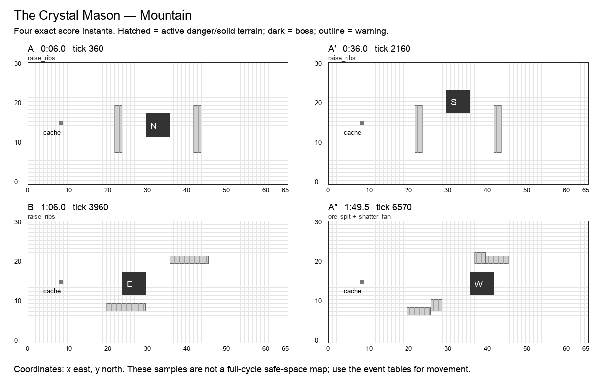

# The Crystal Mason

**Mountain · Forager boss · Normal · 120 seconds / 7,200 ticks · six moves · 25 authored events.** Design revision `v2.0-draft.1`. Shared rules: [CONTRACT](CONTRACT.md). All numbers are proposed Arenic tuning, not WoW values or current runtime behavior.

## Historical precedent and creative direction

The primary precedent is **Fractillus**, Manaforge Omega, The War Within. Scope: Heroic wall construction/shattering relationship; original tuning not copied.

Fractillus creates crystal walls in lanes and uses later mechanics to shatter them; wall accumulation and fragments create pressure. Source guides describe player-directed placement and knockback-driven destruction. Arenic keeps construction followed by demolition but fixes wall locations and expiry, and replaces knockback tasks with optional preparation rewards.[^1]

A mason raises measured crystal ribs, uses them as cover, and shatters them into a known fan. Prepared ground and healing gardens earn long-lived value, while every wall comes with a posted demolition time.

**Unique decision — BUILD:** The arena changes connectivity on schedule. Player attacks cannot open or close a route early. Each raised rib has two open ends; permanent corridors and a perimeter circuit prevent topology locks.

## Arena specification

Crystal ribs stand at [22,8,2,12] and [42,8,2,12]. They obstruct bodies only during Raise Ribs, and no portal or ability is needed to get around y=7 or y=20. Central quarry x=25…40 is the working area. Shards land beside the ribs, never on the permanent perimeter or cache.

The 66 × 31 coordinate system, six-cell boss footprint, recovery perimeter, forty distinct start slots, and cache at `(8,15)` use [the shared geometry contract](CONTRACT.md). A nonblocking cache supplies personal deterministic Transmute entitlements. Terrain and graphics are distinct: only a `terrain` event changes walkability; only printed impact masks deal boss damage. Fields use integer cell sets.

A′ mirrors applicable masks across x=32.5; B’s geometry and reordered events are explicitly baked into the data. The table below is authoritative even when a prose direction describes the opening motif. A″ restores the opening masks and adds exactly one listed overlap. Its final transfer occurs at 1:53, allowing six full seconds without boss damage before the seam.

The diagram samples exact instants; it does not mark permanently safe working space.

## Composition

| Phrase | Interval | Musical role | Player task |
| --- | --- | --- | --- |
| A | 0:00–0:30 | statement | Raise two ribs, shelter from a beam, then leave their shatter fans. |
| A′ | 0:30–1:00 | variation | Mirror the shard pads while the rib footprints stay unchanged. |
| B | 1:00–1:30 | contrast | Build a shorter pair of cross-ribs and work the open north/south aisle. The bridge’s exact reordered attacks appear in the event table. |
| A″ | 1:30–2:00 | return | Return to vertical ribs and combine their known fan with the earlier quarry pulse. The event labeled overlap is simultaneous with a familiar move, with its own mask and damage. |

The opening six seconds have no boss damage. Phrases are clock transitions, never damage phases. The six move names remain recognizable through the variations; changed masks and deliberate overlaps supply complexity. The final opportunity window runs until the seam even where it is longer than an earlier instance of that move.

## Six moves

| Move | Damage / behavior | Counterplay and invariant |
| --- | --- | --- |
| **Raise Ribs** (`raise_ribs`) | solid terrain; crush on appearance; terrain | Raise two fixed impassable rectangles for 570 ticks. At their appearance only, a hero inside suffers crush; during the warning step around an end. Never trap or push a hero. |
| **Quarry Ray** (`quarry_ray`) | 1 HP; projectile | A horizontal ray crosses the room but subtracts the active rib shadow; players behind a rib may work. The exact subtracted masks are stored, not raytraced against sprite pixels. |
| **Shatter Fan** (`shatter_fan`) | 2 HP; floor | Ribs expire before the impact; their adjacent fixed shard rectangles hit once. No knockback, no player-dependent wall break. |
| **Ore Spit** (`ore_spit`) | 1 HP; projectile, expose | Two quarry pads receive splinters and Exposure. Directional defenses can shelter a planted node. |
| **Fault Pulse** (`fault_pulse`) | 1 HP; floor | A narrow central cross-fault pulses once, leaving the long side lanes open. |
| **Fresh Seam** (`fresh_seam`) | optional window; window | Transfer onto the next quarry seam for five seconds. Each actor’s first grounded field tick during the window earns +1. No rock, heal, or damage threshold changes demolition timing. |

Every impact has a warning start, resolve tick, and end tick. A rectangle is `[x,y,width,height]`, inclusive at its origin and exclusive at its far edge. Ordinary attacks warn for at least two seconds; crush, construction and transfers warn for three. Exposure means one personal delayed wound, as defined in CONTRACT. When two events share a timestamp, both occur in stable event-ID order.

## Complete event score

`End` is exclusive. A one-tick impact ends 1/60 second after the displayed impact timestamp; the exact end tick removes ambiguity. Windows without masks use their explicit condition below, not an invisible arena-wide attack.

| Event | Warning | Impact | Tick | End tick | Move | Exact masks / extra payload |
| --- | --- | --- | ---: | ---: | --- | --- |
| `forager.1.1` | 0:03 | 0:06 | 360 | 930 | Raise Ribs | `22,8,2,12`; `42,8,2,12` |
| `forager.1.2` | 0:08.5 | 0:10.5 | 630 | 631 | Quarry Ray | `24,14,18,1`; incoming west |
| `forager.1.3` | 0:13.5 | 0:15.5 | 930 | 931 | Shatter Fan | `20,7,6,2`; `40,20,6,2` |
| `forager.1.4` | 0:17.5 | 0:19.5 | 1170 | 1171 | Ore Spit | `26,8,3,3`; `37,20,3,3`; incoming north |
| `forager.1.5` | 0:20.5 | 0:22.5 | 1350 | 1351 | Fault Pulse | `28,6,2,18` |
| `forager.1.6` | 0:22 | 0:25 | 1500 | 1800 | Fresh Seam | —; boss → (30, 18), s |
| `forager.2.1` | 0:33 | 0:36 | 2160 | 2730 | Raise Ribs | `42,8,2,12`; `22,8,2,12` |
| `forager.2.2` | 0:38.5 | 0:40.5 | 2430 | 2431 | Quarry Ray | `24,14,18,1`; incoming east |
| `forager.2.3` | 0:43.5 | 0:45.5 | 2730 | 2731 | Shatter Fan | `40,7,6,2`; `20,20,6,2` |
| `forager.2.4` | 0:47.5 | 0:49.5 | 2970 | 2971 | Ore Spit | `37,8,3,3`; `26,20,3,3`; incoming north |
| `forager.2.5` | 0:50.5 | 0:52.5 | 3150 | 3151 | Fault Pulse | `36,6,2,18` |
| `forager.2.6` | 0:52 | 0:55 | 3300 | 3600 | Fresh Seam | —; boss → (24, 12), e |
| `forager.3.1` | 1:03 | 1:06 | 3960 | 4530 | Raise Ribs | `20,8,10,2`; `36,20,10,2` |
| `forager.3.2` | 1:08.5 | 1:10.5 | 4230 | 4231 | Quarry Ray | `30,14,6,1`; incoming west |
| `forager.3.3` | 1:13.5 | 1:15.5 | 4530 | 4531 | Shatter Fan | `19,6,12,2`; `35,22,12,2` |
| `forager.3.4` | 1:17.5 | 1:19.5 | 4770 | 4771 | Ore Spit | `26,8,3,3`; `37,20,3,3`; incoming north |
| `forager.3.5` | 1:20.5 | 1:22.5 | 4950 | 4951 | Fault Pulse | `28,6,2,18` |
| `forager.3.6` | 1:22 | 1:25 | 5100 | 5400 | Fresh Seam | —; boss → (36, 12), w |
| `forager.4.1` | 1:33 | 1:36 | 5760 | 6330 | Raise Ribs | `22,8,2,12`; `42,8,2,12` |
| `forager.4.2` | 1:38.5 | 1:40.5 | 6030 | 6031 | Quarry Ray | `24,14,18,1`; incoming west |
| `forager.4.3` | 1:43.5 | 1:45.5 | 6330 | 6331 | Shatter Fan | `20,7,6,2`; `40,20,6,2` |
| `forager.4.4` | 1:47.5 | 1:49.5 | 6570 | 6571 | Ore Spit | `26,8,3,3`; `37,20,3,3`; incoming north |
| `forager.4.overlap` | 1:47.5 | 1:49.5 | 6570 | 6571 | Shatter Fan | `20,7,6,2`; `40,20,6,2` |
| `forager.4.5` | 1:50.5 | 1:52.5 | 6750 | 6751 | Fault Pulse | `28,6,2,18` |
| `forager.4.6` | 1:50 | 1:53 | 6780 | 7200 | Fresh Seam | —; boss → (30, 12), n |

## Optional reward condition

Own a ground field that existed before Fresh Seam opened. Its first grounded Acid or Dig periodic hit during the window earns +1 damage. Attached DOTs do not qualify.

Each reward can be claimed once per actor per window. No successful bonus is required for ordinary damage or the next phrase. Direct-hit definitions and precedence are in [the implementation contract](IMPLEMENTATION.md#exact-window-conditions); the final window ends at tick 7,200.

## Boss pose and target access

| From | Origin | Facing | Rear witness cell |
| --- | --- | --- | --- |
| 0:00 / tick 0 | `30,12` | n | `30,11` |
| 0:25 / tick 1500 | `30,18` | s | `30,24` |
| 0:55 / tick 3300 | `24,12` | e | `23,12` |
| 1:25 / tick 5100 | `36,12` | w | `42,12` |
| 1:53 / tick 6780 | `30,12` | n | `30,11` |

The target stays grounded during these v2 transfers. A pose is a pure function of this track and cycle tick. Direct projectiles use accepted aim cells; attached DOTs use identity. Each rear witness cell is outside the boss footprint. A player may stand at any other valid adjacent rear cell to reserve a nonconflicting route.

## Walking solution, recovery, and recorded roles

Before Raise Ribs finishes, cross through y=7 or y=20; neither rib reaches the border. Work behind a rib for Quarry Ray, then leave the two announced shard pads before Shatter Fan. Dig at future anchors while the boss is elsewhere; the next transfer rewards the prepared substrate. Every hero can instead use the open south route and ordinary direct attacks.

The conservative walking validator finds a zero-hazard cardinal route from `(29,2)`, holds these rear cells for 75 ticks, and returns to `(29,2)` before the seam:

- 0:26.5, tick 1590: `30,24`.
- 0:56.5, tick 3390: `23,12`.
- 1:26.5, tick 5190: `42,12`.
- 1:54.5, tick 6870: `30,11`.

The [full movement witness](data/walking-witnesses.json) is executable planning data at one cardinal cell per 15 ticks. It does not use portals, protection, attunement, or bonus objectives. It establishes a useful solo movement baseline, not a DPS rotation or a simulation of forty heroes. Copying it to multiple heroes without reserving separate cells causes hero contact. Forager setup and player-created friendly fire require the additional fixtures below.

A first recording should claim an approach lane and one working station. A second recording should add a different station or a support adjacency, never simply overlay the first route. Reserve portals and rear cells before adding dense support clusters. A support can widen a damage window, but none is required to make the boss advance.

## All 32 hero abilities

`+` means a strong encounter-specific opportunity, `=` an ordinary useful role, `−` a real positional/timing disadvantage with a stated usable alternative. These are design judgments, not measured DPS. The [ability contract](ABILITIES.md) supplies exact ranges, cooldowns, costs, deterministic changes, and live-versus-planned status.

| Hero | Ability / status | Fit | Opportunity, cost, and fallback |
| --- | --- | --- | --- |
| Hunter | Auto Shot (`auto_shot`); live | - | Ribs can obstruct proposed rays; use open ends or fire after Shatter Fan. |
| Hunter | Poison Shot (`poison_shot`); planned | + | Poison lasts across temporary ribs; prepare recoil space before the walls rise. |
| Hunter | Sniper (`sniper`); planned | - | Opaque ribs break sightlines; wait for shatter or find a route around their ends. |
| Hunter | Trap (`trap`); planned | + | Pre-arm the next seam before the transfer; never interpret detonation as early wall demolition. |
| Warrior | Bash (`bash`); live | = | Work the open seam after shatter; ribs must not turn melee approach into a dead end. |
| Warrior | Block (`block`); planned | + | Protect a seam worker from Ore Spit after the free rib cover disappears. |
| Warrior | Taunt (`taunt`); planned | = | Cover Ore Spit while the Forager matures a node; wall appearance bypasses the pledge. |
| Warrior | Bulwark (`bulwark`); planned | = | A replacement shelter after ribs expire keeps the garden useful through Ore Spit. |
| Thief | Backstab (`backstab`); live | = | Rear access changes with the seam; wait until rib removal rather than squeezing into crush. |
| Thief | Shadow Step (`shadow_step`); planned | + | Pass a short rib span after checking the legal destination; no ability is required to walk around. |
| Thief | Misdirection (`smoke_screen`); planned | + | Convert Ore Spit through a garden station; neither raising nor shattering ribs can be reflected. |
| Thief | Pickpocket (`pickpocket`); planned | = | Wait for Fresh Seam and avoid the former rib fan; tokens are personal, not mined shared stock. |
| Alchemist | Acid Flask (`acid_flask`); live | + | Prepare the next seam while walls guide traffic; shattering never removes player acid. |
| Alchemist | Ironskin Draft (`ironskin_draft`); planned | + | Protect a stationary plant through Ore Spit and its delayed Exposure; avoid wall appearance. |
| Alchemist | Siphon (`siphon`); planned | = | Use the shelter interval after Quarry Ray; a donor behind a rib cannot change the boss route. |
| Alchemist | Transmute (`transmute`); planned | + | Prepare a guard during the wall interval and return for shatter; no wall material is consumed. |
| Cardinal | Sacrifice (`heal`); live | = | Use the open end of a rib to keep range; wall geometry must be checked before casting. |
| Cardinal | Barrier (`barrier`); planned | + | Shield a planter while ribs provide partial cover; wall emergence is still crush. |
| Cardinal | Beam (`beam`); planned | + | Ray through the open quarry after shatter; opaque ribs stop it while active. |
| Cardinal | Resurrect (`resurrect`); planned | = | Revive after rib removal; an occupied or blocked corpse cell causes the living fallback. |
| Bard | Cleanse (`cleanse`); live | + | Clear splinter Exposure near a garden while the boss moves onto the seam. |
| Bard | Dance (`dance`); planned | = | Perform behind ribs before shatter, then exit before the next shard fan. |
| Bard | Mimic (`mimic`); planned | = | Pair at an open rib end; a long blocked sightline can waste the delayed echo. |
| Bard | Helix (`helix`); planned | + | A stationary quarry garden benefits from repeated pulses; overlaps use the shared aura cap. |
| Forager | Dig (`dig`); live | + | The signature setup tool: excavate future seams while ribs advertise safe work areas. |
| Forager | Boulder (`bolder`); planned | + | Roll after ribs shatter; before that, opaque ribs stop the boulder without early demolition. |
| Forager | Border (`border`); planned | + | Permanent-duration personal cover replaces expired ribs against Ore Spit, without body blocking. |
| Forager | Symbiosis (`mushroom`); planned | + | Invest beside a rib, mature before Ore Spit, and keep the garden through shatter. |
| Merchant | Fortune (`fortune`); live | + | Follow the seam after shatter and use frequent overlap; terrain cover cannot change aura radius. |
| Merchant | Coin Toss (`coin_toss`); planned | = | Wait for rib removal to establish a clear ray; a blocked shot loses only cycle scrip. |
| Merchant | Dice (`dice`); planned | = | Stack pips while ribs obstruct shots, then release a direct hit after shatter. |
| Merchant | Vault (`vault`); planned | + | Place just outside the future shard fan; rib removal creates the planned line of fire. |

Every pair of these abilities is governed by the [interaction pipeline](INTERACTIONS.md). A support effect cannot move the boss score, a copied hit cannot copy itself, and a bonus cannot multiply another bonus. The same-caster active-cast restriction remains meaningful: in particular, Fortune competes with that Merchant’s other actions while its aura is active.

## Presentation and authored assets

Show rib footprints and their demolition countdown before they rise. Indicate two open ends, ray cover, and exact shard pads. A fractured rib is still solid until its authored expiry; animation must not imply early path access.

All warning graphics must show the actual mask at native gameplay scale. The six move cues need distinct silhouettes or symbols in addition to sound. Existing boss appearances may be reused; this specification does not claim new attack art, sounds, or engine resources have been produced.

## Implementation and acceptance

Wall removal at the same tick as shatter must happen before movement and impact geometry. Do not use player Boulder or Dig to remove the wall collision early; those interactions grant damage only.

- **Build/end boundaries:** Opening ribs become solid at tick 360 and expire at tick 930. Shatter Fan at 930 uses its separate shard masks; movement sees the ribs already gone.
- **No damage gate:** Hit a rib with Boulder, then compare the wall lifecycle to an empty arena. Raise/expiry/shatter ticks remain identical.
- **Body safety:** Every active rib has an open route around at least one end. A player Border never adds body collision to close that route.
- **Overlap accrual:** A dug tile accumulates only grounded boss overlap. Leaving the tile pauses the counter; returning continues it within the same cycle, with a clean seam reset.

Also run the shared empty-roster/full-roster boss-score checksum, 100-cycle restart comparison, boundary save/load, simultaneous-event ordering, viewport/audio independence, and source/loaded-resource parity fixtures in [IMPLEMENTATION](IMPLEMENTATION.md). These are required future runtime gates. The delivered static validator checks the authored design data and solo walking witnesses; it does not claim those Godot tests already passed.

Per-arena state consists only of the shared clock/revision, active actor effects and budgets, earned personal window flags, and existing combat/recording authority. Pose, warning, visual animation, and terrain shape are derived from the score. A window claim, portal cooldown, attunement, or overlap counter that affects outcomes must be captured/restored through the versioned save boundary.

No Heroic/Mythic timeline is implied by this Normal score. A harder tier requires a separate authored score and the same coverage/navigation gates; increasing damage or narrowing a lane under an existing recording’s fingerprint is forbidden.

## Sources

[^1]: Fractillus, [Manaforge Omega encounter guide](https://www.method.gg/guides/manaforge-omega/fractillus-heroic); BigWigs Mods, [pinned encounter source](https://github.com/BigWigsMods/BigWigs_TheWarWithin/blob/da9346c72880dcd19731f86312d9d02bd6b348c3/ManaforgeOmega/Fractillus.lua). Scope/difficulty distinctions and rejected alternatives are in [research](research/README.md). Arenic adaptation, timing, geometry, and tuning are original design decisions.
