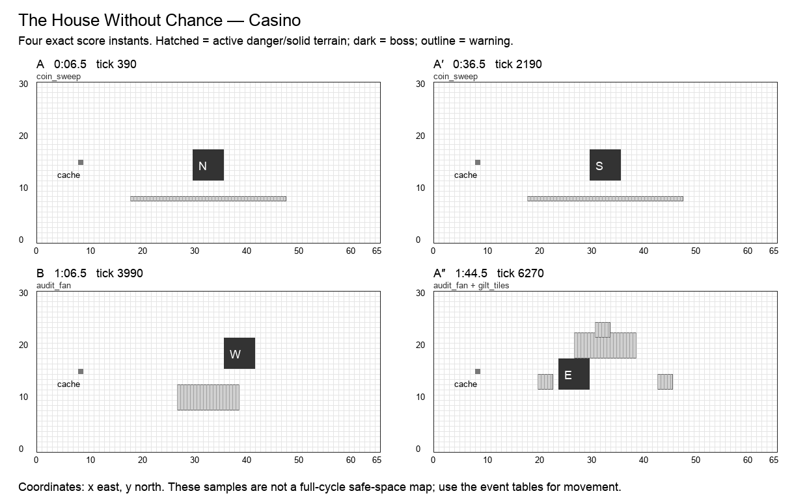

# The House Without Chance

**Casino · Merchant boss · Normal · 120 seconds / 7,200 ticks · six moves · 25 authored events.** Design revision `v2.0-draft.1`. Shared rules: [CONTRACT](CONTRACT.md). All numbers are proposed Arenic tuning, not WoW values or current runtime behavior.

## Historical precedent and creative direction

The primary precedent is **Opulence**, Battle of Dazar’alor, Battle for Azeroth. Scope: Normal/Heroic split approach and jewel preparation.

Opulence begins with separate trapped approaches and preparatory crown jewels before the treasury fight, whose gold effects reward spatial organization. Arenic takes investment before payoff and different approaches. It omits compulsory group splitting, mandatory jewel roles, raid-size tuning, and random payouts.[^1]

A treasury guardian displays every dividend before the first bet. Two trap-lined approaches lead to the same vault. The gamble is how much stationary work to risk in a known window, never a coin flip.

**Unique decision — INVEST:** Cycle-local scrip and personal entitlements guarantee a solvent next loop. The house advertises a posted dividend schedule; a cautious outer route trades a small opportunity for stable progress. Cosmetic dice and roulette never decide combat.

## Arena specification

Two approach strips lie at x=18…25 and x=40…47, joined by y=4 and y=26. The vault stays in the central room; three dividend pads [26,10,4,4], [36,10,4,4], [32,20,4,4] open in a fixed order. No pad is a compulsory soak or a finite shared pickup.

The 66 × 31 coordinate system, six-cell boss footprint, recovery perimeter, forty distinct start slots, and cache at `(8,15)` use [the shared geometry contract](CONTRACT.md). A nonblocking cache supplies personal deterministic Transmute entitlements. Terrain and graphics are distinct: only a `terrain` event changes walkability; only printed impact masks deal boss damage. Fields use integer cell sets.

A′ mirrors applicable masks across x=32.5; B’s geometry and reordered events are explicitly baked into the data. The table below is authoritative even when a prose direction describes the opening motif. A″ restores the opening masks and adds exactly one listed overlap. Its final transfer occurs at 1:53, allowing six full seconds without boss damage before the seam.

The diagram samples exact instants; it does not mark permanently safe working space.

## Composition

| Phrase | Interval | Musical role | Player task |
| --- | --- | --- | --- |
| A | 0:00–0:30 | statement | Read the west approach and save a short charge for the first dividend. |
| A′ | 0:30–1:00 | variation | Take the east approach with the same payoff warning. |
| B | 1:00–1:30 | contrast | The bridge offers a long investment channel before a small safe return. The bridge’s exact reordered attacks appear in the event table. |
| A″ | 1:30–2:00 | return | Reprise the west route with the familiar sweeping tax; unspent resources reset predictably. The event labeled overlap is simultaneous with a familiar move, with its own mask and damage. |

The opening six seconds have no boss damage. Phrases are clock transitions, never damage phases. The six move names remain recognizable through the variations; changed masks and deliberate overlaps supply complexity. The final opportunity window runs until the seam even where it is longer than an earlier instance of that move.

## Six moves

| Move | Damage / behavior | Counterplay and invariant |
| --- | --- | --- |
| **Coin Sweep** (`coin_sweep`) | 1 HP; projectile | A horizontal row of coins crosses the lower vault once. It can be blocked or converted but cannot drain permanent gold. |
| **Gilt Tiles** (`gilt_tiles`) | 2 HP; floor | Three 3×3 gilded pads burst once; their symbols match the visible posted schedule, not a random suit. |
| **Audit Fan** (`audit_fan`) | 1 HP; cone, expose | A fixed vault-side fan wounds and applies Exposure. No damage is based on an actor’s gold, buffs, or deaths. |
| **Closing Bell** (`closing_bell`) | 2 HP; floor | Both outer approach strips flash once; the middle room and all perimeter routes remain safe. |
| **Security Bolts** (`security_bolts`) | 1 HP; projectile | Two marked 2×2 watch posts fire once, creating a defensive support job beside the next dividend pad. |
| **Posted Dividend** (`dividend`) | optional window; window | Transfer/turn to the next vault position for 330 ticks. Each actor on the active dividend pad gains +1 on its first direct hit, plus one cycle scrip on that hit. Off-pad hits remain normal and do not spend banked damage. |

Every impact has a warning start, resolve tick, and end tick. A rectangle is `[x,y,width,height]`, inclusive at its origin and exclusive at its far edge. Ordinary attacks warn for at least two seconds; crush, construction and transfers warn for three. Exposure means one personal delayed wound, as defined in CONTRACT. When two events share a timestamp, both occur in stable event-ID order.

## Complete event score

`End` is exclusive. A one-tick impact ends 1/60 second after the displayed impact timestamp; the exact end tick removes ambiguity. Windows without masks use their explicit condition below, not an invisible arena-wide attack.

| Event | Warning | Impact | Tick | End tick | Move | Exact masks / extra payload |
| --- | --- | --- | ---: | ---: | --- | --- |
| `merchant.1.1` | 0:04.5 | 0:06.5 | 390 | 391 | Coin Sweep | `18,8,30,1`; incoming west |
| `merchant.1.2` | 0:08.5 | 0:10.5 | 630 | 631 | Gilt Tiles | `20,12,3,3`; `43,12,3,3`; `31,22,3,3` |
| `merchant.1.3` | 0:12.5 | 0:14.5 | 870 | 871 | Audit Fan | `27,18,12,5`; incoming south |
| `merchant.1.4` | 0:16.5 | 0:18.5 | 1110 | 1111 | Closing Bell | `18,6,6,18`; `42,6,6,18` |
| `merchant.1.5` | 0:19.5 | 0:21.5 | 1290 | 1291 | Security Bolts | `25,18,2,2`; `39,18,2,2`; incoming north |
| `merchant.1.6` | 0:21.5 | 0:24.5 | 1470 | 1800 | Posted Dividend | —; boss → (30, 12), s; dividend pad [26, 10, 4, 4] |
| `merchant.2.1` | 0:34.5 | 0:36.5 | 2190 | 2191 | Coin Sweep | `18,8,30,1`; incoming east |
| `merchant.2.2` | 0:38.5 | 0:40.5 | 2430 | 2431 | Gilt Tiles | `43,12,3,3`; `20,12,3,3`; `32,22,3,3` |
| `merchant.2.3` | 0:42.5 | 0:44.5 | 2670 | 2671 | Audit Fan | `27,18,12,5`; incoming south |
| `merchant.2.4` | 0:46.5 | 0:48.5 | 2910 | 2911 | Closing Bell | `42,6,6,18`; `18,6,6,18` |
| `merchant.2.5` | 0:49.5 | 0:51.5 | 3090 | 3091 | Security Bolts | `39,18,2,2`; `25,18,2,2`; incoming north |
| `merchant.2.6` | 0:51.5 | 0:54.5 | 3270 | 3600 | Posted Dividend | —; boss → (36, 16), w; dividend pad [36, 10, 4, 4] |
| `merchant.3.1` | 1:04.5 | 1:06.5 | 3990 | 3991 | Audit Fan | `27,8,12,5`; incoming north |
| `merchant.3.2` | 1:08.5 | 1:10.5 | 4230 | 4231 | Coin Sweep | `18,22,30,1`; incoming west |
| `merchant.3.3` | 1:12.5 | 1:14.5 | 4470 | 4471 | Gilt Tiles | `20,16,3,3`; `43,16,3,3`; `31,6,3,3` |
| `merchant.3.4` | 1:16.5 | 1:18.5 | 4710 | 4711 | Security Bolts | `25,11,2,2`; `39,11,2,2`; incoming north |
| `merchant.3.5` | 1:19.5 | 1:21.5 | 4890 | 4891 | Closing Bell | `18,7,6,18`; `42,7,6,18` |
| `merchant.3.6` | 1:21.5 | 1:24.5 | 5070 | 5400 | Posted Dividend | —; boss → (24, 12), e; dividend pad [32, 20, 4, 4] |
| `merchant.4.1` | 1:34.5 | 1:36.5 | 5790 | 5791 | Coin Sweep | `18,8,30,1`; incoming west |
| `merchant.4.2` | 1:38.5 | 1:40.5 | 6030 | 6031 | Gilt Tiles | `20,12,3,3`; `43,12,3,3`; `31,22,3,3` |
| `merchant.4.3` | 1:42.5 | 1:44.5 | 6270 | 6271 | Audit Fan | `27,18,12,5`; incoming south |
| `merchant.4.overlap` | 1:42.5 | 1:44.5 | 6270 | 6271 | Gilt Tiles | `20,12,3,3`; `43,12,3,3`; `31,22,3,3` |
| `merchant.4.4` | 1:46.5 | 1:48.5 | 6510 | 6511 | Closing Bell | `18,6,6,18`; `42,6,6,18` |
| `merchant.4.5` | 1:49.5 | 1:51.5 | 6690 | 6691 | Security Bolts | `25,18,2,2`; `39,18,2,2`; incoming north |
| `merchant.4.6` | 1:50 | 1:53 | 6780 | 7200 | Posted Dividend | —; boss → (30, 12), n; dividend pad [26, 10, 4, 4] |

## Optional reward condition

Stand inside the event’s dividend pad at hit time. The first original direct hit during Dividend earns +1 damage and +1 personal cycle scrip. The claim cannot be taken by another actor.

Each reward can be claimed once per actor per window. No successful bonus is required for ordinary damage or the next phrase. Direct-hit definitions and precedence are in [the implementation contract](IMPLEMENTATION.md#exact-window-conditions); the final window ends at tick 7,200.

## Boss pose and target access

| From | Origin | Facing | Rear witness cell |
| --- | --- | --- | --- |
| 0:00 / tick 0 | `30,12` | n | `30,11` |
| 0:24.5 / tick 1470 | `30,12` | s | `30,18` |
| 0:54.5 / tick 3270 | `36,16` | w | `42,16` |
| 1:24.5 / tick 5070 | `24,12` | e | `23,12` |
| 1:53 / tick 6780 | `30,12` | n | `30,11` |

The target stays grounded during these v2 transfers. A pose is a pure function of this track and cycle tick. Direct projectiles use accepted aim cells; attached DOTs use identity. Each rear witness cell is outside the boss footprint. A player may stand at any other valid adjacent rear cell to reserve a nonconflicting route.

## Walking solution, recovery, and recorded roles

Use y=4 to cross between approaches, then enter the central room before Closing Bell. A Merchant can decline every dividend and use Fortune at ordinary range. A Thief can pickpocket during a posted dwell without altering the next audit. A Cardinal or Bard can repair an overambitious charge after it finishes.

The conservative walking validator finds a zero-hazard cardinal route from `(29,2)`, holds these rear cells for 75 ticks, and returns to `(29,2)` before the seam:

- 0:26, tick 1560: `30,18`.
- 0:56, tick 3360: `42,16`.
- 1:26, tick 5160: `23,12`.
- 1:54.5, tick 6870: `30,11`.

The [full movement witness](data/walking-witnesses.json) is executable planning data at one cardinal cell per 15 ticks. It does not use portals, protection, attunement, or bonus objectives. It establishes a useful solo movement baseline, not a DPS rotation or a simulation of forty heroes. Copying it to multiple heroes without reserving separate cells causes hero contact. Forager setup and player-created friendly fire require the additional fixtures below.

A first recording should claim an approach lane and one working station. A second recording should add a different station or a support adjacency, never simply overlay the first route. Reserve portals and rear cells before adding dense support clusters. A support can widen a damage window, but none is required to make the boss advance.

## All 32 hero abilities

`+` means a strong encounter-specific opportunity, `=` an ordinary useful role, `−` a real positional/timing disadvantage with a stated usable alternative. These are design judgments, not measured DPS. The [ability contract](ABILITIES.md) supplies exact ranges, cooldowns, costs, deterministic changes, and live-versus-planned status.

| Hero | Ability / status | Fit | Opportunity, cost, and fallback |
| --- | --- | --- | --- |
| Hunter | Auto Shot (`auto_shot`); live | + | A short shot spends Posted Dividend without a long Coin Toss commitment. |
| Hunter | Poison Shot (`poison_shot`); planned | = | Apply before the audit and retreat; a DOT does not spend the direct-hit dividend. |
| Hunter | Sniper (`sniper`); planned | + | Spend the pad bonus with a half-second aim; avoid the later outer-strip Closing Bell. |
| Hunter | Trap (`trap`); planned | = | Trap the next vault anchor; remote detonation uses the planter’s position for pad bonuses. |
| Warrior | Bash (`bash`); live | = | Strike from the dividend pad when adjacent; otherwise keep full ordinary melee damage. |
| Warrior | Block (`block`); planned | + | Shield Coin Sweep or Security Bolts; Closing Bell still demands central positioning. |
| Warrior | Taunt (`taunt`); planned | + | Protect a charging Merchant from Audit Fan; no minimum two-hero roster is required. |
| Warrior | Bulwark (`bulwark`); planned | + | Protect Audit Fan near a work pad; never turn the deployed graphic into body collision. |
| Thief | Backstab (`backstab`); live | + | Long vault dwells support repeated stabs; dividend rewards only the first qualifying hit. |
| Thief | Shadow Step (`shadow_step`); planned | = | Escape Closing Bell to the middle; a long charged Coin Toss is still cancelled by own movement. |
| Thief | Misdirection (`smoke_screen`); planned | + | Coin Sweep supplies a thematic guaranteed return; conversion never steals persistent currency. |
| Thief | Pickpocket (`pickpocket`); planned | + | Posted Dividend advertises exactly when a long theft is safe; greed is timing, not RNG. |
| Alchemist | Acid Flask (`acid_flask`); live | = | Use a vault footprint rather than a dividend pad; friendly pools can erase the pad’s advantage. |
| Alchemist | Ironskin Draft (`ironskin_draft`); planned | + | Cover a planned charge against Audit Fan; the aura cannot repay a missed coin. |
| Alchemist | Siphon (`siphon`); planned | + | Recovery after Closing Bell supports another investment; no siphoned HP funds permanent gold. |
| Alchemist | Transmute (`transmute`); planned | + | Guaranteed conversion supports cycle investment; zero permanent wealth is sufficient to start. |
| Cardinal | Sacrifice (`heal`); live | = | Channel beside a vault during a quiet dwell; direct-hit dividend rules do not count channel pulses. |
| Cardinal | Barrier (`barrier`); planned | + | Shield an investing actor; personal event caps prevent an army of shields from multiplying income. |
| Cardinal | Beam (`beam`); planned | = | A clear dividend line can repay positioning with damage and healing; no ally body blocks it. |
| Cardinal | Resurrect (`resurrect`); planned | = | Revive between audit phases; restored actors receive no refund of missed dividends. |
| Bard | Cleanse (`cleanse`); live | + | Repair an overlong investment and keep damage ticking through a vault transfer. |
| Bard | Dance (`dance`); planned | + | A four-second performance can fit a posted quiet investment window without spending scrip. |
| Bard | Mimic (`mimic`); planned | + | Count direct pad hits but not dividend bonus packets; Vault cannot recursively amplify echoes. |
| Bard | Helix (`helix`); planned | = | Prepare a charge before investment; a new aura never shortens a Coin Toss hold. |
| Forager | Dig (`dig`); live | = | Prepare the next vault anchor; digging a dividend pad does not damage an absent boss. |
| Forager | Boulder (`bolder`); planned | = | Roll down an approach toward the vault; collision with scenery stops rather than refunds it. |
| Forager | Border (`border`); planned | + | A dug watch-post line can turn Security Bolts into boss credit; no random payout. |
| Forager | Symbiosis (`mushroom`); planned | = | A vault-side node repairs investment wounds; feeding uses fixed rocks, never random income. |
| Merchant | Fortune (`fortune`); live | + | Guaranteed base-income damage fits the theme; it competes with Coin Toss/Dice/Vault while active. |
| Merchant | Coin Toss (`coin_toss`); planned | + | Short versus full charge is the central decision; Closing Bell and the next pad are known. |
| Merchant | Dice (`dice`); planned | + | The house’s odds are visible arithmetic; dividend priority preserves unused certainty. |
| Merchant | Vault (`vault`); planned | + | Territory and posted payout reinforce each other, with one bonus packet per hit and no exponential stacking. |

Every pair of these abilities is governed by the [interaction pipeline](INTERACTIONS.md). A support effect cannot move the boss score, a copied hit cannot copy itself, and a bonus cannot multiply another bonus. The same-caster active-cast restriction remains meaningful: in particular, Fortune competes with that Merchant’s other actions while its aura is active.

## Presentation and authored assets

Use a posted dividend board, three labeled work pads, fixed coin rows, an audit fan, and a readable closing-bell floor cue. Dice, roulettes and coin flips are cosmetic flourishes with already displayed outcomes.

All warning graphics must show the actual mask at native gameplay scale. The six move cues need distinct silhouettes or symbols in addition to sound. Existing boss appearances may be reused; this specification does not claim new attack art, sounds, or engine resources have been produced.

## Implementation and acceptance

No bonus depends on bank wealth, lucky rolls, prior-cycle streaks, or how many other heroes took the pad. Do not turn resource shortage into a recording refusal on a later cycle; wallets reset at the seam.

- **Broke entry:** Start with no permanent gold. The cycle wallet and Fortune still provide a useful route; no paid entry, roll, or shared-pickup race exists.
- **Bonus priority:** On a direct hit with Dividend, Dice, Vault and Helix available, apply only Dividend +1. Preserve other unspent charges until their own expiry.
- **Active-cast cost:** Attempt Coin Toss during the same Merchant’s Fortune. Reject visibly without spending scrip. A separate Merchant may charge concurrently.
- **Budget reset:** Miss every coin in cycle one, save/reload near the seam, then run cycle two. The initial wallet and casts match a clean cycle; banked wealth has no input path.

Also run the shared empty-roster/full-roster boss-score checksum, 100-cycle restart comparison, boundary save/load, simultaneous-event ordering, viewport/audio independence, and source/loaded-resource parity fixtures in [IMPLEMENTATION](IMPLEMENTATION.md). These are required future runtime gates. The delivered static validator checks the authored design data and solo walking witnesses; it does not claim those Godot tests already passed.

Per-arena state consists only of the shared clock/revision, active actor effects and budgets, earned personal window flags, and existing combat/recording authority. Pose, warning, visual animation, and terrain shape are derived from the score. A window claim, portal cooldown, attunement, or overlap counter that affects outcomes must be captured/restored through the versioned save boundary.

No Heroic/Mythic timeline is implied by this Normal score. A harder tier requires a separate authored score and the same coverage/navigation gates; increasing damage or narrowing a lane under an existing recording’s fingerprint is forbidden.

## Sources

[^1]: Opulence, [Battle of Dazar’alor encounter guide](https://www.wowhead.com/guide/opulence-treasure-guardian-battle-of-dazaralor-raid-strategy-guide); BigWigs Mods, [pinned encounter source](https://github.com/BigWigsMods/BigWigs_BattleForAzeroth/blob/ddb54c9f8bb25c8a23167c0688ee428b33091b31/BattleOfDazaralor/Opulence.lua). Scope/difficulty distinctions and rejected alternatives are in [research](research/README.md). Arenic adaptation, timing, geometry, and tuning are original design decisions.
