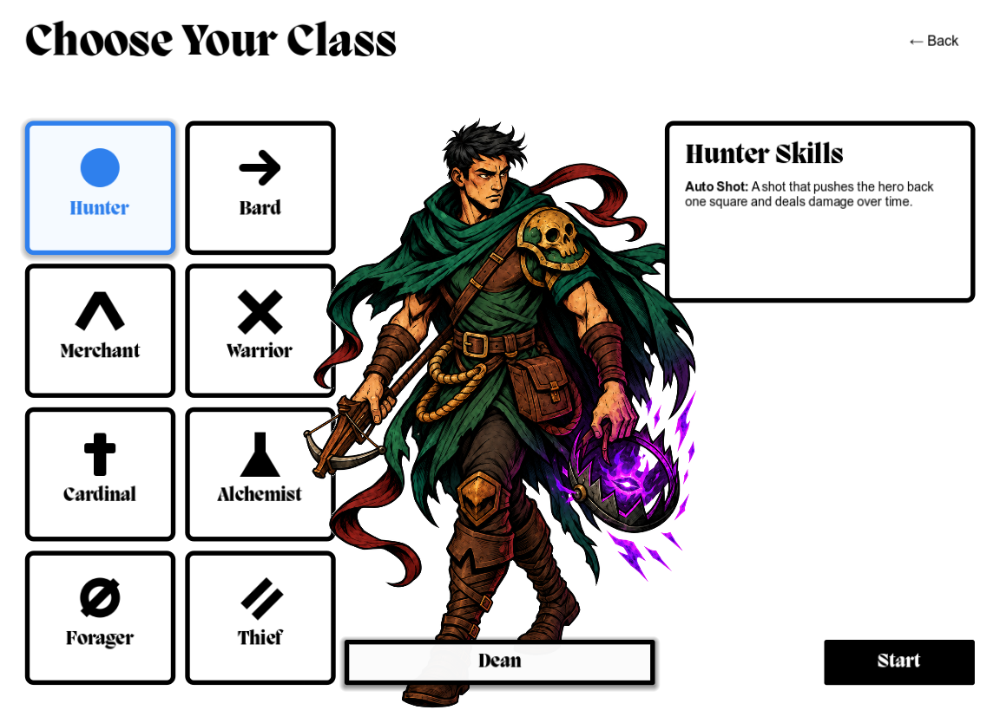

# Class selection

Title **Start** creates a pending save slot and opens `res://scenes/character_creation/class_selection.tscn`. **Back** or Escape returns to the title through `SaveGames`.

## Choose a class

The eight cards appear in catalog order: Hunter, Bard, Merchant, Warrior, Cardinal, Alchemist, Forager, and Thief. Clicking a card or moving keyboard focus to it updates the blue selection, portrait, character name, and skills. Tab and arrow keys move focus. **Space**, **Enter / Return**, or the numeric keypad Enter key starts with the selected hero, including while its card has focus. Back keeps its own keyboard activation; held-key repeats do not confirm again.

The class screen's **Start** stores the definition through `RunSetup.choose_class`, emits the screen's `class_confirmed` signal, and opens its configured **Next Scene** (`next_scene`), the game shell. New heroes enter the [Guild House introduction](introduction.md). The button shows outlined Spacebar and Return keycaps beside Start; its native minimum size keeps the text and icons inside the button. The reusable SVG is `arenic-game/assets/icons/controls/start-shortcuts.svg`.

## Layout and portraits

The reference size is 1280×768. The layout uses exactly 14 rows and 12 columns, a 32-pixel outer margin, and 12-pixel gutters. Using zero-based indices, the two-column, four-row card block occupies columns 0–3 and rows 2–13; each card spans two columns and three rows.

The center portrait renders at `z_index = 10` and can overlap the cards. It ignores mouse input, so visible artwork does not intercept card clicks. The heading, information panel, nameplate, and confirmation button render above it at `z_index = 20`. Portraits retain their aspect ratio and stay bottom-aligned; a width limit preserves card-label readability in narrower windows.

Portrait PNGs in `arenic-game/assets/portraits/` retain their original generated RGB pixels. `scripts/character_creation/portrait_cutout.gdshader` removes their near-white backing at display time. Native `AtlasTexture.region` resources crop the framing without modifying the image files; per-class height and offset settings control placement. The PNG files themselves do not contain transparent alpha.

All eight portraits now use the approved regenerated v2 artwork. [Active portrait records](../assets/portraits/class-selection/active-portraits.json) identify the source images, current hashes, crop regions, and archived v1 originals. The Cardinal uses a height factor of `0.93` to keep its flame clear of the heading. Sunburst remains an optional comparison backdrop only.

## Edit class content

All resource paths below are under `arenic-game/data/classes/`:

- `catalog.tres` is an `ArenicClassCatalog` containing the eight ordered definitions.
- `<class_id>.tres` uses the shared `ArenicClassDefinition` type. Its fields are `class_id`, `display_name`, `character_name`, `icon`, `portrait`, `skills`, `portrait_height`, and `portrait_offset`. The last two fields affect presentation only.
- `<class_id>_primary.tres` uses the shared `ArenicClassAbility` type, with `title` and `description`. A definition's `skills` array supplies the information panel.

The shared resource scripts and interaction controller are in `arenic-game/scripts/character_creation/`. The reusable native card scene and theme are in `arenic-game/scenes/character_creation/`.

The current skill summaries are temporary copy based on the user's reference screenshots. No new complete rulebook has been supplied; review and replace these summaries when it is available.

## Verification

Verified in Godot 4.7.2 on the current Mac: all eight class selections, content and portrait changes, click-through on overlapping artwork, arrow-key navigation, Enter confirmation, Escape back to the title, and clearing the previous choice when starting again. All 22 interaction and state checks passed. Eight GDScript files had no diagnostics, and the final runtime log contained no errors or warnings.

Rendered layouts were reviewed at 1280×768, 1600×900, and 1024×768. The reference-size grid margins, gutters, and first-card bounds were also checked numerically. At that initial verification, gameplay and save transitions had not yet been connected.

After activating v2, all eight textures were reimported, all eight crop regions were read back, and each class was selected and visually reviewed in the 1152×819 embedded Godot preview. No runtime errors or warnings were reported. The image below shows the active v2 Hunter.

