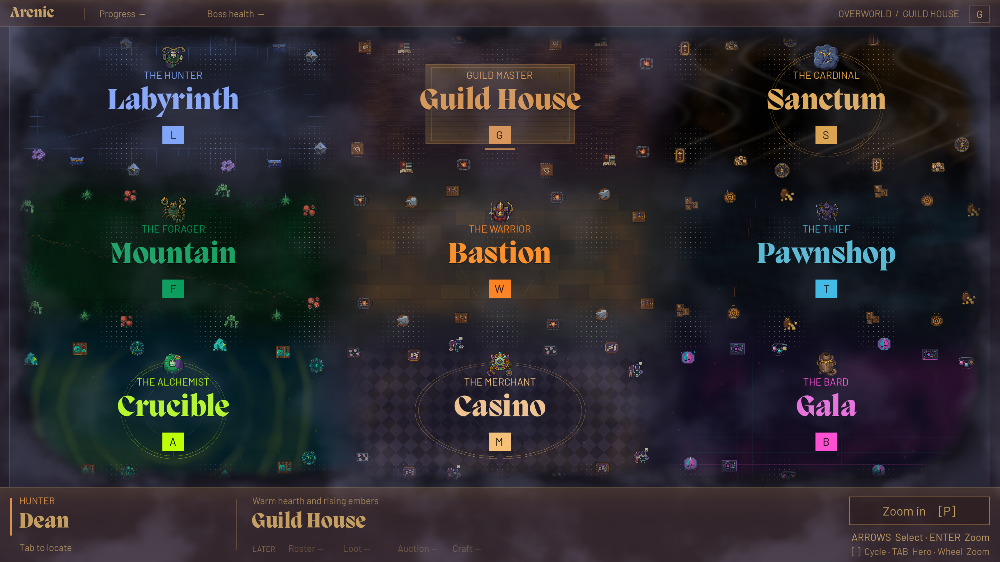

# Connected overworld atmosphere

The overview presents nine themed regions as one rounded, softly eroded landmass. Navigation, arena footprints, hero movement, the 66×31 cell lattice, and 19 logical pixels per focused tile remain authoritative and unchanged.



## Rendering and ownership

`OverworldStage` derives `overview_mix` from the actual camera span (`smoothstep(22, 46, view_span.x)`). Camera progress and settling synchronize the presentation, including cinematic seeks. Exact zero restores focused props, materials and HUD surfaces. The stage owns its sky and foreground, so stage replacement frees them while preserving the shell's HUD.

| Layer | Treatment | Cost / behavior |
| --- | --- | --- |
| Regional floor and backdrop | Shared, organically warped world-space palette field; matching color at mesh joins and four-way intersections. Motifs fade locally before their edges. | Existing shaders; four adjacent palette samples from bounded nine-entry uniform arrays, no screen texture. |
| Frames and decorations | Frames fade away; 108 existing props become quieter and slightly less regular. Full sprite canvases remain within their own arena. | Existing nodes; transforms change only when the blend changes. Exact focused positions and opacity restore at zero. |
| Coast and sky, CanvasLayer 4 | Rounded irregular silhouette, dark feathering and soft rock shadow. | One canvas quad using the shared 256×256 seamless noise texture. Inverse projected-plane coordinates follow orthographic camera rotation and tilt. Degenerate or non-finite projections disable the coast. |
| Labels, CanvasLayer 5 | Palette-colored Migra labels remain sharp. A short underline marks selection. | Existing cached text; no rectangular selection outline. |
| Navigation dissolve, CanvasLayer 6 | Bounded blur and dark themed mist during camera navigation. | One regional screen copy and fixed nine-tap draw; both disabled at rest. |
| Persistent HUD, CanvasLayer 20 | Themed translucent strips run edge-to-edge across the viewport, with square corners, inner separators and a full-width sheen. No outer frame or shadow; hotkey badges and buttons also have zero corner radius. | Cached StyleBox resources and one shared small gradient; no refraction or extra screen copy. Control geometry stays fixed. |
| Foreground clouds, CanvasLayer 21 | Very light clouds drift left to right across the world and HUD. | One quad, two noise samples; mouse input ignored. Both overview quads stop rendering when focused. |

`ArenicOverworldAtmosphere` exposes `atmosphere_time`, `atmosphere_playing`, and `cloud_period_seconds` for sequences. The default cycle is **360 seconds**; the inspector range is 120–600 seconds. Pause clock advancement before seeking. Repeating noise coordinates make the cycle boundary continuous. The clock pauses in focused view and resumes in overview.

Overview clicking uses the middle of the coast fade as the land boundary. The few irregular wisps beyond that boundary are decorative; clicking the surrounding sky does not select an arena. During zoom/pan, the existing swept-arena picking remains available.

## Retina transition correction

The reported top-left rectangle was reproduced in the actual 3436×1932 game view, after exercising `P` and focused arena navigation. Godot 4.7.2's canvas renderers consume the raw `BackBufferCopy.rect` in render-target pixels. The former logical 1254×589 rectangle therefore copied only the top-left fraction on a scaled framebuffer.

The copy rectangle now uses the viewport stretch transform, rounded outward to cover edge pixels. The fog's drawing rectangle remains in logical coordinates, and sampling stays normalized to the world band. A viewport size-change signal updates the copy even when the logical 1280×720 layout does not resize. Window letterbox margins are excluded from the screen texture.

- [Before: top-left scene and dark remainder](images/overworld-atmosphere/transition-before.png)
- [After: full scene coverage during a paused focused pan](images/overworld-atmosphere/transition-after.png)

Godot source references: [RD canvas renderer](https://github.com/godotengine/godot/blob/4.7.2-stable/servers/rendering/renderer_rd/renderer_canvas_render_rd.cpp), [Compatibility canvas renderer](https://github.com/godotengine/godot/blob/4.7.2-stable/drivers/gles3/rasterizer_canvas_gles3.cpp). Recheck the coordinate contract on engine upgrades.

## Validation

All fourteen suites passed without script/shader errors. Saved results are in [overworld-validation.json](overworld-validation.json). The new suites cover regional palette ordering and restoration, HUD resource reuse and geometry, periodic cloud seeking, tilted/rotated projection, coast picking, stage replacement, and exact focused endpoints.

The rendered transition regression fails before the fix at 1920×1080 (a colored scene sample becomes black) and passes after it at window sizes 1280×720, 1920×1080, 2560×1440, 3436×1932, and 2560×1600 with letterboxing. It checks identity, fog and rapid retargeting across the full image. The larger 16:9 test's actual framebuffer is 3434×1932 after content fitting.

Run the relevant scripts with Godot from `arenic-game/`:

```sh
godot --headless --path . --script res://tests/themes/region_checks.gd
godot --path . --script res://tests/themes/overworld_checks.gd
godot --path . --script res://tests/world/transition_render_checks.gd
godot --path . --script res://tests/display/display_checks.gd
godot --path . --script res://tests/themes/transition_benchmark.gd -- --render-size=3436x2009
```

The benchmark requires a real renderer and no other running game. The historical native-resolution reports from before this fix copied too small a screen region and are not representative of corrected transition cost. The current report is [overworld-native-benchmark.json](overworld-native-benchmark.json).

On the local M4 Max using Metal/Forward+, the corrected **3436×1932** framebuffer ran at 118–120 reported FPS. Across 645 transition-route frame intervals, p95 was 10.081 ms, p99 10.878 ms, and maximum 11.419 ms; none exceeded the 16.67 ms budget. The first animated effect frame took 6.557 ms with no new pipeline compilation. The matched control had two brief frames over budget, illustrating why these short local measurements are evidence rather than a universal guarantee. No other game instance was running during measurement.
