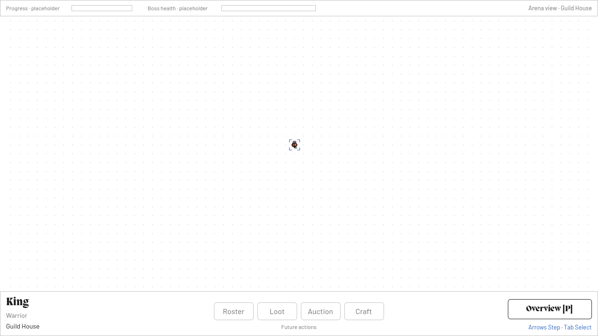
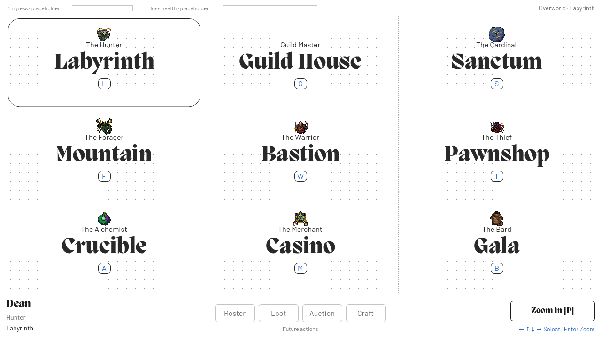
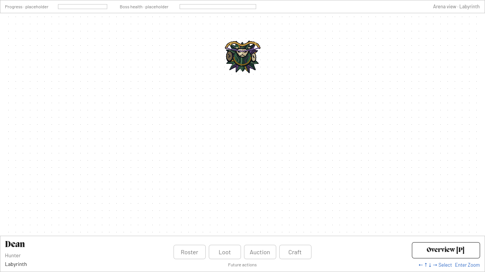

# Overworld

The overworld follows class selection and presents nine arenas in a continuous 3 × 3 grid. A native orthographic `Camera3D` switches between the complete world and a selected arena. Arena contents, the camera, screen labels, sequences, and the persistent HUD have separate owners so later gameplay or cinematics can extend the scene without replacing its foundations.

**Implemented:** Class selection opens the overworld with Guild House highlighted. The chosen hero spawns there, using its native 19 × 19 sprite, and can be selected and moved in a focused arena. Nine arenas each render a complete 66 × 31 tile lattice. Eight arenas display their matching boss; Guild House has no boss. Orthographic navigation, projected labels, and a persistent HUD are integrated. Bosses are presentation only: combat, recordings, a multi-hero roster, and cutscene content remain future work.

## Reference and coordinate system

The reference is [`matthewharwood/arenic`, commit `60da21575de191461a12f2b2f68a7efd1b254bcd`](https://github.com/matthewharwood/arenic/commit/60da21575de191461a12f2b2f68a7efd1b254bcd), dated 2026-06-10. The [arena identity table](https://github.com/matthewharwood/arenic/blob/60da21575de191461a12f2b2f68a7efd1b254bcd/crates/arenic_game/src/arena.rs#L24-L72) and [grid geometry](https://github.com/matthewharwood/arenic/blob/60da21575de191461a12f2b2f68a7efd1b254bcd/crates/arenic_game/src/grid.rs#L11-L48) are the source of arena order, names, dimensions, and placement. The Rust code is reference material; this implementation uses Godot resources, nodes, and GDScript.

The board moves from the reference's XY plane to Godot's XZ plane:

```text
reference (x, y, lift) → Godot (x, lift, -y)

grid width / height   = 66 / 31 tiles
tile size             = 0.25 world units
arena width / depth   = 16.5 / 7.75 world units
world columns / rows  = 3 / 3
```

Arena slots grow toward +X and +Z, so increasing the slot row moves down the screen. Local tile rows grow toward −Z, so increasing a tile row moves up the screen. These are intentionally different: they preserve the reference's arena and local-tile conventions.

For slot `(sx, sy)` and local tile `(column, row)`:

```text
arena_origin = (sx × 16.5, 0, sy × 7.75)
tile_center  = arena_origin + (column × 0.25, 0, -row × 0.25)
arena_center = arena_origin + (8.125, 0, -3.75)
```

The arena origin is the center of tile `(0, 0)`, not the outer corner of its footprint. `Rect2` values represent world `(X, Z)` coordinates with positive size. Half-tile bounds are included around the outermost tile centers:

```text
arena_rect(slot) = Rect2(origin.x - 0.125, origin.z - 7.625, 16.5, 7.75)
world_rect()    = Rect2(-0.125, -7.625, 49.5, 23.25)
world center    = (24.625, 0, 4.0)
```

Adjacent arena footprints meet exactly. There is no gap between slots, and no extra tile row or column at a seam.

## Arena data

`arenic-game/data/world/arenia.tres` holds an ordered `ArenicWorldDefinition` and references individual `ArenicArenaDefinition` resources under the same data directory. The array order is row-major and keeps Guild House at index 1.

| Index | Slot | Arena | Class | Hotkey | Godot center `(X, Z)` |
| ---: | --- | --- | --- | --- | --- |
| 0 | `(0, 0)` | Labyrinth | Hunter | L | `(8.125, -3.75)` |
| 1 | `(1, 0)` | Guild House | Guildmaster | G | `(24.625, -3.75)` |
| 2 | `(2, 0)` | Sanctum | Cardinal | S | `(41.125, -3.75)` |
| 3 | `(0, 1)` | Mountain | Forager | F | `(8.125, 4.0)` |
| 4 | `(1, 1)` | Bastion | Warrior | W | `(24.625, 4.0)` |
| 5 | `(2, 1)` | Pawnshop | Thief | T | `(41.125, 4.0)` |
| 6 | `(0, 2)` | Crucible | Alchemist | A | `(8.125, 11.75)` |
| 7 | `(1, 2)` | Casino | Merchant | M | `(24.625, 11.75)` |
| 8 | `(2, 2)` | Gala | Bard | B | `(41.125, 11.75)` |

Each arena resource exposes `arena_id`, `display_name`, `class_id`, `class_label`, `hotkey`, `grid_slot`, `boss: ArenicBossDefinition`, `boss_origin_cell`, `boss_facing`, and optional `content_scene`. Eight definitions explicitly reference their matching resource in `arenic-game/data/bosses/`; Guild House leaves `boss` null. `boss_origin_cell` defaults to `(30, 22)`, the lower-left tile of the six-by-six-cell art canvas, and `boss_facing` defaults to `"n"`.

The content scene is the extension point for arena-specific gameplay. It is mounted under the arena’s `ContentSlot`, whose origin is the arena center. Subtract `arena_center(slot)` from `tile_to_world(slot, cell)` to place a tile in these local coordinates.

World validation requires exactly nine non-null entries, unique non-empty IDs and hotkeys, and unique valid slots. Hotkey uniqueness ignores letter case. `index_for_class(class_id)` looks up the class-themed arena and falls back to Guild House at index 1 when no class matches. New heroes always spawn in Guild House, irrespective of this class lookup. `index_for_id(id)` and `index_for_slot(slot)` return `-1` when absent. Validate the world resource before relying on the fixed fallback index.

## Tile and boss presentation

Each arena's `Tiles` node is an `ArenicArenaTiles` / `MultiMeshInstance3D` with **2,046 real PlaneMesh instances** on XZ. Each plane measures 0.25 × 0.25 units. A shared 19 × 19 opaque white texture contains one gray pixel at `(9, 9)`; nearest filtering, no mipmaps, and an unshaded material preserve the source at close-view scale. Arenas own separate instance transforms and share the immutable mesh, material, and texture. There are no grid lines or randomly placed markers. `tile_center(cell)` returns the local center matching the grid conversion above.

`ArenicArenaView` mounts the assigned boss as an unshaded, nearest-filtered `AnimatedSprite3D` playing `idle_n` by default. Its 114 × 114 frame uses `pixel_size = 0.25 / 19` and the centered `(57, 57)` pivot, so the art canvas covers exactly six cells in each direction. It sits 0.01 units above the tiles; its center is 2.5 tile steps toward +X/−Z from `boss_origin_cell`. The full canvas must fit inside the arena. This footprint positions artwork; it does not define collision, health, or combat rules. See the [boss source and export contract](../assets/bosses/README.md).

## Scene ownership

The scripts live under `arenic-game/scripts/world/`. The game entry scene is `arenic-game/scenes/game/game_shell.tscn`.

```text
GameShell (Node)
├── ContentSlot (Node)
│   └── OverworldStage (Node3D)
│       ├── Arenas (Node3D)
│       │   └── nine arena instances
│       │       └── ContentSlot / Hero (in the hero's current arena)
│       ├── CameraRig
│       │   └── Camera3D
│       ├── Labels (CanvasLayer)
│       │   └── WorldLabels
│       └── SequenceSlot (Node)
└── HUD (CanvasLayer)
    └── HUDOutline
```

`GameShell` owns the replaceable stage and the persistent HUD as separate branches. `replace_stage(packed)` replaces the content scene in `ContentSlot` while retaining `HUD` and `HUDOutline`. World labels belong to the stage because they describe its arenas. The stage's public surface includes `camera_rig`, `world`, `select_arena(index)`, `get_arena(index)`, `mount_hero(state)`, `sync_hero(show_selection)`, and `hero_at_screen(point)`.

The HUD shows the selected hero, class, arena, navigation hints, and an active overview/zoom button. Progress and boss-health outlines are explicitly marked as placeholders; roster, loot, auction, and craft buttons are disabled future actions. These controls carry no combat or inventory state.

## Orthographic camera and viewport fit

The native `Camera3D` sits above the XZ board, looks down −Y, and uses −Z as screen-up. It uses orthographic projection with uniform scale, so lifting an object above the board does not enlarge it through perspective. `CameraRig` exports `focus_world` and `view_span` as the camera's authorable target and framing controls.

`GameShell` sets the window to a fixed **1280 × 720 logical viewport**, with `CONTENT_SCALE_MODE_VIEWPORT`, `CONTENT_SCALE_ASPECT_KEEP`, and `CONTENT_SCALE_STRETCH_INTEGER`. Larger windows show whole-number enlargements with letterboxing; they do not expand the playable rectangle. The project default window is also 1280 × 720. Title and class-selection scenes retain their own responsive canvas reference layouts. The rig's general viewport-fit math remains available for isolated views and future cinematic composition.

The [reference camera](https://github.com/matthewharwood/arenic/blob/60da21575de191461a12f2b2f68a7efd1b254bcd/crates/arenic/src/intro_scene.rs#L192-L243) uses a vertical field of view of π/8 and perspective distances 24 and 72. Its projected tile size is approximately 18.85 px at 1280 × 720. Godot fits the desired XZ rectangle directly to the current safe viewport instead of using those perspective distances as orthographic settings.

At 1280 × 720, the safe HUD insets are 13 px on each side, 35 px at the top, and 96 px at the bottom:

```text
safe rectangle = Rect2(13, 35, 1254, 589)
safe center    = (640, 329.5)

pixels_per_unit = min(safe_width / span_width, safe_height / span_depth)
```

For one arena, `min(1254 / 16.5, 589 / 7.75) = 76` pixels per world unit. A 0.25-unit tile therefore measures **exactly 19 logical pixels**, and a boss canvas measures **114 × 114 logical pixels**. The arena exactly fills the 1254 × 589 safe region, with its tile edges on whole pixels. Overview uses the 49.5 × 23.25 world footprint at one-third scale: 6⅓ pixels per tile and 38 × 38 pixels per boss canvas. The native one-source-pixel presentation applies to close view; overview deliberately reduces the same world artwork.

With `Camera3D` preserving vertical size, its full-window orthographic height is `viewport_height / pixels_per_unit`: approximately 9.473684 units for one arena and 28.421053 units for overview at the default viewport. The camera centers the target in the safe region, not the full window. For axis-aligned XZ framing, its position offset from `focus_world` is:

```text
offset.x = (right_inset - left_inset) / (2 × pixels_per_unit)
offset.z = (bottom_inset - top_inset) / (2 × pixels_per_unit)
```

Equal side insets produce no horizontal shift. The larger bottom bar moves the visible arena upward into the safe band. The rig recomputes when its viewport changes; the game shell normally keeps that viewport at 1280 × 720 and enlarges its completed image by an integer factor. At 2× output scale, close-view tiles measure 38 output pixels and boss canvases measure 228.

## Navigation

| Input | Behavior |
| --- | --- |
| L, G, S, F, W, T, A, M, B | Select the matching arena from the table above. |
| P | Toggle overview and the selected arena's close view. |
| `[` / `]` | Select the previous/next arena, wrapping through all nine. |
| Arrow keys | In the focused hero arena, step the selected hero one tile per new press. In overview or another arena, select the adjacent arena. |
| Tab / Shift+Tab | Find the current hero, select it, and zoom to its arena. Both address the sole hero in this revision. |
| Click the hero / an empty tile | In its focused arena, select / deselect the hero. An unselected hero does not move. |
| Enter | Zoom to the selected arena. |
| Click an arena | Select it. |
| Double-click an arena | Select it and zoom in. |
| Wheel up | Zoom in to the selected arena. |
| Wheel down | Return to overview. |
| Escape | Return to overview; when already there, remain in the game. |

Hero movement follows the reference's [tile-step input](https://github.com/matthewharwood/arenic/blob/60da21575de191461a12f2b2f68a7efd1b254bcd/crates/arenic_game/src/grid.rs#L51-L102) and [edge-walking](https://github.com/matthewharwood/arenic/blob/60da21575de191461a12f2b2f68a7efd1b254bcd/crates/arenic/src/travel.rs#L144-L189): a new arrow press moves exactly one tile, holding never repeats, simultaneous directions combine into a diagonal, and opposites cancel. Crossing an arena edge enters its neighbor at the opposite edge and moves camera focus with the hero. Horizontal crossings take priority at corners; the outer world boundary clamps and never wraps. Boss artwork has no collision in this revision.

The Godot port deliberately limits hero control to its focused arena so overview arrows retain map navigation. Camera hotkeys do not teleport the hero. Tab finds it again. Clicking the hero is an addition to the original puck controls. Clicking empty floor deselects; arrows then leave both hero and camera still until selection resumes. Letter shortcuts, brackets, P, and Escape remain available. Escape returns to overview, not the title.

## Hero state, sprite, and input ownership

`RunSetup.choose_class()` creates one `ArenicHeroState`, with the chosen class definition, `arena_id = "guild_house"`, cell `(30, 15)`, north facing, and selected status. `begin_new_game()` resets it. A direct GameShell launch supplies the Hunter as a development default. The hero state lives in the run autoload; replacing a stage remounts a new view without resetting position or identity. A replacement world must contain the hero's current arena; an incompatible stage is rejected before the existing stage is removed.

`ArenicHeroInput` turns non-echo arrow press events into four bounded flags. The next physics tick consumes a single device-neutral tile vector. Navigation, selection changes, focus loss, and sequence acquisition clear pending input, so it cannot move the hero after control changes. `ArenicHeroState.step()` owns bounds, edge crossing, and facing; no movement rule reads a rendered transform. The four-way art uses vertical facing on diagonal moves and retains its direction on a blocked step.

Each class resource references its own `world_sprite_frames`. `ArenicHeroView` displays an unshaded, nearest-filtered `AnimatedSprite3D` at `pixel_size = 0.25 / 19`, centered above its authoritative tile. A small blue corner marker shows selection without covering the sprite. The native idle frames and timings are preserved; no walking cycle or abilities were invented. See [base hero exports](../assets/README.md).

The view is a child of its current arena's `ContentSlot`, so arena visibility, scene replacement, and future authored shots work with the existing tree. Edge travel reparents only the view and preserves the same state. During a sequence, both navigation and hero input yield to the sequence owner. The marker returns when ordinary focused control resumes.

## Optional sequences and camera ownership

`GameShell.entry_sequence` is an optional `PackedScene`. Its default is empty, so class selection enters ordinary gameplay directly without a mandatory cinematic.

A sequence root extends `ArenicWorldSequence` and provides `finished`, `start(stage)`, `cancel()`, and `finish()`. The shell instantiates it under the stage's `SequenceSlot`, **adds it to the tree first**, then calls `start(stage)`. This ordering lets the sequence's nodes and animations be ready before it reads the stage or starts playback. `finish()` signals completion; cancellation must release the same ownership and remove the sequence's transient effects.

While a sequence is active, its controller exclusively owns the camera. Ordinary focus/zoom inputs yield while the sequence owns the camera. Escape calls its cancellation hook. Completion or cancellation restores the overhead orientation, reframes the current selection, and returns control to navigation. Starting another sequence or swapping the stage cancels the previous sequence first.

A sequence can use a native `AnimationPlayer` whose root is set relative to the `OverworldStage`. Tracks can then author `CameraRig:focus_world`, `CameraRig:view_span`, and other stage properties directly. The exported rig properties are the stable animation surface; the rig remains responsible for orthographic fit and HUD-safe offset. Do not animate the derived rig position or the Camera3D child. For an AnimationPlayer directly under the sequence root, `root_node = "../../.."` addresses the stage. Connect `animation_finished` to a callback that calls `finish()` after the intended final animation. Stop players and clean up transient effects in `cancel()`.

The default fit assumes overhead viewing. Rotation tracks are available for authored shots, but a tilted shot must author sufficient `view_span` for its composition; automatic perspective or tilted-frustum bounds fitting is outside this revision. A native AnimationPlayer is enough for a linear intro; no animation state graph is required yet.

## Geometry checks and integration verification

`ArenicGridMath` exposes static `arena_origin(slot)`, `arena_center(slot)`, `arena_rect(slot)`, `world_rect()`, `tile_to_world(slot, cell)`, `world_to_tile(slot, world)`, `tile_valid(cell)`, and `slot_valid(slot)`. Coordinate conversion does not clamp. `world_to_tile` ignores lift and preserves invalid outside indices so the caller can reject them.

Picking follows the same lower-inclusive, upper-exclusive XZ bounds as `Rect2`. With `local = world - arena_origin(slot)`:

```text
column = floor(local.x / 0.25 + 0.5)
row    = ceil(-local.z / 0.25 - 0.5)
```

The different rounding directions account for local rows running toward −Z. For arena `(0, 0)`, the valid Z interval is `[-7.625, 0.125)`: the minimum maps to row 30, and the excluded maximum maps to row −1.

The project test scripts live in `arenic-game/tests/world/` and `arenic-game/tests/heroes/`. From this repository on the current Mac:

```sh
"/Applications/Godot.app/Contents/MacOS/Godot" --headless --path arenic-game --script res://tests/heroes/hero_checks.gd
"/Applications/Godot.app/Contents/MacOS/Godot" --headless --path arenic-game --script res://tests/heroes/hero_flow_checks.gd
"/Applications/Godot.app/Contents/MacOS/Godot" --headless --path arenic-game --script res://tests/world/grid_checks.gd
"/Applications/Godot.app/Contents/MacOS/Godot" --headless --path arenic-game --script res://tests/world/camera_checks.gd
"/Applications/Godot.app/Contents/MacOS/Godot" --headless --path arenic-game --script res://tests/world/flow_checks.gd
"/Applications/Godot.app/Contents/MacOS/Godot" --path arenic-game --script res://tests/world/arena_tiles_checks.gd
```

`hero_checks.gd` passed 112 assertions covering all eight identities, bounded press input, diagonals/opposites, all 24 directed arena crossings, corner priority, outer boundaries, and invalid-state rejection. `hero_flow_checks.gd` passed another 112 assertions using real viewport input events: all eight class handoffs, picking/deselection, movement and facing, hotkey cancellation, Tab refocus, retained state across stage replacement, sequence ownership, edge reparenting, and HUD exclusion. Existing world/flow/camera checks also passed after hero integration.

A native Godot Play launch was visually tested through title → Warrior choice → Guild House. Mouse deselection prevented movement; clicking the sprite reselected it, and physical arrow inputs changed its tile and facing. The screenshot below shows the actual 1280 × 720 viewport. Its 19 × 19 Warrior canvas matched all 143 opaque pixels of the paused east-facing source frame exactly, with no scaling or filtering mismatch. Runtime error log was empty. Animation playback was restored after capture.



`grid_checks.gd` checks 354 geometry assertions, including all nine footprints, center/corner round trips, height independence, half-open seams and invalid cells. `camera_checks.gd` checks exact 19 px cells, 18 fits across six viewport shapes, native/numeric projection round trips, resize focus, tween interruption using explicit `custom_step`, and sequence ownership/rotation reset. Both passed after the tile/boss integration. `flow_checks.gd` also passed its 98 assertions covering scene/resource wiring, double-click zoom, persistent HUD identity, class setup, and sequence input locking/cancellation.

`arena_tiles_checks.gd` passed 173 assertions with the native renderer: all 18,414 tile placements and arena seams, the readable source texture, and eight matching boss sprites with Guild House empty. Run it with a normal renderer as shown, **without `--headless`**: Godot's dummy renderer returns identity MultiMesh transforms and cannot validate their placement. On another host, substitute its Godot executable path. Stop an active playtest before running these tests so the runtime MCP registration is not shared.

Earlier visible Godot 4.7.2 checks on macOS covered title → Bard selection → Gala, all nine letter shortcuts and mouse targets, directional selection and edge clamping, bracket wrapping, tween interpolation/interruption, Enter/P/Escape, wheel navigation, the HUD zoom button, stable world/HUD identities during zoom, and stage replacement while keeping the HUD. Earlier resize/picking checks predate the fixed logical viewport. The current 1280 × 720 rendered pass verified all nine arena hotkeys and overview/close-up switching. Pixel inspection across the eight boss arenas found 11,088 unobstructed tiles with exactly one center pixel each; all 46,845 opaque boss pixels matched their paused source frames at 1:1 scale. The gameplay viewport uses integer scaling, but larger physical windows have not been visually certified in this pass. These notes make no exported-build or other-platform claim.




Engine references: [Camera3D projection and picking](https://docs.godotengine.org/en/stable/classes/class_camera3d.html), [AnimationPlayer](https://docs.godotengine.org/en/stable/classes/class_animationplayer.html).
