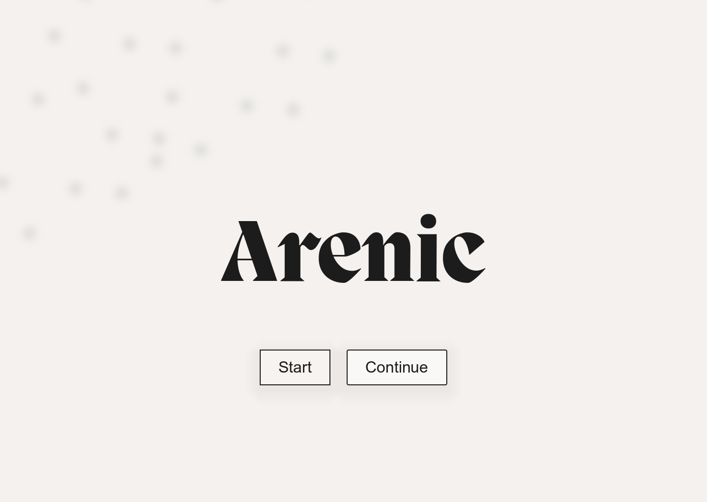

# Arenic title scene

The project starts at `res://scenes/title/title_scene.tscn` in `arenic-game`. Run the project in Godot to open it.

The reference title is a native `Control` scene: an Arenic wordmark, Start and Continue buttons, paper (`#f4f1ee`), and ink (`#1c1c1c`). Its reference size is 1440×1024, with PP Migra Extrabold at size 182 for the wordmark. The supplied font is included in the project and imported directly by Godot without conversion.

## Start and Continue

**Start** clears the previous in-memory class choice and opens `res://scenes/character_creation/class_selection.tscn`, assigned to the root `TitleScene`'s **New Game Scene** property. See [class selection](class-selection.md) for the card layout, editable resources, and confirmation flow. Back or Escape on that screen returns to the title.

**Continue** still displays a short status message because no save system is connected. Its `continue_requested` signal is available for a future save coordinator. To delegate Start to a coordinator instead of loading the assigned `PackedScene`, clear **New Game Scene** and connect `start_requested`.

## Edit the scene

- `Background` and `Wordmark`: paper treatment and the PP Migra title.
- `Start`, `Continue`, and `Status`: native buttons and the action status label.
- `scenes/title/paper_theme.tres`: shared UI styles and a `SystemFont` requesting Arial or Helvetica, with Godot's fallback when unavailable. No Arial font file is copied into the project.
- `scripts/title/title_menu.gd`: action hooks and keyboard focus navigation.
- `scripts/title/title_background.gdshader`: paper background treatment.

The earlier 3D title assets remain in the project but are unused by this scene. Font source and license information is in [the fonts README](../arenic-game/assets/fonts/README.md).

## Verification

Earlier title-only checks in Godot 4.7.2 on the current Mac verified the **PP Migra Extrabold** runtime font, 1440×1024 and 1280×720 layouts, mouse activation, and keyboard focus. The preview below is the 1440×1024 title capture. The new Start transition, returning with Escape, and clearing a previously confirmed class were also verified in a live playtest. See [class-selection verification](class-selection.md#verification) for the complete screen checks; gameplay and save systems remain unconnected.

